# 人物アイデンティティ維持型AI画像生成システム 技術仕様書

| 項目 | 内容 |
|---|---|
| 文書種別 | 設計標準書（1.8.1） |
| 版数 | Version 0.1（Draft） |
| 構成 | 本文 第1章〜第17章、付録A〜G |
| 承認 | 未 |
| 上位文書 | 社内規程（情報セキュリティ規程、個人情報保護規程等）、適用法令 |
| 下位文書 | 登録画像基準書、性能基準書、評価基準書、データ保持基準書、インシデント対応手順書、システム利用規程（いずれも骨子段階） |

**注記**：本版はドラフトである。本文中に「別途定める」とした具体的数値・手順は下位文書の策定を要し、未確定事項は末尾の「未解決事項一覧」に集約している。

---

## 目次

第1章　設計理念および基本思想
　1.1　目的
　1.2　適用範囲
　1.3　背景
　1.4　現状の技術課題
　1.5　設計理念
　1.6　基本原則
　1.7　将来構想
　1.8　本仕様書の位置付け

第2章　システム概要
第3章　用語および定義
第4章　要件定義
第5章　人物アイデンティティモデル
第6章　顔認証・人物認識仕様
第7章　人物ID管理仕様
第8章　AI画像生成仕様
第9章　スタイル変換仕様
第10章　再現性保証仕様
第11章　品質評価仕様
第12章　動画生成仕様
第13章　データ構造設計
第14章　API設計
第15章　セキュリティ設計
第16章　運用・保守設計
第17章　将来拡張仕様

付録A　用語集
付録B　データモデル
付録C　シーケンス図
付録D　データフロー図
付録E　テスト仕様
付録F　標準プロンプト設計
付録G　評価シート

未解決事項一覧

---

# 第1章　設計理念および基本思想

## 1.1　目的

### 1.1.1　本仕様書の目的

本仕様書は、人物アイデンティティ維持型AI画像生成システムの設計、開発、運用および品質評価に必要な技術要件を定義することを目的とする。

本システムは、単に画像を生成することを目的としない。

本システムが目指すものは、特定の人物について、その人物らしさを維持したまま、多様な表現形式へ展開可能なコンテンツを継続的かつ高い再現性で生成することである。

本仕様書では、この「人物らしさ」を「人物アイデンティティ」と定義し（3.2）、システム全体で一貫して管理する対象とする。この定義と、それを維持するための構造は第5章に定める。

### 1.1.2　本仕様書が対象とする技術

本仕様書では、次の技術領域を対象とする。

| 技術領域 | 主な参照章 |
|---|---|
| 顔認証および人物認識技術 | 第6章 |
| 人物特徴量の抽出および管理 | 6.6、6.7 |
| 人物ID管理 | 第7章 |
| AI画像生成 | 第8章 |
| スタイル変換 | 第9章 |
| 再現性の確保 | 第10章 |
| 人物同一性評価 | 第11章 |
| 動画生成における人物の一貫性維持 | 第12章 |
| セキュリティおよび個人情報・肖像権保護 | 第15章 |
| 品質保証および評価 | 第11章、16.7.2 |

これらの技術領域は、いずれも独立した目的ではなく、1.1.1 に定める目的を実現するための要素技術として位置付ける。特に顔認証技術については、本システムの目的そのものではなく、人物アイデンティティを客観的に取り扱うための手段の一つである（6.1）。

### 1.1.3　本仕様書が目指す成果

本仕様書に基づいて設計・開発・運用されるシステムは、次の成果を実現することを目標とする。

**第一に**、同一人物について、生成時期や担当者が異なっても、一貫した人物像を再現できること（BR-01）。この再現性は、人物IDによる人物の一意な管理（第7章）と、生成条件の完全な記録（第10章）によって担保する。

**第二に**、実写、アニメ、レトロ映画風、イラストなど異なる表現スタイルへ変換しても、人物アイデンティティを維持できること（QR-03）。これは、アイデンティティと表現を分離して管理する五層モデル（第5章）によって実現する。

**第三に**、静止画だけでなく動画生成においても、時間方向の連続性を保ち、視聴者が同一人物として認識できる品質を維持すること（QR-05）。これは第12章に定める。

**第四に**、AIモデルの更新や生成技術の進化があっても、人物IDおよび人物アイデンティティを継承し、継続的に利用できる設計とすること（BR-07、IDM-08）。これは、人物アイデンティティの永続的な担い手を、モデル依存の特徴ベクトルではなく人物IDと基準画像に置くという設計判断（5.1.4）によって実現する。

**第五に**、権利者の同意の範囲内でのみ人物情報を利用し、その利用状況を追跡可能とすること（BR-05、BR-06）。これは第15章に定める。

第五の成果は、他の四つとは性質が異なる。前四者がシステムの技術的な能力を定めるのに対し、第五者はその能力を行使してよい条件を定める。本仕様書は、この二種類の要求を等しく重要なものとして扱う（1.5.7）。

### 1.1.4　基本方針

本仕様書では、人物の外見と人物の本質を区別して設計する。

髪型、服装、背景、描画方法などは変更可能な表現要素である。これらは第5章に定める人物属性層・表現スタイル層・シーン層として管理する。

一方、人物の骨格的特徴、顔の比率、特徴的な印象などは人物アイデンティティを構成する要素として管理する（3.2.2、5.1.2）。これは第5章に定めるアイデンティティ層として、他のいかなる層の指定によっても変化しない不変の対象として扱う（IDM-01）。

この分離管理を採用することにより、多様なコンテンツ制作に対応しながら、一貫した人物表現を実現する。分離の思想は 1.5（設計理念）に、分離を担保する構造は第5章に、それぞれ詳しく定める。

### 1.1.5　目的の対象外事項

本仕様書の目的は、次を含まない。誤解を避けるため、ここに明示する。

| 対象外事項 | 理由 |
|---|---|
| 人物を特定・識別すること自体 | 1.2.5 第1項。本人確認・監視を目的としないため |
| 実在人物の言動を事実として記録・再現すること | 15.7.1 第2項。生成物は制作物であって記録ではない |
| 特定の生成AI技術・製品の性能向上 | 1.2.5 第4〜6項。本仕様書は要素技術に依存しない設計標準である |

これらは、1.1.1 に定める目的そのものからの逸脱であり、本仕様書が禁止用途として定める事項（15.7.1）と直接に対応する。目的の内側にあることと、許容される用途であることは、本仕様書において同一の境界を持つ。

---

### 本節の要旨

本仕様書は、「人物の外見を生成する技術」ではなく、「**人物というものを、技術の交代を越えて一貫して扱うための仕組み**」を定める文書である。

この目的を達成する上で中心となる考え方——人物の本質と表現を分離すること——は、1.5（設計理念）において宣言の形で改めて示し、第5章においてその宣言を実装可能な構造へと具体化する。

---

---

## 1.2　適用範囲

### 1.2.1　適用対象

本仕様書は、AI技術を活用して人物画像および人物映像を生成するシステムに適用する。

本システムは、人物の外見を単に生成することを目的とするものではなく、人物アイデンティティを維持しながら、多様な表現形式へ展開可能なコンテンツを生成することを目的とする。

本仕様書は、人物情報の登録から画像生成、品質評価、運用管理に至るまでの一連のライフサイクルを対象とし、システム設計、開発、運用および品質保証の共通基準として適用する。

---

### 1.2.2　対象業務

本仕様書は、次に示す業務に適用する。

1. 人物情報の登録および管理
2. 顔認証による人物特徴の抽出
3. 人物IDの生成および管理
4. AIによる人物画像の生成
5. AIによる人物映像の生成
6. スタイル変換処理
7. 品質評価および人物同一性評価
8. コンテンツ管理および運用

なお、本仕様書は社内利用を前提とした設計標準として位置付けるが、将来的な外部サービスへの展開にも適用できる構成とする。

---

### 1.2.3　対象コンテンツ

本仕様書では、次のコンテンツを対象とする。

#### （1）静止画

- 写真風画像
- ポートレート
- 宣材画像
- イラスト
- アニメ画像
- 漫画表現
- 水彩画
- 油彩画
- 昭和レトロ映画風
- モノクロ写真風
- その他の二次元・三次元画像

#### （2）動画

- 実写風動画
- アニメーション
- ショートムービー
- CM・広告映像
- SNS向け動画
- 教材映像
- プレゼンテーション映像
- デジタルヒューマン映像

#### （3）将来対象

- 三次元キャラクター
- メタバース向けアバター
- リアルタイムAIアバター
- AR／VRコンテンツ
- XRコンテンツ
- ホログラム表示
- その他、人物アイデンティティの維持を必要とする生成コンテンツ

---

### 1.2.4　対象技術

本仕様書は、次の技術を対象とする。

#### 人物認識技術

- 人物検出
- 顔認証
- 顔特徴量抽出
- 人物識別
- 人物追跡

#### AI生成技術

- 画像生成AI
- 動画生成AI
- スタイル変換AI
- 画像編集AI
- 映像編集AI

#### 品質管理技術

- 人物同一性評価
- 画像品質評価
- 動画品質評価
- 生成履歴管理
- 品質監査

#### データ管理技術

- 人物ID管理
- 特徴量管理
- 生成履歴管理
- バージョン管理
- アクセス制御

---

### 1.2.5　適用対象外

本仕様書では、次に示す内容を対象外とする。

1. 人物を特定することのみを目的とした監視システム
2. 法執行機関における犯罪捜査用途
3. 生体認証システムそのものの設計
4. AIモデル内部アルゴリズムの詳細設計
5. 学習済みAIモデルの開発手法
6. AI基盤ソフトウェアの実装仕様

これらについては、本仕様書とは別に個別の設計書または運用基準を定めるものとする。

---

### 1.2.6　将来拡張

本仕様書は、現在のAI画像生成技術に限定されるものではない。

今後登場する新たな生成AI、動画生成技術、三次元表現技術、リアルタイム人物生成技術等についても、本仕様書で定義する人物アイデンティティ管理モデルを共通基盤として適用できることを基本方針とする。

技術の進歩に伴い生成モデルやアルゴリズムが変更された場合であっても、人物IDおよび人物アイデンティティは継承され、既存コンテンツとの整合性を維持しなければならない。

また、本仕様書は将来的に次の派生仕様書を策定することを前提とする。

- 動画生成システム仕様書
- デジタルヒューマン設計仕様書
- 三次元キャラクター生成仕様書
- リアルタイムAIアバター仕様書
- 品質保証・評価基準書
- AI運用管理標準書

---

### 1.2.7　設計上の要点

本仕様書は、AI画像生成技術そのものを規定する文書ではなく、人物アイデンティティを維持したコンテンツ生成システムの設計・開発・運用に関する標準仕様を定めることを目的とする。

したがって、画像・動画・三次元表現などコンテンツの種類が変化しても、「人物アイデンティティを維持する」という基本原則は変更しない。

---

## 1.3　背景

### 1.3.1　本節の目的

本節は、本仕様書が策定されるに至った状況を記述する。

技術仕様書において背景を記すのは、単なる経緯の説明のためではない。将来、本仕様書を読む者が「なぜこのような設計になっているのか」を判断できるようにするためである。設計判断の根拠が失われると、仕様は形式だけが残り、状況の変化に応じた適切な改訂ができなくなる。

### 1.3.2　人物コンテンツの需要

事業活動において、人物が登場するコンテンツは広範に用いられる。広報資料、製品紹介、教材、案内表示、社内向け説明資料などがこれに該当する。

これらのコンテンツには、次の性質がある。

1. 同一人物が、複数の媒体・複数の文脈にわたって繰り返し登場する。
2. 制作は一度で終わらず、期間をおいて継続的に行われる。
3. 媒体により、求められる表現形式が異なる。

第1と第2の性質から、**人物の一貫性**が要求される。第3の性質から、**表現の多様性**が要求される。この二つの要求は、従来の制作手法においては両立が困難であった。

### 1.3.3　従来の制作における制約

従来、人物コンテンツの制作には次の制約があった。

| 制約 | 内容 |
|---|---|
| 撮影の都度性 | 新たな構図・服装・場面が必要になるたびに撮影を要する |
| 時期的制約 | 対象人物の都合、季節、場所の確保に依存する |
| 表現の固定 | 撮影された写真を、後から別の表現形式へ変換することが困難 |
| 経年変化 | 時間の経過により、過去の素材と現在の素材が整合しなくなる |
| 費用 | 撮影のたびに費用が発生する |

これらの制約により、同一人物を用いた継続的なコンテンツ展開には限界があった。

### 1.3.4　生成AIによる変化

画像生成技術の発達により、上記の制約の多くは原理的に解消しうる状況となった。撮影を伴わずに、任意の構図・服装・場面・表現形式の画像を得ることが可能になったためである。

しかし、この技術を人物コンテンツへ適用しようとした際、従来は存在しなかった種類の問題が生じた。

### 1.3.5　新たに生じた問題

**同一人物を繰り返し生成することが、技術的に困難である。**

これが中心的な問題である。撮影であれば、被写体が同一人物である限り、写るのは当然に同一人物であった。生成においては、この当然が成立しない。同じ指示を与えても、生成のたびに異なる人物が現れうる。

さらに、表現形式を変更すると、人物としての同一性がより失われやすい。実写風で生成した人物をアニメ風に変換すると、しばしば別人になる。

これらの問題は、生成技術の性能が向上すれば自然に解決するというものではない。**人物を独立した管理対象として扱う仕組みが存在しないこと**に起因する構造的な問題である。

### 1.3.6　本仕様書策定の契機

以上の状況から、次の認識に至った。

1. 人物コンテンツへの生成技術の適用には、生成そのものとは別に、**人物を管理する仕組み**が必要である。
2. その仕組みは、特定の生成技術に依存してはならない。生成技術は数年で交代するが、人物の管理は長期にわたるためである。
3. したがって必要なのは、個別の実装手順書ではなく、**技術世代を跨いで適用できる設計標準**である。

本仕様書は、この認識に基づき策定するものである。

---

## 1.4　現状の技術課題

### 1.4.1　本節の位置付け

本節は、1.3.5 で述べた問題を、技術的な課題として整理する。ここで整理する課題が、本仕様書の各章が応答すべき対象となる。

なお本節は、特定の製品・モデルの性能を評価するものではない。生成技術一般に共通する構造的な課題を対象とする。

### 1.4.2　課題1：生成結果の非決定性

**内容**

同一の指示を与えても、生成のたびに異なる人物が生成される。

**原因**

生成処理には確率的な要素が含まれる。また、人物の外見を指定する自然言語の記述は、必然的に曖昧さを含む。「30代の男性、短髪、眼鏡」という記述に合致する人物は無数に存在し、そのいずれが生成されるかは制御されていない。

**帰結**

同一人物を繰り返し登場させるコンテンツを制作できない。制作のたびに人物が変わるため、コンテンツ間の連続性が成立しない。

### 1.4.3　課題2：表現変更に伴う同一性の喪失

**内容**

表現形式を変更すると、人物としての同一性が失われる。

**原因**

表現形式の指定と人物の指定が、いずれも同一の指示系統（プロンプト等）の中で扱われるため、両者が分離されていない。結果として、表現形式の変更指示が人物の外見にも影響する。

さらに、表現形式によっては人物の識別に必要な情報の一部が原理的に表現できない。線画表現において肌の階調情報が失われるのは、その例である。

**帰結**

同一人物を複数の表現形式で展開できない。実写素材とアニメ素材が、同一人物のものとして認識されない。

### 1.4.4　課題3：時間方向の不安定性

**内容**

動画において、フレームが進むにつれて人物の外見が変化する。

**原因**

多くの生成方式は、フレームを個別に、あるいは直前フレームを参照して生成する。前者では各フレームの結果が独立に揺らぎ、後者では微小な差異が一方向に蓄積する。

**帰結**

視聴者は、冒頭と終盤で異なる人物を見ることになる。人は顔の微細な変化に敏感であるため、この不安定性は容易に知覚される。

### 1.4.5　課題4：評価手段の不足

**内容**

生成された人物が「同一人物である」ことを、客観的に判定する手段が確立していない。

**原因**

顔認証技術は本来、実写画像同士の照合を目的として発達した。非実写の表現形式に対しては、そもそも学習の対象外である場合が多い。

また、人が同一人物と感じるかどうかは、数値化困難な印象に依存する部分がある。数値上は高い一致を示しながら、人が見ると違和感を覚える場合がある。逆もまた生じる。

**帰結**

品質の判断が担当者ごとに異なり、組織として一定の水準を維持できない。

### 1.4.6　課題5：資産の非継承性

**内容**

生成モデルが更新されると、それまでに確立した人物が再現できなくなる。

**原因**

人物の特徴が、特定のモデルに固有の形式（追加学習した重み、モデル依存の特徴ベクトル等）でのみ保持されている場合、モデルの更新とともにその形式は無効となる。

**帰結**

モデル更新のたびに人物を作り直すことになる。長期にわたるコンテンツ展開が成立せず、技術の進歩がむしろ資産の喪失を招く。

### 1.4.7　課題6：管理と追跡の不在

**内容**

どの人物を、いつ、どのような条件で生成したかが記録されない。

**原因**

生成が個別の作業として行われ、条件が体系的に記録される仕組みが存在しない。

**帰結**

- 過去と同じ結果を再現できない。
- 問題が生じた際に原因を特定できない。
- 権利者から利用状況の照会があった際に回答できない。
- 同意の範囲内で利用されていることを証明できない。

最後の点は、人物情報を扱う以上、技術的な不便を超えた問題となる。

### 1.4.8　課題の構造

以上六つの課題は、独立したものではない。共通する根本原因が存在する。

**人物が、生成条件の一部として扱われており、独立した管理対象になっていない。**

人物を「プロンプトに書かれた記述の一つ」として扱う限り、次はいずれも成立しない。

- 記述以上の精度で人物を特定すること（課題1）
- 人物の記述と表現の記述を分離すること（課題2）
- フレームを越えて人物を固定すること（課題3）
- 人物を基準として評価すること（課題4）
- モデルを越えて人物を引き継ぐこと（課題5）
- 人物単位で利用を追跡すること（課題6）

したがって解決策は、個々の課題への個別対応ではない。**人物を独立した管理対象へ昇格させること**である。

これが本仕様書の出発点である。

### 1.4.9　課題と本仕様書の対応

| 課題 | 本仕様書における応答 | 主な章 |
|---|---|---|
| 課題1 非決定性 | 人物IDと特徴データによる人物の固定、生成条件の完全管理 | 第7章、第10章 |
| 課題2 同一性喪失 | 五層モデルによるアイデンティティと表現の分離 | 第5章、第9章 |
| 課題3 時間不安定性 | 時間レイヤーの定義、系列評価によるドリフト検出 | 5.5、第12章 |
| 課題4 評価手段 | 三方式併用の評価、スタイル別の受入基準 | 第11章 |
| 課題5 非継承性 | 人物IDの継承、モデル非依存のデータ構造 | 7.5、第13章 |
| 課題6 管理不在 | 生成条件の凍結、履歴の追記専用管理、同意管理 | 第10章、第15章 |

---

## 1.5　設計理念

### 1.5.1　中核宣言

本仕様書の全体を貫く思想を、次のとおり宣言する。

> **本システムは、人物の外見を生成することを目的としない。**
>
> **本システムの目的は、人物のアイデンティティを維持したまま、多様な表現媒体へ展開可能なコンテンツを生成することである。**

本仕様書におけるすべての設計判断は、この宣言に照らして行う。判断に迷う場面が生じた場合、この宣言に立ち返る。

### 1.5.2　理念1：生成ではなく再現

本システムは、人物を**生成**するのではなく、**再現**する。

両者の違いは次のとおりである。

| | 生成 | 再現 |
|---|---|---|
| 対象 | 存在しない人物を作り出す | 既に定義された人物を呼び出す |
| 基準 | 存在しない | 基準画像・特徴データ |
| 評価 | 主観的な良否 | 基準との一致 |
| 結果の一意性 | 毎回異なってよい | 毎回同一でなければならない |

この違いは、システムの位置付けを根本的に変える。再現システムにおいては、「毎回異なる結果」は多様性ではなく**不具合**である。

### 1.5.3　理念2：本質と表現の分離

人物を構成する要素のうち、**その人物である理由となる要素**と、**見せ方に属する要素**を分離して管理する。

この分離は、単なる実装上の工夫ではなく、本仕様書の中心的な思想である。分離が成立していれば、表現を自由に変えても人物は保たれる。分離が崩れれば、表現を変えるたびに人物が失われる。

分離の構造は第5章に定義する五層モデルとして具体化する。

### 1.5.4　理念3：アイデンティティは資産である

登録された人物アイデンティティを、消耗品ではなく**継承される資産**として扱う。

資産として扱うとは、次を意味する。

1. 一度確立したものを、繰り返し利用する。
2. 技術の交代を越えて引き継ぐ。
3. 誰が利用しても同一の品質が得られる。
4. 誰の資産であるかを明確にし、権利者の意思に従って管理する。

第4項は、他の三項とは性質が異なる。人物アイデンティティは、システムの所有物ではなく、その人物本人に由来するものだからである。資産として扱うことは、権利者の権利を軽視することではなく、むしろ厳格に管理することを意味する。

### 1.5.5　理念4：維持できたことを確認する

本システムは、生成して終わりとしない。生成結果が人物アイデンティティを維持しているかを、**評価により確認する**。

確認を仕組みとして組み込む理由は次のとおりである。

1. 生成技術は確率的であり、常に期待通りの結果を返すとは限らない。
2. 品質の判断を担当者個人に委ねると、組織として水準を維持できない。
3. 確認の記録がなければ、事後に説明できない。

ただし、評価を数値のみに委ねることもしない。数値と人の判断を併用し、**最終的な判断権限は人に置く**。これは第11章を通じて一貫する方針である。

### 1.5.6　理念5：技術の交代を前提とする

本仕様書は、現在の生成技術が数年のうちに交代することを前提として設計する。

したがって、次を設計方針とする。

1. 特定のモデル・製品・アルゴリズムに依存した規定を置かない。
2. 具体的な数値基準を仕様書本体に固定しない。
3. 交代時に何を引き継ぐかを、あらかじめ定めておく。

第2項は重要である。類似度のしきい値などの具体値を仕様書に書き込むと、モデル更新のたびに仕様書の改訂が必要となり、やがて実態と乖離した基準が放置される。本仕様書は測定項目と設定手順のみを定め、具体値は下位文書に委ねる（11.8）。

### 1.5.7　理念6：同意なくして生成なし

権利者の同意が確認されていない人物について、本システムは登録も生成も行わない。

これは運用上の注意事項ではなく、**設計上の制約**として扱う。すなわち、同意情報が存在しなければ人物IDを発行できず、人物IDがなければ生成を実行できない構成とする（14.4.4、8.2）。

人の外見を高い再現性で生成できる能力は、そのまま悪用の可能性でもある。この能力を扱う以上、制約を運用の善意に委ねてはならない。構造として組み込む必要がある。

### 1.5.8　理念相互の関係

六つの理念は、次の関係にある。

```
理念1（再現）
  └─ を成立させるために ─> 理念2（分離）
                              └─ を長期に維持するために ─> 理念3（資産）
                                                            └─ を裏付けるために ─> 理念4（確認）
                                                                                    
理念5（技術交代）── 理念1〜4 すべてに対する制約条件
理念6（同意）  ── 理念1〜5 すべてに対する前提条件
```

理念5 と理念6 は、他の理念と並列ではない。前者は設計の制約条件であり、後者は実施の前提条件である。理念6 が満たされない場合、他のすべての理念は適用の余地を持たない。

---

## 1.6　基本原則

### 1.6.1　本節の位置付け

1.5 が思想を述べるのに対し、本節はそれを**判断可能な規則**として定める。

本節に定める原則は、システムの設計・実装・運用のすべての場面において適用される。個別章の規定が原則と矛盾する場合、原則を優先し、当該規定を改訂する。

### 1.6.2　原則一覧

| ID | 原則 | 由来する理念 |
|---|---|---|
| P-01 | 人物アイデンティティは、システム全体で一意に管理する。 | 理念1 |
| P-02 | 人物アイデンティティと表現スタイルは、独立した管理対象とする。 | 理念2 |
| P-03 | 表現の変更によって、人物アイデンティティを変更してはならない。 | 理念2 |
| P-04 | 人物属性の変更によって、人物アイデンティティを変更してはならない。 | 理念2 |
| P-05 | 生成モデルが交代しても、人物IDは継承する。 | 理念3・理念5 |
| P-06 | すべての生成は、条件を記録した上で実行する。 | 理念4 |
| P-07 | 評価を経ない生成物を、承認済みコンテンツとして扱わない。 | 理念4 |
| P-08 | 評価は、数値と人の判断を併用し、最終判断は人が行う。 | 理念4 |
| P-09 | 特定のモデル・製品に依存する規定を、本仕様書本体に置かない。 | 理念5 |
| P-10 | 権利者の同意が確認できない人物について、登録および生成を行わない。 | 理念6 |

### 1.6.3　各原則の適用

#### P-01　一意性の原則

一人の人物に対して、一つの人物IDのみが存在する。同一人物が複数の人物IDで重複登録されることを防止する（7.3.1）。

重複が生じると、どちらが正であるかの判断が必要となり、一貫性の根拠が失われる。

#### P-02　分離の原則

属性・スタイル・シーンは、それぞれ独立して指定できなければならない（FR-18）。

実装上は、これらを単一の自由記述に統合せず、構造化データとして保持することを要する（5.2.5）。統合された記述からは、どの部分がどの層に属するかを事後に判別できない。

#### P-03・P-04　不変性の原則

表現スタイルおよび人物属性の指定は、人物アイデンティティに影響してはならない（QR-03、QR-04）。

影響が生じた場合、それは干渉であり、不具合として扱う（5.6）。原因の所在にかかわらず、結果として人物が変化していれば不適合である。

#### P-05　継承の原則

モデルの交代に際し、人物IDは維持される（BR-07、IDM-08）。

この原則を満たすため、人物IDに紐づく永続データは、モデルに依存しない形式で保持しなければならない。モデル依存の特徴ベクトルは派生データにすぎず、アイデンティティの担い手ではない（5.1.4）。

#### P-06　記録の原則

条件を記録せずに生成を行ってはならない（16.3.2）。

記録は生成の副産物ではなく、生成の一部である。記録できない条件で生成する場合、その生成自体を行わない。

#### P-07　検証の原則

評価を経ていない生成物は、いかなる理由があっても承認済みコンテンツとして扱わない（QR-07）。

急を要する場合であっても例外を認めない。例外を一度認めると、それが前例となり、原則は実効性を失う。

#### P-08　人の判断の原則

数値評価と目視評価が矛盾する場合、目視評価を優先する（11.6.1）。

数値は判断を支援するものであり、判断を代替するものではない。特に、数値上は基準を満たしながら人が違和感を覚える生成物を、数値を根拠に承認してはならない。

#### P-09　非依存の原則

本仕様書本体には、特定のモデル名・製品名・具体的な数値基準を記載しない（11.8.1）。

これらは下位文書に記載し、モデルの交代に応じて下位文書のみを改訂する。仕様書本体は、下位文書の存在と、その設定手順のみを定める。

#### P-10　同意の原則

同意情報が存在しない人物について、システムは人物IDを発行しない（FR-06、OR-01）。

同意の有効期限が到来した場合、当該人物IDは自動的に失効し、生成は実行できなくなる（OR-02、15.3.2）。

### 1.6.4　原則と不変条件の関係

本節の原則は、第5章に定める不変条件（IDM-01〜08）と次の関係にある。

| 原則 | 対応する不変条件 |
|---|---|
| P-01 | IDM-05 |
| P-02 | IDM-02 |
| P-03 | IDM-01、IDM-06 |
| P-04 | IDM-01 |
| P-05 | IDM-08 |
| P-06〜P-08 | （評価・記録に関する原則。不変条件の充足を確認する手段） |
| P-09・P-10 | （設計方針および前提条件。層モデルの外側に位置する） |

原則は「どうあるべきか」を、不変条件は「モデル上どう表現されるか」を、それぞれ規定する。

### 1.6.5　判断に迷う場合の指針

設計・運用の場面で判断に迷う場合、次の順序で検討する。

1. 1.5.1 の中核宣言に照らして判断できるか
2. 1.6.2 の原則のいずれかに該当するか
3. 第5章の不変条件に抵触しないか
4. いずれにも該当しない場合、判断の内容と根拠を記録し、次回改訂時に本仕様書へ反映する

第4項が重要である。仕様書に規定のない事項について判断した場合、その判断を記録しなければ、同種の場面で異なる判断がなされうる。記録と反映により、仕様書は運用を通じて成長する。

---

## 1.7　将来構想

### 1.7.1　本節の位置付け

本節は、本仕様書が将来どのように発展しうるかを示す。

本節の内容は計画ではなく構想であり、実施を約束するものではない。ただし、本仕様書の設計は、本節に示す発展が可能となるよう配慮して行う。

### 1.7.2　発展の三方向

本仕様書からの発展は、次の三方向が想定される。

| 方向 | 内容 |
|---|---|
| 表現媒体の拡張 | 静止画 → 動画 → 三次元 → リアルタイム |
| 適用範囲の拡張 | 社内利用 → 外部サービス |
| アイデンティティの拡張 | 外見 → 動作・音声を含む総体 |

第3の方向は、他の二つとは性質が異なる。人物アイデンティティの定義そのものを拡張するため、本仕様書の中核（第5章）の改訂を伴う。

### 1.7.3　表現媒体の拡張

| 段階 | 対象 | 追加される要件 | 状況 |
|---|---|---|---|
| 第1段階 | 静止画 | — | 本仕様書の主対象 |
| 第2段階 | 動画 | 時間的一貫性、動作の一貫性 | 第12章に定義済み |
| 第3段階 | 三次元キャラクター | 立体形状としての同一性、任意視点からの一貫性 | 未定義 |
| 第4段階 | リアルタイムアバター | 実時間性、応答性 | 未定義 |
| 第5段階 | XR・ホログラム | 空間内での一貫性 | 未定義 |

第3段階以降において、五層モデルは次のように拡張されることが想定される。

- アイデンティティ層に、立体形状としての特徴が加わる。
- シーン層に、視点位置が加わる。
- 時間層の要件が、実時間制約を含むよう強化される。

いずれの段階においても、**アイデンティティ層が不変であるという構造は変更しない**。

### 1.7.4　アイデンティティの拡張

現在の本仕様書は、人物アイデンティティを主として外見的特徴として定義している（3.2.2）。

将来的には、次の要素を含む拡張が想定される。

| 要素 | 内容 | 検討事項 |
|---|---|---|
| 動作特徴 | 歩き方、しぐさ、視線の動き | 取得方法、評価方式（5.5.5） |
| 音声特徴 | 声質、話し方、抑揚 | 音声情報の取得同意、評価方式 |
| 言語的特徴 | 語彙、言い回し | 適用範囲の慎重な検討を要する |

第3の要素については、特に慎重な検討を要する。人物の言語的特徴を再現することは、当該人物が述べていない内容を、その人物が述べたかのように表現する能力に直結するためである。15.7.1 第2項に定める禁止用途との関係を、拡張の前提として整理しなければならない。

### 1.7.5　派生仕様書の体系

本仕様書からの派生として、次の文書が想定される（1.2.6）。

| 文書 | 対象 | 位置付け |
|---|---|---|
| 動画生成編 | 動画に固有の詳細仕様 | 第12章の展開 |
| デジタルヒューマン設計仕様書 | 対話を伴う人物表現 | 新規 |
| 三次元キャラクター生成仕様書 | 立体表現 | 新規 |
| リアルタイムAIアバター仕様書 | 実時間生成 | 新規 |
| 品質保証・評価基準書 | 評価の具体基準 | 第11章の展開 |
| AI運用管理標準書 | 組織的な運用管理 | 第16章の展開 |

いずれの派生文書も、本仕様書の第1章および第5章を前提として作成する。すなわち、設計理念と人物アイデンティティモデルは共通基盤とし、派生文書はその上に固有の要件を積み上げる。

### 1.7.6　継承されるものと変わるもの

| 継承されるもの | 変わるもの |
|---|---|
| 中核宣言（1.5.1） | 対象とする表現媒体 |
| 基本原則（1.6.2） | 使用する生成技術 |
| 五層モデルの構造（第5章） | 各層の構成要素の粒度 |
| アイデンティティ層の不変性 | 特徴の取得・表現方法 |
| 人物ID | 特徴ベクトルの形式 |
| 評価における人の最終判断 | 評価の具体手法・基準値 |
| 同意に基づく運用 | 同意取得の範囲・方式 |

左列が、技術の交代を越えて維持される本仕様書の中核である。

### 1.7.7　発展の前提条件

上記の発展を実施するにあたり、次を前提条件とする。

1. **同意範囲の再定義**：適用範囲が拡張される場合、既存の同意はその範囲を含まない。拡張に先立ち、権利者から改めて同意を得る。
2. **悪用防止措置の先行**：能力の拡張に先立ち、対応する悪用防止措置（15.7）を整備する。措置の整備が能力の拡張に遅れてはならない。
3. **評価手段の確立**：評価できない品質要件を要件として定義しない。評価手段が未確立の領域については、その旨を明記し、定性的要件にとどめる（5.5.5、12.6.1）。

第2項は特に重要である。生成能力の向上は、そのまま悪用時の被害の拡大を意味する。能力を先に拡張し、対策を後から整備する順序をとってはならない。

---

## 1.8　本仕様書の位置付け

### 1.8.1　文書の性格

本仕様書は、**設計標準書**である。

すなわち、特定のシステムの実装手順を記した文書ではなく、この分野のシステムを設計・開発・運用する際に共通して従うべき基準を定めた文書である。

| 性格 | 該当 |
|---|---|
| 設計標準書 | ○ |
| 要件定義書 | 一部（第4章） |
| 基本設計書 | 一部（第2章、第13章、第14章） |
| 詳細設計書 | × |
| 実装手順書 | × |
| 操作マニュアル | × |

詳細設計および実装は、本仕様書に適合する範囲で、個別のシステムごとに行う。

### 1.8.2　文書体系

本仕様書は、次の文書体系の中に位置する。

```
上位
 ├─ 社内規程（情報セキュリティ規程、個人情報保護規程等）
 ├─ 適用法令
 │
本仕様書
 ├─ 人物アイデンティティ維持型AI画像生成システム 技術仕様書
 │
下位
 ├─ 登録画像基準書
 ├─ 性能基準書
 ├─ 評価基準書
 ├─ データ保持基準書
 ├─ インシデント対応手順書
 ├─ システム利用規程
 │
派生
 ├─ 動画生成編
 ├─ デジタルヒューマン設計仕様書
 ├─ 三次元キャラクター生成仕様書
 ├─ リアルタイムAIアバター仕様書
 ├─ 品質保証・評価基準書
 └─ AI運用管理標準書
```

上位文書と本仕様書が矛盾する場合、上位文書を優先する。特に、適用法令および社内の個人情報保護規程は、本仕様書に優先して適用される。

### 1.8.3　下位文書の役割

本仕様書は、次の事項を下位文書に委ねる（P-09）。

| 下位文書 | 委ねる事項 |
|---|---|
| 登録画像基準書 | 画像品質のしきい値、必須枚数 |
| 性能基準書 | 性能目標値 |
| 評価基準書 | 類似度しきい値、PIQI の重み、動画受入基準 |
| データ保持基準書 | 各データの保持期間 |
| インシデント対応手順書 | インシデント時の具体手順 |
| システム利用規程 | 禁止用途の詳細、違反時の措置 |

これらを本仕様書本体に記載しない理由は、いずれも**モデル・環境・法令の変化に応じて改訂頻度が高い**ためである。改訂頻度の異なる事項を同一文書に置くと、頻繁な改訂により文書全体の安定性が損なわれる。

### 1.8.4　適用

本仕様書は、1.2 に定める適用範囲において、次に対して適用される。

| 対象 | 適用内容 |
|---|---|
| 新規システムの設計 | 本仕様書に適合する設計を行う |
| 既存システムの改修 | 改修範囲について本仕様書を適用する |
| 運用 | 第16章に定める運用要件に従う |
| 外部委託 | 委託先に対して本仕様書への適合を求める |

### 1.8.5　逸脱の扱い

本仕様書の規定に適合できない事情がある場合、次の手続による。

1. 逸脱する規定、理由、代替措置を文書化する。
2. 承認を得る。
3. 逸脱の記録を保持する。
4. 定期的に、逸脱の解消可能性を再検討する。

ただし、次の規定については逸脱を認めない。

| 逸脱不可の規定 | 理由 |
|---|---|
| P-07（評価を経ない生成物の扱い） | 例外が前例となり原則が形骸化するため |
| P-10（同意なき登録・生成の禁止） | 権利者の権利に関わるため |
| 15.7.1（禁止用途） | 法令および社会的責任に関わるため |

### 1.8.6　改訂

### 1.8.6.1　改訂の契機

| 契機 | 改訂範囲 |
|---|---|
| 適用範囲の拡張 | 1.2、第5章、関連章 |
| 新たな技術課題の顕在化 | 1.4、対応する章 |
| 運用を通じた判断の蓄積 | 該当章（1.6.5 第4項） |
| 上位文書の改訂 | 影響を受ける章 |
| 派生仕様書の策定 | 1.7.5、相互参照 |

### 1.8.6.2　改訂の制約

改訂にあたり、次を制約とする。

1. 1.5.1 の中核宣言は改訂しない。これを改訂する場合、それは本仕様書の改訂ではなく、別の仕様書の策定である。
2. 1.6.2 の基本原則の削除は、慎重な検討を要する。追加は、既存原則との矛盾がないことを確認した上で行う。
3. 第5章の五層構造は、拡張は可としつつ、アイデンティティ層の不変性は維持する。

### 1.8.6.3　版の管理

本仕様書は版番号により管理し、改訂履歴を保持する。各章は、参照する他章の版を意識せずに記述できるよう、章間の参照は章・節番号によって行い、版番号による参照は行わない。

### 1.8.7　本仕様書が規定しないもの

誤解を避けるため、本仕様書が規定しない事項を明示する。

| 事項 | 理由 |
|---|---|
| AIモデル内部のアルゴリズム | 1.2.5 第4項 |
| 生体認証システムそのものの設計 | 1.2.5 第3項 |
| 監視・犯罪捜査用途への適用 | 1.2.5 第1・2項 |
| 具体的な製品・サービスの選定 | P-09 |
| 具体的な数値基準 | P-09、1.8.3 |
| 実装言語・フレームワーク | 詳細設計の範疇 |
| 生成物の著作権の帰属 | 法務判断を要するため別途定める |
| 生成物の広告表示義務等の法的要件 | 適用法令による |

最後の二項は、本仕様書の範囲外であるが、実務上は必ず検討を要する事項である。本仕様書の適用にあたり、これらが別途整理されていることを前提とする。

---

---

# 第2章　システム概要

## 2.0　本章の位置付け

第1章が本システムの理念と目的を示し、第3章以降が個別の仕様を定めるのに対し、本章は**システム全体の見取り図**を示す。

本章の目的は、読者が個別章へ進む前に、システムの構成要素・処理の流れ・時間軸上の変化を把握できるようにすることである。したがって本章の記述は概略にとどめ、詳細はすべて該当章を参照する。

---

## 2.1　システム概要

### 2.1.1　システムの目的

本システムは、登録された人物について、人物アイデンティティを維持したまま、多様な表現形式のコンテンツを継続的かつ高い再現性で生成することを目的とする（1.1.1）。

本システムは、次の三つを一体として扱う点に特徴がある。

1. 人物アイデンティティを**資産として管理する**こと
2. アイデンティティと表現を**分離して制御する**こと
3. 維持できたことを**評価により確認する**こと

第3の要素を含む点が、一般的な画像生成システムとの最大の差異である。本システムは生成するだけでなく、生成結果が要件を満たすかを自ら判定し、記録する。

### 2.1.2　システムの特徴

| 特徴 | 内容 | 参照 |
|---|---|---|
| 五層モデルによる制御 | アイデンティティ・属性・スタイル・シーン・時間を独立に制御する | 第5章 |
| 人物IDによる永続管理 | モデルが更新されても人物IDは継承される | 第7章 |
| 生成条件の完全記録 | すべての生成について条件を凍結し、再現可能とする | 第10章 |
| 三方式併用の評価 | 特徴量・幾何・目視を併用して同一性を判定する | 第11章 |
| モデル非依存の構成 | 生成モデル・顔認証モデルを差し替え可能とする | NFR-05 |
| 同意に基づく運用 | 権利者の同意なしに人物を登録・利用しない | 第15章 |

### 2.1.3　利用者

| 利用者 | 主な操作 | 権限区分 |
|---|---|---|
| 制作担当者 | 生成の実行、結果の確認 | 制作担当者 |
| 登録担当者 | 人物の登録、特徴データの更新 | 登録担当者 |
| 人物情報管理責任者 | 登録・削除の承認、同意管理 | 管理者 |
| 品質管理担当者 | 評価の実施、受入判定 | 制作担当者＋評価権限 |
| モデル管理者 | モデル・プロファイルの更新管理 | 管理者 |
| システム管理者 | 基盤運用、権限管理 | 管理者 |
| 監査担当者 | 記録の点検 | 閲覧者＋監査権限 |

権限区分の詳細は 7.7 に、役割の責務は 16.1 に定める。

### 2.1.4　適用範囲

本システムの適用範囲は 1.2 に定める。要約すると次のとおりである。

| 区分 | 内容 |
|---|---|
| 対象 | 人物情報の登録から生成、評価、運用までの全ライフサイクル |
| 対象コンテンツ | 静止画、動画、将来的に三次元・XR コンテンツ |
| 対象外 | 監視用途、犯罪捜査用途、生体認証システムそのものの設計、AIモデル内部アルゴリズム |

---

## 2.2　システム構成

### 2.2.1　構成方針

システムは、次の方針により構成する。

1. **責務による分離**：人物管理、生成、評価を独立したサブシステムとする。
2. **外部モデルの分離**：生成モデル・顔認証モデルを外部要素として扱い、差し替え可能とする（NFR-05）。
3. **個人情報の分離**：個人情報に該当するデータを、それ以外と区分して配置する（13.1）。
4. **障害の非波及**：生成処理の障害が管理機能へ波及しない構成とする（NFR-07）。

### 2.2.2　サブシステム一覧

| ID | サブシステム | 責務 | 主な参照章 |
|---|---|---|---|
| SS-1 | 人物管理サブシステム | 人物IDの発行・管理、同意管理、状態遷移 | 第7章、15.3 |
| SS-2 | 特徴処理サブシステム | 顔検出、特徴抽出、特徴統合、類似度算出 | 第6章 |
| SS-3 | 生成サブシステム | 生成条件の組立、生成の実行、結果の取得 | 第8章 |
| SS-4 | スタイル管理サブシステム | スタイルプロファイル、プロンプトテンプレートの管理 | 第9章、8.5 |
| SS-5 | 評価サブシステム | 同一性評価、系列評価、判定、指標算出 | 第11章、第12章 |
| SS-6 | 履歴管理サブシステム | 生成条件の凍結、履歴の保持、再現実行 | 第10章 |
| SS-7 | 基盤サブシステム | 認証・認可、監査ログ、暗号化、バックアップ | 第15章、16.5 |

### 2.2.3　各サブシステムの責務境界

責務の重複を避けるため、境界を次のとおり定める。

| 境界 | 定め |
|---|---|
| SS-1 と SS-2 | 人物IDの管理は SS-1、特徴データの生成は SS-2。SS-2 は人物IDを発行しない。 |
| SS-2 と SS-5 | 類似度の**算出**は SS-2、算出結果の**判定**は SS-5。基準値の適用は SS-5 が行う。 |
| SS-3 と SS-4 | 生成の実行は SS-3、スタイル定義の保持は SS-4。SS-3 はプロファイルを改変しない。 |
| SS-3 と SS-6 | 生成の実行は SS-3、条件の凍結と保持は SS-6。 |
| SS-5 と SS-6 | 評価の実施は SS-5、評価結果の保持は SS-6。 |

第2の境界は特に重要である。類似度スコアそのものは客観的な数値だが、それを適合と見なすかは基準値の設定に依存する（11.8）。両者を同一サブシステムに置くと、基準値の変更が算出処理に混入しうる。

### 2.2.4　外部要素

次は本システムの外部要素として扱い、内部仕様を規定しない。

| 外部要素 | 扱い | 根拠 |
|---|---|---|
| 画像生成モデル | 差し替え可能な外部資源 | 1.2.5 第4項 |
| 動画生成モデル | 同上 | 同上 |
| 顔認証モデル | 同上 | 1.2.5 第3項 |
| 追加学習済み重み | 差し替え可能な外部資源 | 8.3 |

本システムは、これら外部要素を**識別子とバージョンにより参照する**（8.6）。内部アルゴリズムに依存した設計を行わないことにより、モデルの世代交代に耐える構成とする。

### 2.2.5　サブシステム間の依存関係

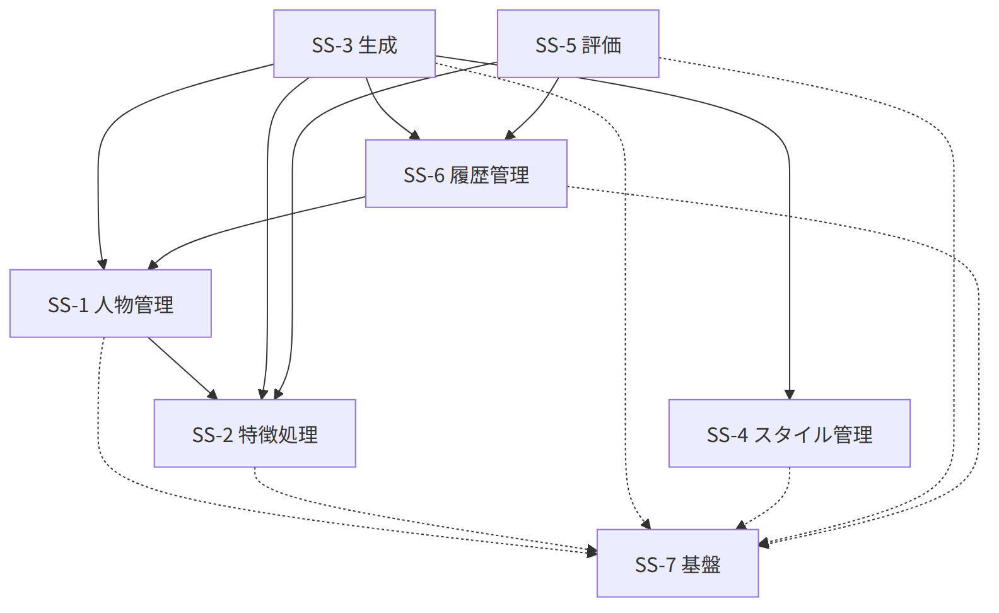

*図2-1　サブシステム間の依存関係（実線：機能的依存、破線：基盤機能の利用）*

実線は機能的依存、破線は基盤機能の利用を示す。

依存関係に循環がないことを設計要件とする。特に、SS-1（人物管理）は他のサブシステムに依存しない構成とする。人物IDおよび同意情報は、生成・評価の可否にかかわらず独立して管理されなければならないためである。

---

## 2.3　全体アーキテクチャ

### 2.3.1　層構成

システムを次の四層で構成する。

| 層 | 責務 | 含まれる要素 |
|---|---|---|
| 提示層 | 利用者との対話 | 管理画面、制作画面、評価画面 |
| API層 | 外部インタフェース | 第14章に定めるAPI |
| 業務層 | 業務ロジック | SS-1〜SS-6 |
| データ層 | 永続化 | 第13章に定めるデータ |

### 2.3.2　アーキテクチャ概要

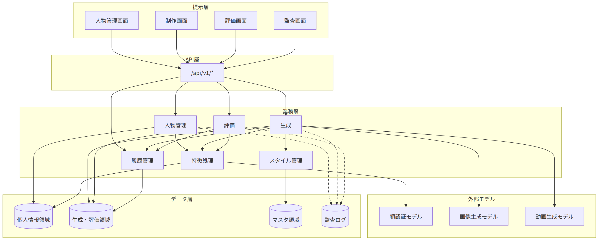

*図2-2　全体アーキテクチャ概要（提示層／API層／業務層／外部モデル／データ層）*

### 2.3.3　データ領域の分離

データ層は、保護水準に応じて四領域に分離する（15.2）。

| 領域 | 格納データ | 保護水準 |
|---|---|---|
| 個人情報領域 | 登録画像、基準画像、特徴ベクトル、同意情報 | 最高 |
| 生成・評価領域 | 生成履歴、生成結果、評価結果 | 高 |
| マスタ領域 | スタイルプロファイル、テンプレート、モデル情報 | 中 |
| 監査ログ領域 | 全操作の記録 | 高（追記専用） |

個人情報領域への参照は、登録担当者以上の権限に限定する（7.7）。生成サブシステムは、必要な特徴データを取得するために本領域へ参照するが、原画像への直接参照は行わない構成とすることが望ましい。

### 2.3.4　設計上の分離原則

本システムのアーキテクチャは、次の三つの分離原則に立脚する。

**第一：アイデンティティと表現の分離**

第5章のモデルを、システム構成に反映する。属性・スタイル・シーンは構造化データとして個別に保持し、単一の自由記述に統合しない（5.2.5）。

**第二：モデルとデータの分離**

特徴ベクトルはモデル依存の一時的表現であり、アイデンティティの永続的な担い手は人物IDと基準画像である（5.1.4、10.8.3）。したがって、モデルが更新されてもデータ層の中核は影響を受けない構成とする。

**第三：実行と記録の分離**

生成の実行（SS-3）と、条件・結果の記録（SS-6）を分離する。生成処理が失敗した場合でも、条件と失敗の事実は記録される。記録を実行処理の副作用としない。

### 2.3.5　外部モデルの抽象化

外部モデルは、次の抽象化されたインタフェースを通じて利用する。

| インタフェース | 責務 |
|---|---|
| 特徴抽出 | 正規化済み顔画像 → 特徴ベクトル |
| 類似度算出 | 特徴ベクトル×2 → スコア |
| 画像生成 | 生成条件 → 画像 |
| 動画生成 | 生成条件 → フレーム系列 |

本システムの業務層は、これらのインタフェースのみに依存する。具体的なモデルの実装・API形式の差異は、アダプタにより吸収する。

この構成により、モデル更新時の影響範囲をアダプタに限定し、業務層の改修を不要とする。

---

## 2.4　データフロー

### 2.4.1　主要フロー一覧

| ID | フロー | 契機 | 参照 |
|---|---|---|---|
| F1 | 人物登録 | 登録依頼 | 16.2.1 |
| F2 | 画像生成 | 生成要求 | 8.2 |
| F3 | 評価 | 生成完了 | 11.2 |
| F4 | 再現生成 | 再現要求 | 10.4.3 |
| F5 | モデル更新 | モデル更新の決定 | 16.4.1 |
| F6 | 削除 | 削除要求・同意撤回 | 7.6、15.3.3 |

### 2.4.2　F1：人物登録フロー

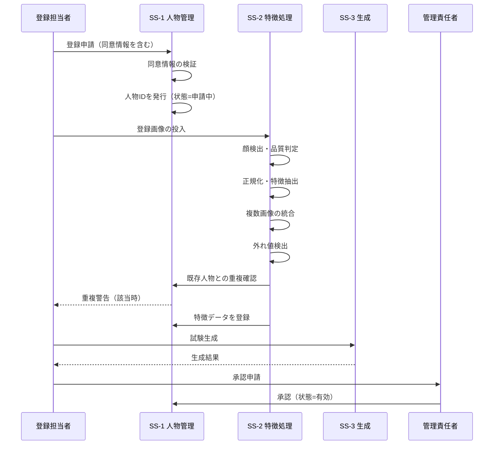
```mermaid
sequenceDiagram
    participant U as 登録担当者
    participant S1 as SS-1 人物管理
    participant S2 as SS-2 特徴処理
    participant S3 as SS-3 生成
    participant R as 管理責任者

    U->>S1: 登録申請（同意情報を含む）
    S1->>S1: 同意情報の検証
    S1->>S1: 人物IDを発行（状態=申請中）
    U->>S2: 登録画像の投入
    S2->>S2: 顔検出・品質判定
    S2->>S2: 正規化・特徴抽出
    S2->>S2: 複数画像の統合
    S2->>S2: 外れ値検出
    S2->>S1: 既存人物との重複確認
    S1-->>U: 重複警告（該当時）
    S2->>S1: 特徴データを登録
    U->>S3: 試験生成
    S3-->>U: 生成結果
    U->>R: 承認申請
    R->>S1: 承認（状態=有効）
```

*図2-3　F1：人物登録フロー*

同意情報の検証を最初に行うのは、同意なき登録を構造的に排除するためである（FR-06、OR-01）。

### 2.4.3　F2：画像生成フロー

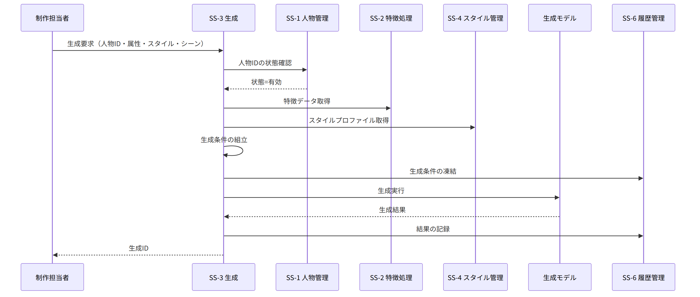

*図2-4　F2：画像生成フロー*

人物IDの状態確認を生成実行前に行い、「有効」以外の場合は実行しない（8.2 第2段階）。同意撤回後の生成を防止するための措置である。

生成条件の凍結を実行前に行うのは、生成が失敗した場合でも条件が記録されるようにするためである（2.3.4 第三原則）。

### 2.4.4　F3：評価フロー

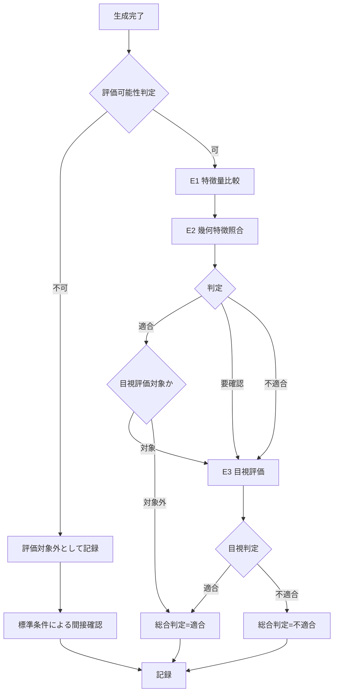
```mermaid
flowchart TD
    A[生成完了] --> B{評価可能性判定}
    B -->|不可| C[評価対象外として記録]
    B -->|可| D[E1 特徴量比較]
    D --> E[E2 幾何特徴照合]
    E --> F{判定}
    F -->|適合| G{目視評価対象か}
    F -->|要確認| H[E3 目視評価]
    F -->|不適合| H
    G -->|対象| H
    G -->|対象外| I[総合判定=適合]
    H --> J{目視判定}
    J -->|適合| I
    J -->|不適合| K[総合判定=不適合]
    C --> L[標準条件による間接確認]
    I --> M[記録]
    K --> M
    L --> M
```

*図2-5　F3：評価フロー*

評価可能性の判定を最初に行い、条件を満たさない場合は「評価対象外」とする。適合・不適合のいずれとも扱わない点が要点である（11.6.2）。

### 2.4.5　F4：再現生成フロー

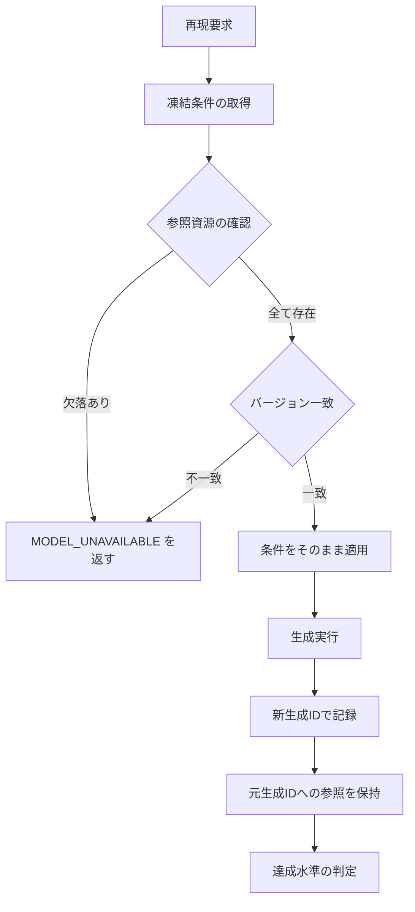
```mermaid
flowchart TD
    A[再現要求] --> B[凍結条件の取得]
    B --> C{参照資源の確認}
    C -->|欠落あり| D[MODEL_UNAVAILABLE を返す]
    C -->|全て存在| E{バージョン一致}
    E -->|不一致| D
    E -->|一致| F[条件をそのまま適用]
    F --> G[生成実行]
    G --> H[新生成IDで記録]
    H --> I[元生成IDへの参照を保持]
    I --> J[達成水準の判定]
```

*図2-6　F4：再現生成フロー*

代替バージョンによる自動実行を行わない点が要点である。条件が異なればそれは再現ではない（10.4.3）。

### 2.4.6　F5：モデル更新フロー

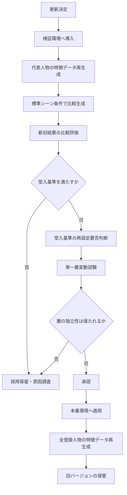
```mermaid
flowchart TD
    A[更新決定] --> B[検証環境へ導入]
    B --> C[代表人物の特徴データ再生成]
    C --> D[標準シーン条件で比較生成]
    D --> E[新旧結果の比較評価]
    E --> F{受入基準を満たすか}
    F -->|否| G[採用保留・原因調査]
    F -->|可| H[受入基準の再設定要否判断]
    H --> I[単一層変動試験]
    I --> J{層の独立性は保たれるか}
    J -->|否| G
    J -->|可| K[承認]
    K --> L[本番環境へ適用]
    L --> M[全登録人物の特徴データ再生成]
    M --> N[旧バージョンの保管]
```

*図2-7　F5：モデル更新フロー*

第8段階の単一層変動試験（5.7.2）を含めるのは、モデル更新により層の独立性が損なわれる可能性があるためである。同一性が保たれていても、干渉が生じていれば不合格とする。

### 2.4.7　F6：削除フロー

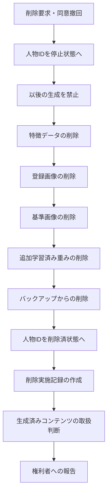
```mermaid
flowchart TD
    A[削除要求・同意撤回] --> B[人物IDを停止状態へ]
    B --> C[以後の生成を禁止]
    C --> D[特徴データの削除]
    D --> E[登録画像の削除]
    E --> F[基準画像の削除]
    F --> G[追加学習済み重みの削除]
    G --> H[バックアップからの削除]
    H --> I[人物IDを削除済状態へ]
    I --> J[削除実施記録の作成]
    J --> K[生成済みコンテンツの取扱判断]
    K --> L[権利者への報告]
```

*図2-8　F6：削除フロー*

第7段階（追加学習済み重みの削除）および第8段階（バックアップからの削除）は、いずれも削除処理から漏れやすい対象である（8.3.2、16.5.2）。フローに明示的に含める。

### 2.4.8　個人情報の境界

データフローにおいて、個人情報が境界を越える箇所を次に示す。

| 境界 | 越える情報 | 制御 |
|---|---|---|
| 利用者 → システム | 登録画像 | 同意確認済みであること |
| SS-2 → SS-3 | 特徴データ | 権限確認、監査ログ記録 |
| SS-3 → 外部モデル | 特徴データ、参照画像 | 外部送信の可否を運用方針で定める |
| システム → 利用者 | 生成結果 | 権限確認 |
| システム → バックアップ | 全個人情報 | 暗号化 |

第3の境界は、外部のクラウドサービス上で動作する生成モデルを利用する場合に問題となる。人物の特徴データを社外へ送信することの可否は、同意取得時の利用範囲および社内規程により判断する。この判断は本仕様書では行わず、運用方針に委ねる。

---

## 2.5　システムライフサイクル

### 2.5.1　四つのライフサイクル

本システムには、時間スケールの異なる四つのライフサイクルが並行して存在する。

| ライフサイクル | 対象 | 典型的な期間 |
|---|---|---|
| LC-1 | 人物データ | 数年〜十数年 |
| LC-2 | 生成物 | 数か月〜数年 |
| LC-3 | モデル・重み | 数か月〜数年 |
| LC-4 | システム基盤 | 数年〜十年 |

**これらの期間が異なることが、本システムの設計上の核心である。**

最も長く存続するのは人物データ（LC-1）であり、最も短いのはモデル（LC-3）である。すなわち、人物データはモデルを何世代も跨いで存続する。

この非対称性から、次の設計方針が導かれる。

1. 人物データをモデルに依存させてはならない（NFR-06、5.1.4）。
2. モデル更新時に人物データを継承する仕組みが必須である（IDM-08、7.5）。
3. 長期の再現手段は、条件の保存ではなく結果の保存に移行する（10.8.2）。

### 2.5.2　LC-1：人物データのライフサイクル

```
登録申請 → 同意取得 → 特徴抽出 → 承認 → 有効
                                         ↓
                          ┌──────────────┼──────────────┐
                          ↓              ↓              ↓
                    特徴データ更新    一時停止      同意期限到来
                          ↓              ↓              ↓
                        有効           有効/失効       失効
                                                        ↓
                                                    削除処理
                                                        ↓
                                                     削除済
```

状態遷移の詳細は 7.2 に定める。

各段階における主要な作業を次に示す。

| 段階 | 作業 | 参照 |
|---|---|---|
| 登録 | 同意取得、画像収集、特徴抽出、試験生成、承認 | 16.2.1 |
| 運用 | 生成利用、定期的な同意期限確認 | 16.2.2 |
| 更新 | 画像追加、モデル更新に伴う再生成 | 7.4 |
| 終了 | 削除処理、記録の保持 | 7.6 |

### 2.5.3　LC-2：生成物のライフサイクル

```
生成 → 評価 → 承認 → 利用 → 保管 → 廃棄
         ↓
      不適合 → 分析用に保持 → 期間経過後消去
```

| 段階 | 内容 | 参照 |
|---|---|---|
| 生成 | 条件の凍結、実行 | 8.2 |
| 評価 | 同一性評価、コンテンツ品質評価 | 第11章 |
| 承認 | 品質管理担当者による受入判定 | 16.3.1 |
| 利用 | 公開・配布 | 16.1.2 |
| 保管 | 保持期間中の保存 | 13.6 |
| 廃棄 | 保持期間経過後の消去 | 13.6 |

不適合となった生成物も一定期間保持する。改善のための分析材料とするためである（8.8）。

### 2.5.4　LC-3：モデルのライフサイクル

```
評価 → 検証環境導入 → 比較評価 → 承認 → 本番適用 → 運用
                                                      ↓
                                              後継モデルの登場
                                                      ↓
                                            移行 → 保管 → 廃棄
```

重要なのは、**本番適用の終了がモデルの廃棄を意味しない**点である。過去条件の再現には旧モデルが必要となるため、一定期間は保管する（8.6、10.4.2）。

保管期間は、対応する生成履歴の保持期間と整合させる。

### 2.5.5　LC-4：システム基盤のライフサイクル

| 段階 | 内容 |
|---|---|
| 企画・設計 | 本仕様書に基づく設計 |
| 構築 | 実装、試験 |
| 受入 | 全水準の再現性検証、単一層変動試験 |
| 運用 | 通常運用、監視、監査 |
| 更新 | 機能追加、基盤更新 |
| 移行 | 後継システムへのデータ移行 |
| 廃止 | データの移行完了後に廃止 |

### 2.5.6　ライフサイクル間の関係

四つのライフサイクルの関係を、時間軸上で次に示す。

```
時間軸 ──────────────────────────────────────────────────>

LC-4 基盤    [────────────────────────────────────────]

LC-1 人物         [──────────────────────────────]
                  [────────────────────]
                          [──────────────────────────]

LC-3 モデル  [──v1──][──v2──][──v3──][──v4──][──v5──]

LC-2 生成物    [─][──][─][───][──][─][───][──][────]
```

この図が示すのは、次の事実である。

1. 人物データは複数世代のモデルを跨いで存続する。
2. 生成物は特定のモデル世代に紐づく。
3. 基盤は最も長く存続するが、それでも永続ではない。

したがって、**システム移行時（LC-4 の更新）に最優先で継承すべきは人物データ（LC-1）である**。生成条件や生成物は、可能な範囲で移行すればよい。人物IDと基準画像さえ継承されれば、新システムで当該人物を再び生成できる（10.8.3）。

### 2.5.7　移行時の要件

システム移行または大規模更新にあたり、次を必須とする。

| 対象 | 要件 |
|---|---|
| 人物ID | 完全に継承すること。再発行してはならない |
| 同意情報 | 完全に継承すること |
| 基準画像 | 完全に継承すること |
| 登録画像 | 完全に継承すること |
| 特徴データ | 新環境で再生成してよい |
| 生成履歴 | 継承すること（再現可能性は保証しない） |
| 生成物 | 継承すること |
| 監査ログ | 保持期間内のものを継承すること |

特徴データのみ「再生成してよい」としているのは、これがモデル依存の派生データにすぎないためである（5.1.4）。

---

## 補足：本章と他章の関係

| 章 | 本章との関係 |
|---|---|
| 第1章 | 1.2 適用範囲を、システム構成として具体化したものが 2.2 である |
| 第5章 | 5.0.3 の五層モデルを、2.3.4 でアーキテクチャへ反映している |
| 第7章 | 7.2 の状態遷移を、2.5.2 でライフサイクルとして再掲している |
| 第13章 | 13.2 のエンティティを、2.3.3 でデータ領域として整理している |
| 第14章 | 第14章のAPIが、2.3.1 のAPI層に対応する |
| 第16章 | 16.1 の役割を、2.1.3 で利用者として整理している |

---

---

# 第3章　用語および定義

## 3.1　用語一覧

本仕様書で使用する主要な用語を次に定める。本章の定義は、以降の全章および付録に対して優先的に適用する。

| 用語 | 定義 |
|---|---|
| 人物アイデンティティ | ある人物を他の人物と区別し、同一人物であると認識させる不変の特徴の総体。 |
| 人物属性 | 人物に付随する変更可能な特徴。髪型、髪色、服装、年齢表現など。 |
| 表現スタイル | 描画・生成の方法に関する情報。実写風、アニメ風、水彩画風など。 |
| シーン | 人物を取り巻く環境情報。背景、照明、季節、時間帯、カメラアングルなど。 |
| 人物ID | 人物アイデンティティを一意に識別するためにシステムが付与する識別子。 |
| 特徴ベクトル | 顔画像から抽出された数値表現。人物照合に用いる。 |
| 基準画像 | 人物登録時に採用され、以後の同一性評価の基準となる画像群。 |
| 生成条件 | 画像生成時に指定されるパラメータの総体。モデル、シード値、プロンプト等を含む。 |
| 人物同一性 | 生成結果が基準画像と同一人物であると判断できる状態。 |
| 人物同一性維持率 | 一連の生成結果のうち、人物同一性の受入基準を満たしたものの割合。 |
| 再現性 | 同一の人物IDおよび生成条件から、同等の結果を繰り返し得られる性質。 |
| 時間的一貫性 | 動画において、フレーム間で人物の特徴が不自然に変化しない性質。 |
| スタイル変換プロファイル | 特定の表現スタイルへ変換する際の標準パラメータ群を定義したもの。 |
| 生成履歴 | 生成の実行内容（入力条件・使用モデル・出力）を記録したもの。 |
| 権利者 | 対象人物本人、または対象人物の肖像に関する権利を管理する者。 |

## 3.2　人物アイデンティティ

### 3.2.1　定義

人物アイデンティティとは、ある人物を他の人物と区別し、表現形式が変化しても同一人物であると認識させる、不変の特徴の総体をいう。

### 3.2.2　構成要素

人物アイデンティティは、次の要素により構成する。

1. 顔の骨格構造（頭蓋形状に由来する輪郭・下顎線・頬骨の張り）
2. 目・鼻・口の相対配置および比率
3. 各パーツの形状的特徴（目の形、鼻梁の形状、口角の位置等）
4. 顔全体の縦横比および正中線に対する対称性
5. 上記から総合的に形成される「特徴的な印象」

### 3.2.3　人物アイデンティティに含まれないもの

次の要素は、変更可能な要素として人物アイデンティティに含めない。

- 表情
- 髪型および髪色
- 服装およびアクセサリー
- 化粧
- 照明条件による陰影
- 描画方法および画風

### 3.2.4　運用上の留意事項

第5項「特徴的な印象」は、他の要素に比べて客観的定量化が難しい。本仕様書では、これを数値のみで判定せず、第11章に定める目視評価と組み合わせて判断するものとする。

## 3.3　人物属性

### 3.3.1　定義

人物属性とは、対象人物に属する変更可能な特徴をいう。「何を描くか」に関わる要素であり、生成のたびに指定・変更してよい。

### 3.3.2　分類

| 分類 | 例 |
|---|---|
| 年齢表現 | 青年期、壮年期、老年期 |
| 頭髪 | 髪型、髪色、髪の長さ |
| 顔面付属 | ひげ、眉の形状、化粧 |
| 装着物 | 眼鏡、帽子、イヤリング、マスク |
| 服装 | 種類、色、素材感 |
| 表情 | 無表情、笑顔、驚き、怒り |

### 3.3.3　人物アイデンティティとの関係

人物属性の変更は、人物アイデンティティを変更してはならない。例えば髪型を変更した結果、顔の輪郭や目鼻の配置が変化する場合、それは属性変更ではなくアイデンティティの破壊とみなし、不合格として扱う。

## 3.4　表現スタイル

### 3.4.1　定義

表現スタイルとは、描画・生成の方法に関する情報をいう。「どう描くか」に関わる要素であり、人物属性とは独立して制御する。

### 3.4.2　人物属性との切り分け基準

両者は次の基準で切り分ける。

- 現実の当人に対して変更しうるもの（髪を切る、眼鏡をかける等）は**人物属性**とする。
- 現実の当人には変更しえず、描画・撮影の方法にのみ属するもの（線画にする、水彩で描く、モノクロで撮る等）は**表現スタイル**とする。

例：「ショートヘア」は人物属性であり、それを実写風で描くかアニメ塗りで描くかは表現スタイルである。同一の属性設定に対して複数のスタイルを適用できることを、システムの前提とする。

### 3.4.3　標準スタイル区分

第9章に定めるスタイル変換プロファイルにより管理する。

## 3.5　シーン

### 3.5.1　定義

シーンとは、人物を取り巻く環境情報をいう。人物そのものの特徴には属さない。

### 3.5.2　構成要素

- 背景（場所、屋内外、時代設定）
- 照明（光源の種類、方向、強度、色温度）
- カメラ（画角、距離、アングル、被写界深度）
- 時間（季節、時間帯、天候）
- 構図（人物の配置、画面比率）

### 3.5.3　留意事項

照明およびカメラアングルは、人物の見え方に強く影響し、極端な条件下では人物同一性の評価を困難にする。第11章の評価においては、シーン条件を評価結果の付帯情報として記録する。

## 3.6　人物ID

### 3.6.1　定義

人物ID とは、人物アイデンティティを一意に識別するためにシステムが付与する識別子をいう。

### 3.6.2　性質

人物IDは次の性質を持つ。

1. **一意性**：システム全体で重複しない。
2. **不変性**：一度付与された人物IDは、対象人物が同一である限り変更しない。
3. **継承性**：顔認証モデルまたは画像生成モデルが更新された場合も、人物IDは継承する。
4. **独立性**：人物IDは、特定の生成モデルや特徴抽出モデルに依存しない。

### 3.6.3　人物IDと特徴データの関係

人物IDは論理的な識別子であり、実際の特徴ベクトルは人物IDに紐づく別データとして管理する。モデル更新により特徴ベクトルを再生成した場合も、人物IDは変更せず、特徴データのバージョンのみを更新する。

詳細は第7章に定める。

---

# 第4章　要件定義

## 4.0　本章の構成

本章では、システムに対する要件を分類して定義する。各要件には識別子を付し、以降の設計・試験工程における追跡を可能とする。

要件は、性質の異なる六つの分類に分けて定める。分類ごとに節（4.1〜4.6）を設けるのは、単なる整理のためではなく、**各分類が異なる検証手段を要する**ためである。

| 節 | 分類 | 主な検証手段 |
|---|---|---|
| 4.1 | 業務要件（BR） | 業務上の合意・運用実績による確認 |
| 4.2 | 機能要件（FR） | 機能試験（付録E） |
| 4.3 | 非機能要件（NFR） | 構成確認・監査（15章） |
| 4.4 | 性能要件（PR） | 性能測定（別途「性能基準書」） |
| 4.5 | 品質要件（QR） | 第11章の評価方式 |
| 4.6 | 運用要件（OR） | 運用手順の整備状況確認（16章） |

六分類は独立した節として扱うが、同一の識別子体系（下表）と区分（必須／推奨／任意）を共通に用いることで、章全体としての一貫性を保つ。

要件識別子の体系は次のとおりとする。

| 接頭辞 | 分類 |
|---|---|
| BR | 業務要件（Business Requirement） |
| FR | 機能要件（Functional Requirement） |
| NFR | 非機能要件（Non-Functional Requirement） |
| PR | 性能要件（Performance Requirement） |
| QR | 品質要件（Quality Requirement） |
| OR | 運用要件（Operational Requirement） |

各要件には次の区分を付す。

- **必須**：本仕様に適合するために満たさなければならない。
- **推奨**：満たすことが望ましい。満たさない場合は理由を記録する。
- **任意**：実装は選択による。

## 4.1　業務要件

| ID | 要件 | 区分 |
|---|---|---|
| BR-01 | 特定人物について、担当者・生成時期が異なっても一貫した人物像を再現できること。 | 必須 |
| BR-02 | 一度登録した人物を、継続的に長期にわたり利用できること。 | 必須 |
| BR-03 | 複数の表現スタイルへ展開したコンテンツを、同一人物として運用できること。 | 必須 |
| BR-04 | 静止画で構築した人物資産を、動画生成にも適用できること。 | 必須 |
| BR-05 | 生成物について、いつ・誰が・どの条件で生成したかを事後に追跡できること。 | 必須 |
| BR-06 | 権利者の同意の範囲内でのみ人物情報を利用できること。 | 必須 |
| BR-07 | 生成技術の更新時に、既存の人物資産を移行できること。 | 必須 |

## 4.2　機能要件

### 4.2.1　人物登録機能

| ID | 要件 | 区分 |
|---|---|---|
| FR-01 | 複数枚の顔画像を入力として受け付けられること。 | 必須 |
| FR-02 | 入力画像から顔領域を検出できること。 | 必須 |
| FR-03 | 検出した顔から特徴ベクトルを抽出できること。 | 必須 |
| FR-04 | 複数画像の特徴を統合し、人物の代表特徴として保持できること。 | 必須 |
| FR-05 | 人物IDを発行し、特徴データと紐づけて登録できること。 | 必須 |
| FR-06 | 登録時に権利者の同意情報を必須項目として記録できること。 | 必須 |
| FR-07 | 登録画像の品質（解像度、顔サイズ、ぶれ、遮蔽）を判定し、基準を満たさない画像を却下できること。 | 必須 |

### 4.2.2　人物管理機能

| ID | 要件 | 区分 |
|---|---|---|
| FR-08 | 登録済み人物の一覧を参照できること。 | 必須 |
| FR-09 | 人物の特徴データを追加登録により更新できること。 | 必須 |
| FR-10 | 特徴データの更新履歴をバージョンとして保持できること。 | 必須 |
| FR-11 | 人物IDを維持したまま特徴データを再生成できること。 | 必須 |
| FR-12 | 人物の利用停止（失効）および削除ができること。 | 必須 |
| FR-13 | 削除時に、関連する特徴データ・原画像を確実に消去できること。 | 必須 |

### 4.2.3　生成機能

| ID | 要件 | 区分 |
|---|---|---|
| FR-14 | 人物IDを指定して画像を生成できること。 | 必須 |
| FR-15 | 人物属性を指定できること。 | 必須 |
| FR-16 | 表現スタイルを指定できること。 | 必須 |
| FR-17 | シーンを指定できること。 | 必須 |
| FR-18 | 人物属性・表現スタイル・シーンを相互に独立して指定できること。 | 必須 |
| FR-19 | 生成条件（モデル、シード値、プロンプト等）を明示的に指定できること。 | 必須 |
| FR-20 | 過去の生成条件を再指定し、同等の結果を再生成できること。 | 必須 |
| FR-21 | 生成結果と生成条件を対応付けて履歴として保存できること。 | 必須 |
| FR-22 | 複数枚を一括生成できること。 | 推奨 |

### 4.2.4　評価機能

| ID | 要件 | 区分 |
|---|---|---|
| FR-23 | 生成画像と基準画像の特徴量類似度を算出できること。 | 必須 |
| FR-24 | 算出結果を受入基準と照合し、合否を判定できること。 | 必須 |
| FR-25 | 目視評価の結果を記録できること。 | 必須 |
| FR-26 | 評価結果を人物ID・生成条件と対応付けて保存できること。 | 必須 |
| FR-27 | 人物同一性維持率を集計・出力できること。 | 推奨 |

### 4.2.5　動画関連機能

| ID | 要件 | 区分 |
|---|---|---|
| FR-28 | 人物IDを指定して動画を生成できること。 | 必須 |
| FR-29 | フレーム単位で人物同一性を評価できること。 | 必須 |
| FR-30 | 時間的一貫性を評価できること。 | 必須 |

詳細は第12章に定める。

## 4.3　非機能要件

| ID | 要件 | 区分 |
|---|---|---|
| NFR-01 | 人物情報および特徴データは、保存時に暗号化すること。 | 必須 |
| NFR-02 | 通信経路は暗号化すること。 | 必須 |
| NFR-03 | 機能単位で権限を制御できること。 | 必須 |
| NFR-04 | 人物情報への全アクセスを監査ログとして記録すること。 | 必須 |
| NFR-05 | 顔認証モデル・生成モデルを差し替え可能な構成とすること。 | 必須 |
| NFR-06 | 特定ベンダーの製品に依存しないデータ形式で特徴データを保持すること。 | 推奨 |
| NFR-07 | 生成処理と管理機能を分離し、片方の障害が他方に波及しない構成とすること。 | 推奨 |
| NFR-08 | 生成物に来歴情報を付与できること。 | 推奨 |

## 4.4　性能要件

性能目標値は、採用するモデル構成および実行環境に依存する。本仕様書では測定項目のみを定め、具体値は実証試験を経て別途「性能基準書」に定めるものとする。

| ID | 測定項目 | 区分 |
|---|---|---|
| PR-01 | 人物登録処理時間（画像入力から人物ID発行まで） | 必須 |
| PR-02 | 静止画1枚あたりの生成時間 | 必須 |
| PR-03 | 同一性評価1件あたりの処理時間 | 必須 |
| PR-04 | 同時実行可能な生成ジョブ数 | 必須 |
| PR-05 | 登録可能な人物数の上限 | 必須 |
| PR-06 | 動画生成における1秒あたりの処理時間 | 必須 |

## 4.5　品質要件

| ID | 要件 | 区分 |
|---|---|---|
| QR-01 | 標準スタイル区分において、人物同一性の受入基準を満たすこと。 | 必須 |
| QR-02 | 同一の人物IDおよび生成条件による再生成において、結果の同等性が保たれること。 | 必須 |
| QR-03 | 表現スタイル変更によって人物アイデンティティが変化しないこと。 | 必須 |
| QR-04 | 人物属性変更によって人物アイデンティティが変化しないこと。 | 必須 |
| QR-05 | 動画において、フレーム間で人物特徴が不自然に変化しないこと。 | 必須 |
| QR-06 | 評価は、特徴量比較と目視評価の双方により行うこと。 | 必須 |
| QR-07 | 受入基準を満たさない生成物を、承認済みコンテンツとして流通させないこと。 | 必須 |

受入基準の具体値（類似度しきい値等）は、採用する顔認証モデルおよび用途ごとに実証試験により定め、第11章に定める評価基準書に記載する。単一の固定値を全スタイルに一律適用することは適切でないため、スタイル区分ごとに基準を設定する。

## 4.6　運用要件

| ID | 要件 | 区分 |
|---|---|---|
| OR-01 | 人物登録は、権利者の同意確認を経た上でのみ実施すること。 | 必須 |
| OR-02 | 同意の有効期限を管理し、期限到来時に利用を停止できること。 | 必須 |
| OR-03 | 権利者からの削除要求に対応する手順を定めること。 | 必須 |
| OR-04 | モデル更新時に、既存人物について再評価を実施すること。 | 必須 |
| OR-05 | 人物データおよび生成履歴を定期的にバックアップすること。 | 必須 |
| OR-06 | 運用担当者に対する教育を実施すること。 | 必須 |
| OR-07 | 定期的に監査を実施し、記録を保管すること。 | 推奨 |

---

---

# 第5章　人物アイデンティティモデル

## 5.0　本章の位置付け

### 5.0.1　本章の目的

本章は、本仕様書の中核となる設計モデル、すなわち「人物アイデンティティと表現を分離して管理する」という思想を、システムが実装可能な構造として定義することを目的とする。

第3章が個々の用語を定義したのに対し、本章は**それらの相互関係と制御規則**を定める。また第11章が「維持できたかをどう測るか」を定めるのに対し、本章は「何を維持すべきか」を定める。

本章で定義するモデルは、静止画・動画・将来の三次元表現を通じて共通に適用する（1.2.6 将来拡張）。したがって本章の記述は、特定の生成技術に依存しない抽象度で行う。

### 5.0.2　なぜ階層化するのか

人物を単一の不可分な対象として扱うと、次の問題が生じる。

1. 髪型を変えたい、という指示が顔立ちまで変えてしまう。
2. アニメ風にしたい、という指示が別人を生んでしまう。
3. 生成結果が期待と異なったとき、どの指定が原因かを切り分けられない。
4. 生成技術が変わったとき、何を引き継ぐべきかが定まらない。

これらはいずれも、**変えてよいものと変えてはならないものが分離されていない**ことに起因する。

本モデルは、人物を構成する要素を性質に応じて層に分離し、層ごとに独立した制御対象とすることで、この問題を構造的に解決する。

### 5.0.3　モデルの全体構造

本モデルは、次の五層で構成する。

| 層 | 名称 | 性質 | 可変性 |
|---|---|---|---|
| 第1層 | アイデンティティレイヤー | その人物を他と区別する核 | 不変 |
| 第2層 | 属性レイヤー | 対象人物に属する特徴 | 可変 |
| 第3層 | スタイルレイヤー | 描画・生成の方法 | 可変 |
| 第4層 | シーンレイヤー | 人物を取り巻く環境 | 可変 |
| 第5層 | 時間レイヤー | 時間方向の変化と連続性 | 可変（動画のみ） |

第1層のみが不変であり、第2層以降はすべて可変である。この非対称性が本モデルの本質である。

第5層は、静止画では単一時点として退化し、実質的に第4層までのモデルと一致する。すなわち、静止画は動画の特殊な場合として扱う。

### 5.0.4　形式表現

生成されるコンテンツを次のように表現する。

```
C(t) = G( I , A(t) , S , Sc(t) , t )
```

| 記号 | 意味 |
|---|---|
| C(t) | 時刻 t におけるコンテンツ |
| G | 生成関数（画像生成モデルおよび生成条件） |
| I | アイデンティティ（第1層） |
| A(t) | 属性（第2層） |
| S | スタイル（第3層） |
| Sc(t) | シーン（第4層） |
| t | 時間（第5層） |

この表現において最も重要なのは、**I が t の関数ではない**という点である。すなわち、

```
∀t : I(t) = I
```

属性 A およびシーン Sc は時間の関数でありうる（動画中で表情が変わる、カメラが動く）が、アイデンティティ I は時間に対して定数である。

またスタイル S は、原則として一つの作品内で固定する（9.5、5.3.5）。

### 5.0.5　不変条件

本モデルは、次の不変条件を持つ。これらはシステム全体を通じて満たされなければならず、いずれかが破られた場合、その生成結果は不適合として扱う。

| ID | 不変条件 |
|---|---|
| IDM-01 | アイデンティティ層は、他のいかなる層の指定によっても変化しない。 |
| IDM-02 | 各層は、他層の値に依存せず独立して指定できる。 |
| IDM-03 | 層間で指定が競合する場合、上位層（数字の小さい層）を優先する。 |
| IDM-04 | 動画において、アイデンティティ層は時間に対して不変である。 |
| IDM-05 | 人物IDとアイデンティティ層は一対一に対応する。 |
| IDM-06 | スタイル層の指定は、属性層の値を変更してはならない。 |
| IDM-07 | シーン層の指定は、アイデンティティの識別可能性を損なってはならない。 |
| IDM-08 | 生成モデル・顔認証モデルが変更されても、アイデンティティ層は継承される。 |

IDM-01 は QR-03・QR-04 の、IDM-02 は FR-18 の、IDM-04 は QR-05 の、IDM-08 は BR-07 の、それぞれ設計上の根拠である。

---

## 5.1　アイデンティティレイヤー

### 5.1.1　定義

アイデンティティレイヤーとは、ある人物を他の人物と区別し、表現形式が変化しても同一人物であると認識させる、不変の特徴の総体を保持する層をいう（3.2）。

本モデルにおいて、本層は**唯一の不変層**であり、他のすべての層の基準となる。

### 5.1.2　構成要素

| 分類 | 要素 | 性質 |
|---|---|---|
| 骨格的特徴 | 頭蓋形状に由来する輪郭、下顎線、頬骨の張り、額の傾斜 | 幾何的・定量可能 |
| 配置的特徴 | 目・鼻・口の相対位置、両眼間距離と顔幅の比、目から鼻・鼻から口の距離比 | 幾何的・定量可能 |
| 形状的特徴 | 目の形状、鼻梁の形状、口角の位置、耳の形状 | 半定量的 |
| 全体的特徴 | 顔の縦横比、正中線に対する対称性 | 幾何的・定量可能 |
| 固有標識 | ほくろ、傷、生来の非対称性 | 離散的・強い識別力 |
| 印象的特徴 | 上記から総合的に形成される「その人らしさ」 | 定量困難 |

### 5.1.3　定量可能性による区分

構成要素は、扱いやすさの観点から次の三区分に分けられる。この区分は第11章の評価方式の選択に直結する。

| 区分 | 該当要素 | 評価手段 |
|---|---|---|
| 幾何的に定量可能 | 骨格的・配置的・全体的特徴 | ランドマーク座標による幾何比較 |
| 統計的に定量可能 | 形状的特徴を含む顔全体 | 特徴ベクトル比較 |
| 定量困難 | 印象的特徴 | 目視評価 |

「印象的特徴」を定量困難としながらモデルに含めるのは、これが実務上の判断を左右する要素だからである。数値上は基準を満たしていても「何か違う」と感じられる生成物は、承認すべきではない。本仕様書が特徴量比較を単独の判定手段としない理由（QR-06、6.9）は、この要素の存在にある。

### 5.1.4　システム上の表現

アイデンティティ層は、システム上で次のデータとして具体化される。

| 表現 | 実体 | 参照 |
|---|---|---|
| 論理的識別子 | 人物ID | 3.6、第7章 |
| 統計的表現 | 特徴ベクトル（モデル依存） | 6.6、13.3.3 |
| 幾何的表現 | 顔ランドマーク座標 | 6.5.2 |
| 視覚的表現 | 基準画像 | 7.1.2 |

これら四つは、同一のアイデンティティに対する異なる表現である。いずれか一つが失われても、他から復元または再生成できる構成とする。

特に、特徴ベクトルはモデルに依存する一時的な表現にすぎない（6.6.2）。モデルが変われば作り直されるものであり、アイデンティティそのものではない。**アイデンティティの永続的な担い手は人物IDと基準画像である。**

### 5.1.5　不変性の意味

本層が「不変」であるとは、次を意味する。

1. 属性・スタイル・シーン・時間のいかなる指定によっても変化しない（IDM-01）。
2. 生成モデルの更新によって変化しない（IDM-08）。
3. 生成の実行者・実行時期によって変化しない（BR-01）。

一方、次は不変性の例外ではない。

- 対象人物の経年変化に伴う特徴データの更新（7.4.1）— これは同一人物の同一アイデンティティに対する、表現の更新である。
- 顔認証モデル更新に伴う特徴ベクトルの再生成 — 同上。

いずれも人物IDは維持され、アイデンティティそのものは継承される。

### 5.1.6　表現不能領域

すべてのスタイルが、アイデンティティの全構成要素を表現できるわけではない。

例えば線画中心の漫画風表現では、頬骨の張りや肌の階調に由来する情報が失われる。この場合、アイデンティティの一部は**そのスタイルにおいて表現不能**である。

本モデルは、この事実を欠陥ではなく前提として扱う。対応として、各スタイルプロファイルは「そのスタイルにおいて必ず維持すべき最小識別特徴」を定義する（9.4.3）。表現不能領域が存在しても、最小識別特徴が保持されていれば、当該スタイルにおける同一性は達成されたものとする。

---

## 5.2　属性レイヤー

### 5.2.1　定義

属性レイヤーとは、対象人物に属する変更可能な特徴を保持する層をいう（3.3）。「何を描くか」に関わる要素であり、現実の当人に対しても変更しうるものが該当する。

### 5.2.2　構成要素と管理項目

| 分類 | 項目 | 値の例 |
|---|---|---|
| 年齢表現 | 年代 | 20代／30代／40代／50代以上 |
| 頭髪 | 髪型、髪色、長さ | ショート／黒／肩まで |
| 顔面付属 | ひげ、眉形状、化粧 | 無精ひげ／整眉／ナチュラル |
| 装着物 | 眼鏡、帽子、装身具、マスク | 黒縁眼鏡／なし |
| 服装 | 種類、色、素材 | スーツ／紺／ウール |
| 表情 | 表情種別、強度 | 微笑／弱 |
| 姿勢 | ポーズ、体の向き | 直立／正面 |

各項目は独立して指定でき、指定しない項目には既定値を適用する。既定値は人物ごとに設定できる（例：常に眼鏡を着用する人物）。

### 5.2.3　属性とアイデンティティの境界

属性層で最も慎重な扱いを要するのは、**アイデンティティに接近する属性**である。

| 属性 | 影響 | 扱い |
|---|---|---|
| 表情 | 顔の一時的な変形を伴う | 通常の可変属性として扱う |
| 髪型 | 顔の輪郭の見え方に影響 | 通常の可変属性として扱う |
| 年齢表現 | 大幅な変更は骨格的印象を変える | 許容範囲を設定する |
| 体格表現 | 顔の輪郭に直接影響する | 許容範囲を設定する |

年齢表現および体格表現については、変更幅が一定を超えるとアイデンティティ層の値と矛盾する。本モデルでは、これらを「**制限付き可変属性**」として区別し、次を定める。

1. 人物ごとに、変更を許容する範囲を登録時に定義する。
2. 範囲外の指定は警告を発し、実行には明示的な承認を要する。
3. 範囲外での生成結果は、通常より厳格な評価を適用する。

許容範囲の具体値は、人物および用途により異なるため、一律には定めない。

### 5.2.4　属性の時間依存性

属性は時間の関数でありうる（`A(t)`）。動画において、表情や姿勢は時間とともに変化する。

一方、同一シーン内で不連続に変化してはならない属性がある。

| 属性 | 同一シーン内での変化 |
|---|---|
| 表情、姿勢 | 連続的な変化を許容 |
| 髪型、髪色 | 原則として不変 |
| 服装 | 原則として不変 |
| 装着物 | 演出上の必然性がある場合を除き不変 |
| 年齢表現 | 不変（時間経過の演出を除く） |

詳細は 5.5.4 に定める。

### 5.2.5　システム上の表現

属性層は、生成条件のうち `attributes` として表現する（14.4.1）。構造化データとして保持し、自由記述と区別する。

構造化して保持する理由は次のとおりである。

1. 属性のみを変更した比較生成が可能になる（5.7.2）。
2. スタイル指定への属性の混入を検出できる（5.6.2）。
3. 過去の生成条件から属性のみを差し替えた再生成が可能になる。

---

## 5.3　スタイルレイヤー

### 5.3.1　定義

スタイルレイヤーとは、描画・生成の方法に関する情報を保持する層をいう（3.4）。「どう描くか」に関わる要素であり、現実の当人には変更しえないものが該当する。

### 5.3.2　属性層との切り分け

両層の切り分けは、次の判定により行う（3.4.2）。

```
その要素は、現実の当人に対して変更できるか？
  ├─ できる  → 属性レイヤー（第2層）
  └─ できない → スタイルレイヤー（第3層）
```

判定例：

| 要素 | 判定 | 層 |
|---|---|---|
| 髪を短くする | 当人に対して可能 | 属性 |
| 眼鏡をかける | 当人に対して可能 | 属性 |
| 線画で描く | 当人に対して不可能 | スタイル |
| 水彩の質感を与える | 当人に対して不可能 | スタイル |
| モノクロにする | 当人に対して不可能（撮影方法） | スタイル |
| フィルム粒子を加える | 当人に対して不可能 | スタイル |

### 5.3.3　構成要素

| 分類 | 要素 |
|---|---|
| 描画方式 | 写実／線画／セル塗り／筆致 |
| 色彩表現 | 彩度、色調、モノクロ、退色 |
| 質感 | 粒状感、筆跡、紙質、フィルム質感 |
| 輪郭表現 | 輪郭線の有無、太さ、強調 |
| 陰影表現 | 階調の連続性、段階数 |
| 時代的様式 | 昭和映画風、レトロ印刷風 |

### 5.3.4　スタイル層の制約

スタイル層には、他層にはない制約を課す。

| 制約 | 内容 | 根拠 |
|---|---|---|
| 属性不干渉 | 属性層の値を変更する指定を含んではならない | IDM-06 |
| 形状不干渉 | 顔の形状・比率を変更する指定を含んではならない | IDM-01 |
| プロファイル化 | 自由記述ではなく、承認済みプロファイルとして管理する | 9.2 |

第2の制約は特に重要である。スタイル指定に顔立ちへ影響する語（顔の形に関する形容など）が含まれると、スタイル変更が意図せずアイデンティティ変更を引き起こす（8.5.2）。

### 5.3.5　スタイルの時間非依存性

スタイル層は、原則として時間の関数としない（`S(t) = S`）。

一つの作品内でスタイルが変化すると、視聴者は別作品の断片が混入したと認識する。したがって動画においては、全フレームを通じて同一のスタイルプロファイルを適用する（QR-05、9.5）。

演出上、意図的にスタイルを切り替える場合（回想シーンをモノクロにする等）は、これを例外として扱い、切り替え点および切り替え前後のプロファイルを生成条件に明記する。

### 5.3.6　スタイルとアイデンティティの緊張関係

スタイル層の可変幅を大きくするほど表現の自由度は増すが、アイデンティティの維持は困難になる。これは原理的なトレードオフであり、システムの改良では解消できない（9.4.1）。

本モデルはこのトレードオフを次のように扱う。

1. スタイルごとに達成可能な同一性の水準が異なることを前提とする。
2. 一律の受入基準を設けず、スタイルごとに基準を定める（9.2.2）。
3. 達成困難なスタイルについては、その旨を明記し、無理な基準を設定しない（9.4.2）。

---

## 5.4　シーンレイヤー

### 5.4.1　定義

シーンレイヤーとは、人物を取り巻く環境情報を保持する層をいう（3.5）。人物そのものの特徴には属さない。

### 5.4.2　構成要素

| 分類 | 要素 |
|---|---|
| 背景 | 場所、屋内外、時代設定、背景の情報量 |
| 照明 | 光源種別、方向、強度、色温度、コントラスト |
| カメラ | 画角、距離、アングル、被写界深度、ショットサイズ |
| 時間設定 | 季節、時間帯、天候 |
| 構図 | 人物配置、画面比率、余白 |

### 5.4.3　シーンによる識別可能性への影響

シーン層は人物の特徴を変更しないが、**人物の見え方**には強く影響する。

| シーン条件 | 影響 |
|---|---|
| 強い側面光 | 顔の片側が陰に入り、配置的特徴が判別困難になる |
| 極端な逆光 | 顔全体が暗部となり、特徴の大部分が失われる |
| 極端な仰角・俯角 | 顔の比率が透視により変化して見える |
| 遠景ショット | 顔領域の画素数が不足する |
| 強い被写界深度効果 | 顔がぼけ、輪郭が失われる |

これらは、アイデンティティが変化したのではなく、**アイデンティティが観測できない**状態である。両者は明確に区別しなければならない。

### 5.4.4　識別可能性の確保

IDM-07 に基づき、次を定める。

1. シーン指定は、評価に必要な最低限の識別可能性を確保する範囲で行う。
2. 識別可能性を損なうシーン条件下で生成する場合、その旨を生成条件に記録する。
3. 当該条件下の生成結果については、特徴量比較の結果を判定根拠としない。
4. 代わりに、同一の人物ID・属性・スタイルで標準シーン条件により生成した結果を用いて、間接的に同一性を確認する。

第4項は、演出上どうしても逆光や遠景が必要な場合の運用手段である。標準条件下で同一性が確認できていれば、同一の条件から派生した逆光ショットも同一人物であるとみなす。

### 5.4.5　標準シーン条件

評価の基準となる標準シーン条件を、次のとおり定める。

| 項目 | 標準条件 |
|---|---|
| 背景 | 無地または情報量の少ない背景 |
| 照明 | 正面からの均一な軟光 |
| カメラ角度 | アイレベル、正面 |
| ショットサイズ | バストショット |
| 被写界深度 | 顔全体が合焦する範囲 |

新規人物の登録時試験生成（16.2.1 第8項）、モデル更新時の比較評価（16.4.1 第4項）、スタイルプロファイルの評価（9.6 第3項）は、いずれもこの標準シーン条件で実施する。条件を統一しなければ比較が成立しないためである。

---

## 5.5　時間レイヤー

### 5.5.1　定義

時間レイヤーとは、動画コンテンツにおける時間方向の変化と連続性を規定する層をいう。

静止画では本層は単一時点に退化し、実質的に存在しない。動画において初めて意味を持つ層である。

### 5.5.2　本層が扱う対象

時間レイヤーは、それ自体が独立した内容を持つのではなく、**他の四層が時間方向にどう振る舞うか**を規定する。

| 層 | 時間方向の振る舞い |
|---|---|
| アイデンティティ | 不変（IDM-04） |
| 属性 | 連続的変化を許容（制約あり） |
| スタイル | 不変（例外は明示） |
| シーン | 連続的変化を許容 |

### 5.5.3　一貫性の四要件

動画において満たすべき一貫性を、次の四つに分解する。

| 要件 | 内容 | 対象層 |
|---|---|---|
| 同一性の一貫性 | すべてのフレームで同一人物であること | 第1層 |
| 時間的一貫性 | フレーム間で顔の特徴が不自然に変化しないこと | 第1層 |
| 動作の一貫性 | その人物らしい動きが保たれること | 第1層・第2層 |
| 表現の一貫性 | 全編を通じてスタイルが変化しないこと | 第3層 |

第1と第2の違いは重要である。各フレームが個別には同一人物と判定されても、フレーム間で微小な揺らぎが連続すると、人は違和感を覚える。前者はフレーム単位の評価であり、後者はフレーム系列の評価である。

### 5.5.4　属性の時間方向の制約

属性は時間とともに変化しうるが、次の制約を課す。

| 属性区分 | 制約 |
|---|---|
| 連続変化属性（表情、姿勢） | 隣接フレーム間で不連続に変化しないこと |
| 固定属性（髪型、髪色、服装、装着物） | 同一シーン内で変化しないこと |
| 制限付き可変属性（年齢表現、体格表現） | 同一作品内で変化しないこと（時間経過の演出を除く） |

固定属性のフレーム間変動（服の色が揺らぐ、眼鏡が消える等）は、アイデンティティの変化ではないが、視聴者に強い違和感を与える。これも不適合として扱う。

### 5.5.5　動作の一貫性

「その人物らしい動き」は、外見的特徴とは別種の識別情報である。歩き方、うなずき方、視線の動かし方、笑い方などが該当する。

本仕様書の初版では、動作の一貫性を**定性的要件**として定義するにとどめ、定量的な評価方式は定めない。理由は次のとおりである。

1. 動作特徴を数値化する確立した手法が、顔の特徴量ほど成熟していない。
2. 登録時に動作情報を取得する運用が、静止画中心の現行フローに含まれていない。
3. 用途によって、動作の再現が必要かどうかが大きく異なる。

将来的に動作情報を人物IDに紐づけて管理する場合は、アイデンティティ層の拡張として扱い、本章の改訂により定義する。派生仕様書「動画生成編」における検討事項とする（1.2.6）。

### 5.5.6　時間方向のドリフト

動画生成において最も頻出する不具合が、**時間方向のドリフト**である。すなわち、フレームが進むにつれて人物の特徴が少しずつ変化し、冒頭と終盤で別人になる現象をいう。

ドリフトは、隣接フレーム間では検知されにくい。フレーム間の差分が小さくとも、それが一方向に蓄積すると全体では大きな変化となるためである。

したがって時間的一貫性の評価は、隣接フレーム間の比較だけでなく、**基準画像に対する各フレームの評価**および**冒頭フレームと終盤フレームの直接比較**を併せて行う。詳細は第12章に定める。

---

## 5.6　レイヤー間の干渉と制御

> 本節は正式目次に存在しない新規節である。

### 5.6.1　干渉とは

本モデルは各層の独立性を原則とする（IDM-02）が、実際の生成処理においては層間の干渉が発生する。干渉とは、ある層への指定が、他層の値を意図せず変化させる現象をいう。

干渉は本モデルにおける主要な不具合要因であり、あらかじめ類型化して対策を定める。

### 5.6.2　干渉の類型

| 類型 | 内容 | 影響 | 検知 |
|---|---|---|---|
| 干渉A | スタイル指定がアイデンティティを変化させる | 別人化 | 特徴量比較・目視 |
| 干渉B | スタイル指定が属性を変化させる | 髪色・服装等の意図せぬ変化 | 属性の目視確認 |
| 干渉C | 属性指定がアイデンティティを変化させる | 年齢・体格変更に伴う別人化 | 特徴量比較・目視 |
| 干渉D | シーン指定が識別可能性を損なう | 評価不能 | 顔領域の品質判定 |
| 干渉E | 時間方向のドリフト | 動画内での別人化 | 系列評価 |

### 5.6.3　干渉Aへの対策

**原因**：スタイルプロファイルの記述に、顔の形状・比率へ影響する語が含まれている。

**対策**：

1. プロファイル作成時に、顔立ちに関する形容を含めない（8.5.2）。
2. プロファイル承認時、複数の代表人物による試験生成で確認する（9.6 第3項）。
3. 標準シーン条件下で、スタイルのみを変えた比較生成を行う（5.7.2）。

### 5.6.4　干渉Bへの対策

**原因**：スタイルプロファイルに、属性に相当する記述（髪色、服装等）が混入している。

**対策**：

1. プロファイルの構成項目を審査し、属性語を除去する（9.5 第2項）。
2. 属性を構造化データとして保持し、スタイル記述と混在させない（5.2.5）。
3. 同一属性指定で複数スタイルを生成し、属性が保たれているか確認する。

干渉Bは、アイデンティティが保たれているため特徴量比較では検知されない。属性の目視確認が唯一の検知手段である点に注意を要する。

### 5.6.5　干渉Cへの対策

**原因**：年齢表現・体格表現の変更幅が、アイデンティティと矛盾する水準に達している。

**対策**：

1. 制限付き可変属性として許容範囲を設定する（5.2.3）。
2. 範囲外指定に警告を発し、明示的承認を要求する。
3. 範囲外での生成結果に、厳格な評価を適用する。

### 5.6.6　干渉Dへの対策

**原因**：照明・アングル・距離が、顔の観測を妨げる条件になっている。

**対策**：

1. 標準シーン条件による間接確認を用いる（5.4.4）。
2. 顔領域の品質を判定し、評価可能性を事前に判断する。
3. 評価不能な条件下の結果を「評価対象外」として記録し、「適合」と混同しない。

### 5.6.7　干渉Eへの対策

**原因**：フレーム系列生成における特徴の累積的変化。

**対策**：

1. 基準画像に対する各フレームの評価を行う（5.5.6）。
2. 冒頭・終盤フレームの直接比較を行う。
3. 詳細は第12章に定める。

### 5.6.8　層の優先順位

干渉が回避できず、層間で指定が競合する場合、IDM-03 に基づき上位層を優先する。

```
アイデンティティ ＞ 属性 ＞ スタイル ＞ シーン
```

具体的には、次のように解決する。

| 競合 | 解決 |
|---|---|
| スタイルとアイデンティティ | スタイルの適用強度を下げる |
| 属性とアイデンティティ | 属性の変更幅を制限する |
| シーンとアイデンティティ | シーン条件を標準側へ寄せる |
| スタイルと属性 | スタイル記述から属性語を除去する |

いかなる場合も、アイデンティティを譲ってはならない。これが本仕様書全体を貫く原則である（1.5 設計理念）。

---

## 5.7　モデルの検証

> 本節は正式目次に存在しない新規節である。

### 5.7.1　検証の目的

本章で定義したモデルが実装上も成立していること、すなわち各層が実際に独立して制御できていることを確認する。

この検証は、システムの受入時、モデル更新時、およびスタイルプロファイル追加時に実施する。

### 5.7.2　単一層変動試験

**方法**：一つの層のみを変動させ、他の層を固定して生成し、変動させていない層が保たれているかを確認する。

| 試験 | 変動させる層 | 固定する層 | 確認事項 |
|---|---|---|---|
| T-1 | 属性 | I・S・Sc | アイデンティティが保たれること |
| T-2 | スタイル | I・A・Sc | アイデンティティと属性が保たれること |
| T-3 | シーン | I・A・S | アイデンティティが保たれること |
| T-4 | 時間（動画） | I・A・S・Sc | 全層が保たれること |

各試験において、変動させない層に変化が観測された場合、対応する干渉が発生している（5.6.2）。

### 5.7.3　試験条件

- 代表人物は複数名とし、異なる年齢・性別・顔立ちを含める。単一人物では特定の顔立ちに偏った検証となるためである（9.6 第3項）。
- シーン条件は、変動させる場合を除き標準シーン条件を用いる（5.4.5）。
- 各条件につき複数枚を生成し、単発の偶然による判断を避ける。

### 5.7.4　合否の判断

| 結果 | 判断 |
|---|---|
| 全試験で他層が保たれる | モデルは成立している |
| 特定のスタイルでのみ干渉Aが発生 | 当該プロファイルを修正する |
| 特定の属性値でのみ干渉Cが発生 | 当該属性の許容範囲を見直す |
| 広範に干渉が発生 | 生成条件の構成、または反映方式を見直す（8.3） |

最後の場合、個別のプロファイル修正では解決せず、システム構成そのものの見直しを要する。

### 5.7.5　継続的な確認

本モデルの成立は、一度確認すれば恒久的に保証されるものではない。モデルの更新、プロファイルの追加、プロンプトテンプレートの変更のいずれもが、層の独立性を損なう可能性を持つ。

したがって、これらの変更時には必ず単一層変動試験を実施する（16.4.1、9.6、8.5.3）。

---

## 補足：本章と他章の関係

| 章 | 本章との関係 |
|---|---|
| 第1章 | 本章は 1.5 設計理念を構造化したものである |
| 第3章 | 第3章が各層の用語を定義し、本章が相互関係を定義する |
| 第6章 | 6.5・6.6 がアイデンティティ層の取得手段を定める |
| 第7章 | 第7章がアイデンティティ層の永続化と管理を定める |
| 第8章 | 8.4・8.5 が本章の層構造を生成条件へ写像する |
| 第9章 | 第9章がスタイル層の実装仕様を定める |
| 第11章 | 第11章が本章の不変条件が満たされたかを測る方法を定める |
| 第12章 | 第12章が時間レイヤーの実装仕様を定める |

---

---

# 第6章　顔認証・人物認識仕様

## 6.1　本章の位置付け

本章は、人物アイデンティティを取得・照合するための要素技術に関する仕様を定める。

本システムにおいて顔認証は目的ではなく、人物アイデンティティを客観的に取り扱うための手段である。したがって本章では、認証精度そのものの追求ではなく、生成および評価に利用可能な形で人物特徴を取得・保持することを主眼とする。

なお、本仕様書は生体認証システムそのものの設計（1.2.5 適用対象外）を規定しない。本章が定めるのは、既存の顔認証技術をシステムへ組み込む際の要件および取り扱いである。

## 6.2　処理フロー

人物認識処理は次の順序で実行する。

1. 入力画像の受領および形式検証
2. 顔検出
3. 顔品質判定
4. 顔位置の正規化
5. 顔ランドマーク抽出
6. 特徴ベクトル生成
7. 複数画像からの特徴統合
8. 人物特徴データとしての登録

## 6.3　顔検出

### 6.3.1　要件

- 入力画像から顔領域を矩形として検出すること。
- 複数の顔が検出された場合の取り扱いを定めること。
- 検出信頼度を出力し、しきい値未満を却下できること。

### 6.3.2　複数顔検出時の扱い

登録処理においては、複数の顔が検出された画像は原則として却下する。やむを得ず使用する場合は、対象とする顔を明示的に指定し、その旨を登録履歴に記録する。これは、第三者の顔を誤って登録することを防止するための措置である（第15章参照）。

## 6.4　顔品質判定

登録用画像は、次の項目により品質を判定する。基準を満たさない画像は登録に使用しない。

| 項目 | 判定内容 |
|---|---|
| 解像度 | 顔領域が規定画素数以上であること |
| ぶれ | 画像の鮮鋭度が基準以上であること |
| 遮蔽 | 顔の主要部位が手・髪・マスク等で覆われていないこと |
| 顔向き | 規定角度範囲内であること |
| 露出 | 白飛び・黒つぶれが規定範囲内であること |
| 圧縮劣化 | 過度な圧縮ノイズがないこと |

具体的なしきい値は、採用する顔認証モデルの特性に応じて定め、「登録画像基準書」に記載する。

## 6.5　顔位置正規化およびランドマーク抽出

### 6.5.1　正規化

検出した顔について、両眼の位置を基準として回転・拡大縮小を行い、規定サイズへ正規化する。これにより、撮影条件の差異が特徴ベクトルへ与える影響を低減する。

### 6.5.2　ランドマーク抽出

顔の主要点（眼、鼻、口、輪郭等）の座標を抽出する。ランドマークは次の用途に使用する。

- 正規化の基準点
- 顔の比率・配置に関する幾何的特徴の算出
- 生成結果の構造的評価（第11章）

## 6.6　特徴ベクトル生成

### 6.6.1　要件

- 正規化済み顔画像から、固定長の数値ベクトルを生成すること。
- 生成に使用したモデル名およびバージョンを、ベクトルと不可分に記録すること。
- ベクトルの次元数・正規化方式をモデルごとに記録すること。

### 6.6.2　モデル依存性への対応

特徴ベクトルは、生成に用いたモデルに固有のものである。異なるモデルが生成したベクトル同士を直接比較してはならない。

そのため、特徴データは常に「人物ID＋モデル識別子＋モデルバージョン」の組で管理する。モデルを変更する場合は、原画像から特徴ベクトルを再生成する。

## 6.7　複数画像からの特徴統合

### 6.7.1　目的

単一画像から抽出した特徴は、その画像の撮影条件（角度、表情、照明）に偏る。人物アイデンティティを安定して表現するため、複数画像から統合した代表特徴を用いる。

### 6.7.2　登録画像の構成要件

登録には、次の条件を含む複数枚の画像を用いることを必須とする。

| 区分 | 内容 |
|---|---|
| 角度 | 正面、左斜め、右斜め |
| 表情 | 無表情、笑顔 |
| 照明 | 均一光、方向性のある光 |

推奨枚数および必須枚数は「登録画像基準書」に定める。

### 6.7.3　統合方式

複数の特徴ベクトルから代表特徴を算出する。算出にあたっては次を満たすこと。

- 統合方式（平均、加重平均、クラスタ中心等）を明示し、記録すること。
- 統合前の個別ベクトルも併せて保持すること。
- 他のベクトルから著しく乖離したベクトルを外れ値として検出し、警告できること。

外れ値が検出された場合、別人の画像が混入している可能性があるため、登録を保留し確認を行う。

## 6.8　類似度計算および判定

### 6.8.1　類似度計算

二つの特徴ベクトル間の類似度を算出する。算出方式（コサイン類似度、ユークリッド距離等）はモデルごとに定め、記録する。

### 6.8.2　判定

類似度を受入基準と照合し、次のいずれかに分類する。

| 判定 | 内容 |
|---|---|
| 適合 | 受入基準を満たす |
| 要確認 | 基準近傍であり、目視評価を要する |
| 不適合 | 受入基準を満たさない |

「要確認」の範囲を設けることにより、数値のみによる機械的判定を避け、目視評価と組み合わせた運用を可能とする。

### 6.8.3　基準値の取り扱い

類似度の受入基準は、次の理由により固定値を全用途に一律適用しない。

- 顔認証モデルごとにスコアの分布が異なる。
- 表現スタイルの隔たりが大きいほど、実写同士に比べてスコアが低下する。
- 用途により要求される厳格さが異なる。

基準値は、スタイル区分および用途ごとに実証試験を経て設定し、根拠とともに記録する。

## 6.9　適用上の限界

本章の技術には次の限界がある。仕様書利用者はこれを認識した上で運用すること。

1. 顔認証モデルは、非実写スタイル（アニメ、イラスト等）に対して学習されていない場合が多く、スタイル変換後の評価では信頼性が低下する。
2. 年齢表現を大きく変更した場合、同一人物であってもスコアが低下する。
3. 極端な照明・アングルは、同一人物でもスコアを低下させる。
4. スコアが高いことは、人が見て同一人物と感じることを保証しない。

これらの理由により、本仕様書では特徴量比較を単独の合否判定手段としない（QR-06）。

---

# 第7章　人物ID管理仕様

## 7.1　人物IDの体系

### 7.1.1　書式

人物IDは、次の要件を満たす識別子とする。

- システム全体で一意であること。
- 人物の氏名等、個人を推測しうる情報を含まないこと。
- 発行順序から人物の登録時期等が推測されにくいこと。

推奨形式：UUID（バージョン4）。

### 7.1.2　人物IDに紐づくデータ

人物IDには、次のデータを紐づけて管理する。

| データ | 内容 |
|---|---|
| 人物メタ情報 | 管理用名称、登録者、登録日時、状態 |
| 同意情報 | 権利者、同意日、利用目的、有効期限 |
| 特徴データ | モデル別・バージョン別の特徴ベクトル群 |
| 基準画像 | 同一性評価の基準となる画像群 |
| 生成履歴 | 当該人物IDを用いた生成の記録 |
| 評価履歴 | 同一性評価の結果 |

## 7.2　ライフサイクル

人物IDは次の状態を持つ。

| 状態 | 内容 | 生成利用 |
|---|---|---|
| 申請中 | 登録申請が行われ、同意確認待ちの状態 | 不可 |
| 有効 | 登録が完了し、利用可能な状態 | 可 |
| 停止 | 一時的に利用を停止した状態 | 不可 |
| 失効 | 同意期限切れ等により利用資格を失った状態 | 不可 |
| 削除済 | 特徴データ・原画像を消去した状態 | 不可 |

状態遷移は次のとおりとする。

```
申請中 ──承認──> 有効 ──停止──> 停止 ──再開──> 有効
                  │                │
                  ├──期限到来──> 失効 ──削除処理──> 削除済
                  └──削除要求──────────────────> 削除済
```

「削除済」からの復帰は行わない。同一人物を再度利用する場合は、新規登録として扱い、新たな人物IDを発行する。

## 7.3　登録要件

人物IDの発行にあたり、次のすべてを満たすこと。

1. 権利者の同意が記録されていること（OR-01）。
2. 登録画像が第6章の品質要件および構成要件を満たすこと。
3. 特徴統合において外れ値警告が解消されていること。
4. 既存の登録人物との重複確認が行われていること。

### 7.3.1　重複確認

新規登録時、既存の全人物の代表特徴と照合し、高い類似を示す既存人物が存在する場合は警告する。これは、同一人物が異なる人物IDで重複登録されることを防ぐための措置である。

警告が出た場合、登録者は次のいずれかを選択し、理由を記録する。

- 既存人物IDへの画像追加として処理する
- 別人であることを確認の上、新規登録として処理する

## 7.4　特徴データの更新およびバージョン管理

### 7.4.1　更新事由

次の場合に特徴データを更新する。

| 事由 | 人物ID | 特徴データ |
|---|---|---|
| 登録画像の追加 | 維持 | 新バージョン作成 |
| 顔認証モデルの更新 | 維持 | 新バージョン作成 |
| 対象人物の外見の経年変化 | 維持 | 新バージョン作成 |
| 誤登録の訂正 | 状況により再発行 | 再作成 |

### 7.4.2　バージョン管理要件

- 特徴データはバージョン番号を持ち、過去バージョンを保持すること。
- 各バージョンについて、作成日時・使用モデル・元画像・作成者を記録すること。
- 生成履歴には、その時点で使用した特徴データのバージョンを記録すること。
- 過去の生成条件を再現する際、当時のバージョンを参照できること。

過去バージョンを破棄すると、過去の生成物の再現性が失われる。したがって、原則として過去バージョンは削除しない（人物IDの削除処理時を除く）。

## 7.5　モデル更新時の継承

顔認証モデルまたは画像生成モデルが更新された場合も、人物IDは継承する（3.6.2 第3項）。

継承処理は次の手順で行う。

1. 新モデルにより、保存済み原画像から特徴ベクトルを再生成する。
2. 新旧両バージョンの特徴データを併存させる。
3. 代表的な生成条件により再生成を行い、旧バージョンの結果と比較評価する（OR-04）。
4. 評価結果が受入基準を満たすことを確認する。
5. 確認後、新バージョンを既定として設定する。

第3項の評価において受入基準を満たさない場合、新モデルの採用を保留し、原因を調査する。

## 7.6　削除

### 7.6.1　削除対象

削除処理では、次のすべてを消去する。

- 特徴データ（全バージョン）
- 登録画像
- 基準画像

### 7.6.2　削除後も保持するもの

次は、監査上の必要性から削除後も保持する。

- 人物IDそのもの（再利用防止のため）
- 削除の実施記録（実施者、日時、事由）
- 生成履歴のうち、個人を特定しない統計情報

なお、当該人物IDを用いて過去に生成されたコンテンツの取り扱い（回収、公開停止等）は、削除要求の内容に応じて別途定める運用手順による。

## 7.7　アクセス権限

人物IDに関する操作は、次の権限区分により制御する。

| 権限 | 参照 | 生成利用 | 登録 | 更新 | 削除 |
|---|---|---|---|---|---|
| 閲覧者 | ○ | × | × | × | × |
| 制作担当者 | ○ | ○ | × | × | × |
| 登録担当者 | ○ | ○ | ○ | ○ | × |
| 管理者 | ○ | ○ | ○ | ○ | ○ |

原画像および特徴ベクトルの実体への参照は、登録担当者以上に限定する。

---

# 第8章　AI画像生成仕様

## 8.1　本章の位置付け

本章は、人物IDに紐づく特徴を画像生成へ反映させるための仕様を定める。

本仕様書は、画像生成モデル内部のアルゴリズムを規定しない（1.2.5 適用対象外）。本章が定めるのは、生成モデルを外部要素として扱った上での、入力条件の構成・管理・記録に関する要件である。

## 8.2　生成パイプライン

生成処理は次の段階で構成する。

1. 生成要求の受領（人物ID、属性、スタイル、シーン、生成条件）
2. 人物IDの状態確認および利用可否判定
3. 特徴データの取得
4. 生成条件の組み立て
5. 生成の実行
6. 生成結果の取得
7. 同一性評価（第11章）
8. 生成履歴の記録

第2段階において、人物IDが「有効」以外の状態である場合、生成を実行してはならない。

## 8.3　人物特徴の反映方式

### 8.3.1　方式の分類

人物特徴を生成へ反映させる方式は、次に分類する。

| 方式 | 概要 |
|---|---|
| 参照画像方式 | 基準画像を参照入力として与える |
| 埋め込み方式 | 特徴ベクトルを生成条件として与える |
| 追加学習方式 | 対象人物について追加学習した重みを適用する |
| 併用方式 | 上記を組み合わせる |

### 8.3.2　方式選定の要件

採用方式は用途により選定してよいが、次を満たすこと。

- 採用方式および関連するモデル・重みのバージョンを、生成条件の一部として記録すること。
- 方式を変更した場合、同一人物・同一条件での比較評価を実施すること。
- 追加学習方式を用いる場合、学習に使用した画像を記録し、当該人物IDの削除時に学習済み重みも削除対象に含めること。

第3項は特に重要である。追加学習した重みは特徴データとは別の実体であるため、削除処理から漏れやすい。

## 8.4　生成条件の管理

### 8.4.1　管理対象パラメータ

再現性を確保するため、次のパラメータをすべて記録する。

| 分類 | 項目 |
|---|---|
| 人物 | 人物ID、特徴データバージョン、反映方式 |
| モデル | 生成モデル名、バージョン、追加重みの識別子とバージョン |
| 指示 | プロンプト、ネガティブプロンプト |
| 生成 | シード値、サンプラー、ステップ数、CFGスケール |
| 出力 | 画像サイズ、アスペクト比、出力形式 |
| 制御 | 構図制御の入力とその強度 |
| 属性 | 人物属性の指定内容 |
| スタイル | 適用したスタイル変換プロファイルとバージョン |
| シーン | 背景、照明、カメラの指定内容 |
| 環境 | 実行環境識別子、実行日時、実行者 |

### 8.4.2　再現性に関する留意事項

上記すべてを固定しても、実行環境（GPU種別、演算ライブラリのバージョン、並列処理の順序等）の差異により、生成結果が完全一致しない場合がある。

したがって本仕様書では、再現性を「ビット単位の完全一致」ではなく、「同一人物として受入基準を満たす同等の結果が得られること」と定義する（QR-02）。実行環境識別子を記録するのは、この差異を事後に説明可能とするためである。

## 8.5　プロンプト設計標準

本節は、プロンプト設計の**構造と規則**を定める。生成モデルの交代に応じて改訂頻度が高い具体的な記述例・テンプレートの実体は、本節ではなく付録F（標準プロンプト設計）に収録する（P-09）。すなわち、本節が「何を守るか」を定め、付録Fが「その時点での実例」を保持するという役割分担である。プロンプト設計を独立した章として切り出さず本章の一節に位置付けているのは、プロンプトが AI画像生成（第8章）の生成条件を構成する一要素（8.4.1）にすぎず、独立した工程ではないためである。

### 8.5.1　構成

プロンプトは、四階層構造に対応して次の順序で構成する。

```
[人物指定] + [人物属性] + [表現スタイル] + [シーン] + [品質指定]
```

各部分を独立した記述単位として管理することにより、階層ごとの差し替えを可能とする。

### 8.5.2　記述規則

- 人物アイデンティティに関わる記述を、属性・スタイル部分に混入させないこと。
- スタイル指定に、顔の形状を変更しうる語（顔立ちに関する形容等）を含めないこと。
- ネガティブプロンプトには、人物同一性を損なう傾向のある要素を標準として含めること。
- 標準的な記述はテンプレートとして管理し、自由記述部分と区別すること。

第2項は特に重要である。スタイル指定に顔立ちへ影響する語を含めると、スタイル変更が意図せずアイデンティティ変更を引き起こす。

### 8.5.3　テンプレート管理

プロンプトテンプレートはバージョン管理し、付録Fに標準テンプレートを収録する。テンプレートの変更は、変更前後の比較評価を経て承認する。

## 8.6　モデルおよび重みの管理

| 要件 | 内容 |
|---|---|
| 識別 | 使用する全モデル・重みに識別子とバージョンを付与する |
| 保管 | 過去バージョンを一定期間保管し、過去条件の再現を可能とする |
| 変更管理 | モデル・重みの変更は承認手続を経る |
| 検証 | 変更時は代表人物・代表条件により比較評価を実施する |
| 記録 | 変更履歴（変更内容、理由、実施者、日時、評価結果）を保持する |

## 8.7　生成履歴

生成の実行ごとに、次を記録する。

- 生成ID
- 生成条件の全項目（8.4.1）
- 生成結果の識別子および保存先
- 同一性評価の結果
- 実行者、実行日時
- 承認状態

生成履歴は、BR-05（追跡可能性）を満たすための中核データであり、改ざんを防止する措置を講じる。

## 8.8　生成失敗時の扱い

同一性評価が不適合となった生成結果は、次のとおり扱う。

1. 承認済みコンテンツとして扱わない（QR-07）。
2. 生成条件および評価結果を履歴として保持する。
3. 不適合の傾向を分析し、プロンプトテンプレートまたはスタイル変換プロファイルの改善へ反映する。

不適合結果を削除せず保持するのは、改善のための分析材料とするためである。ただし保持期間は定め、期間経過後は消去する。

---

# 第9章　スタイル変換仕様

## 9.1　本章の位置付け

本章は、人物アイデンティティを維持したまま表現スタイルのみを変更するための仕様を定める。

本仕様書の中核となる設計思想「アイデンティティと表現の分離」が、実際の処理として現れるのが本章である。

## 9.2　スタイル変換プロファイル

### 9.2.1　定義

スタイル変換プロファイルとは、特定の表現スタイルへ変換する際の標準パラメータ群を定義したものをいう。

### 9.2.2　構成項目

| 項目 | 内容 |
|---|---|
| プロファイルID | 一意の識別子 |
| 名称 | 表現スタイルの名称 |
| バージョン | プロファイルのバージョン |
| 分類 | 実写系／二次元系／絵画系／特殊 |
| スタイル記述 | プロンプトのスタイル部分の標準記述 |
| ネガティブ記述 | 当該スタイルで抑制すべき要素 |
| 推奨パラメータ | 変換強度、CFGスケール等の推奨値 |
| 使用モデル・重み | 当該スタイルで使用する重みの識別子 |
| 受入基準 | 当該スタイルにおける同一性の受入基準 |
| 評価上の留意事項 | 特徴量比較の信頼性に関する注意 |
| 承認情報 | 承認者、承認日 |

各スタイルに個別の受入基準を持たせるのは、スタイルにより特徴量スコアの分布が異なるためである（6.8.3）。

## 9.3　標準スタイル区分

初版では次を標準スタイルとして定義する。

### 9.3.1　実写系

| スタイル | 概要 |
|---|---|
| 標準写真風 | 一般的な写真表現 |
| ポートレート | 人物撮影を想定した表現 |
| 宣材写真風 | 商業利用を想定した表現 |
| モノクロ写真風 | 白黒表現 |
| 昭和レトロ映画風 | 粒状感・退色を伴う映画的表現 |

### 9.3.2　二次元系

| スタイル | 概要 |
|---|---|
| アニメ風 | セル画的表現 |
| 漫画風 | 線画・トーン表現 |
| イラスト風 | 彩色イラスト表現 |

### 9.3.3　絵画系

| スタイル | 概要 |
|---|---|
| 水彩画風 | 水彩表現 |
| 油彩画風 | 油彩表現 |

### 9.3.4　特殊

| スタイル | 概要 |
|---|---|
| サイバーパンク風 | 特定の世界観を伴う表現 |

特殊区分は、スタイルが世界観・シーン要素と分離しにくい性質を持つ。そのため、シーン層との重複が生じる旨をプロファイルに明記する。

## 9.4　変換強度と同一性のトレードオフ

### 9.4.1　基本的性質

表現スタイルの隔たりが大きくなるほど、人物同一性の維持は困難になる。これはシステムの欠陥ではなく、原理的な性質である。

例えば、実写から写真風への変換に比べ、実写から漫画風への変換では、線画化により顔の階調情報が大きく失われるため、同一性の判断根拠が減少する。

### 9.4.2　仕様上の対応

この性質に対し、本仕様書では次の方針をとる。

1. スタイルごとに受入基準を個別に設定する（9.2.2）。
2. スタイルの隔たりが大きい区分では、目視評価の比重を高める。
3. 各スタイルについて、維持すべき最小限の識別特徴を定義する。
4. 達成困難なスタイルについては、その旨をプロファイルに明記し、無理な基準を設定しない。

第4項は重要である。すべてのスタイルで同等の同一性を要求すると、仕様が現実と乖離し、運用時に形骸化する。

### 9.4.3　最小識別特徴

各スタイルプロファイルには、そのスタイルにおいて必ず維持すべき特徴を明記する。これは、階調や質感が失われても保持しうる構造的特徴を中心とする。

例：

- 顔全体の縦横比
- 目の相対的な大きさおよび間隔
- 鼻の位置および長さの比率
- 輪郭線の形状（下顎線、頬の張り）
- 特徴的な部位（ほくろ、傷、非対称性等）

二次元系スタイルでは、特徴量比較の信頼性が低下するため、上記の幾何的特徴の照合（6.5.2 のランドマーク利用）が評価の主軸となる。

## 9.5　スタイル間の一貫性

同一人物を複数スタイルで展開する場合、次を満たすこと。

1. すべてのスタイルの生成物が、同一の基準画像に対して評価されること。
2. スタイル間で人物属性の指定が意図せず変化していないこと。
3. 一連のスタイル展開を1つのセットとして記録し、まとめて評価できること。

第2項は、スタイル指定に属性的要素が混入した場合に発生する。例えばアニメ風プロファイルに髪色を変更する記述が含まれていると、スタイル変更が属性変更を伴ってしまう。プロファイル作成時にこの混入を確認する。

## 9.6　新規スタイルの追加手順

新たな表現スタイルを標準に追加する場合、次の手順による。

1. 追加の必要性および用途を明確化する。
2. プロファイル案を作成する（9.2.2 の全項目）。
3. 代表人物（複数名、異なる年齢・性別を含む）により試験生成を行う。
4. 特徴量比較および目視評価を実施する。
5. 評価結果に基づき受入基準を設定する。
6. 達成困難な場合は、最小識別特徴の見直しまたは追加見送りを判断する。
7. 承認を経て標準スタイルへ登録する。

第3項において複数の代表人物を用いるのは、単一人物では特定の顔立ちに偏った基準となるためである。

---

---

# 第10章　再現性保証仕様

## 10.1　本章の位置付け

本章は、同一の人物IDおよび生成条件から、同等の結果を繰り返し得るための要件を定める。

再現性は、BR-01（担当者・時期が異なっても一貫した人物像を再現できること）を技術的に担保する基盤である。再現性が確保されていなければ、人物アイデンティティの一貫性は運用上の偶然に依存することになる。

本章は第8章（AI画像生成仕様）と密接に関係する。第8章が生成条件の構成を定めるのに対し、本章は**それを固定・保存・再適用する仕組み**を定める。

## 10.2　再現性の定義と水準

### 10.2.1　再現性を三水準に分ける理由

「同じ結果が得られること」という要求は、一見単純だが実際には複数の意味を含む。厳密さの水準を区別せずに要件化すると、達成不可能な要件を課すか、逆に不十分な要件で満足するかのいずれかに陥る。

本仕様書では、再現性を次の三水準に区分する。

### 10.2.2　水準の定義

| 水準 | 名称 | 定義 | 達成可能性 |
|---|---|---|---|
| R1 | 完全再現 | 生成結果がビット単位で一致する | 環境固定時のみ |
| R2 | 同等再現 | 視覚的に区別できない程度に一致する | 条件固定により達成可能 |
| R3 | 同一性再現 | 同一人物として受入基準を満たす | 本仕様書の必須水準 |

### 10.2.3　各水準の適用

| 用途 | 要求水準 |
|---|---|
| 過去生成物の完全な復元 | R1（達成可能な場合のみ） |
| 承認済みコンテンツの再出力 | R2 |
| 通常の制作業務 | R3 |
| 動画のフレーム間 | R2 相当（12.5） |

QR-02 が要求するのは **R3** である。R1 を必須要件としないのは、10.5 に述べる環境依存性のためである。

### 10.2.4　水準の記録

生成履歴には、どの水準の再現性が保証されるかを記録する。具体的には、実行環境識別子が保存されていれば R1 の再現を試みることができ、生成条件のみが保存されていれば R2 または R3 の再現に限られる。

## 10.3　管理対象要素

### 10.3.1　分類

再現性に影響する要素を、性質により四分類する。

| 分類 | 内容 | 管理方法 |
|---|---|---|
| 第一類：人物要素 | 人物ID、特徴データバージョン、反映方式 | 明示的に固定 |
| 第二類：モデル要素 | 生成モデル、追加重み、顔認証モデル、各バージョン | 明示的に固定 |
| 第三類：条件要素 | プロンプト、シード値、サンプラー、ステップ数等 | 明示的に固定 |
| 第四類：環境要素 | 演算装置、ライブラリ、実行順序 | 記録のみ（固定困難） |

第一類から第三類は固定可能であり、第四類は記録にとどめる。この区別が、10.2 の水準区分に対応する。

- 第一〜三類を固定 → R3・R2 が達成される
- 第四類まで一致 → R1 が達成されうる

### 10.3.2　管理対象一覧

第8.4.1 に定める生成条件の全項目を管理対象とする。本章では、そのうち再現性の観点から特に留意すべき項目を次に示す。

| 項目 | 留意事項 |
|---|---|
| 特徴データバージョン | 既定バージョンの変更により、暗黙に結果が変わりうる |
| 追加学習済み重み | ファイル名が同一でも内容が異なる場合がある |
| プロンプトテンプレート | テンプレート更新により、同一指示でも展開結果が変わる |
| スタイルプロファイル | プロファイル改訂により結果が変わる |
| シード値 | 未指定時に自動生成される値も必ず記録する |

上記はいずれも、**利用者が意識せずに変化しうる要素**である。再現性の喪失は多くの場合、明示的なパラメータではなく、こうした暗黙の要素の変化に起因する。

### 10.3.3　バージョン参照の原則

生成履歴には、参照した資源を**バージョン込みで**記録する。

```
不可：style_profile_id = "9a2e..."
可　：style_profile_id = "9a2e...", style_profile_version = 3
```

「最新版を参照する」形式の記録は、再現性を破壊するため用いてはならない。

## 10.4　固定化の方式

### 10.4.1　生成条件の凍結

生成の実行時、その時点の全条件を一つの不変な記録として保存する。以後、参照先の資源が更新されても、当該記録は影響を受けない。

これを「条件の凍結」と呼ぶ。凍結された条件は追記専用データとして扱い、更新しない（13.5）。

### 10.4.2　資源の保管

凍結された条件を再適用するには、参照先の資源が存在しなければならない。次を保管する。

| 資源 | 保管方針 |
|---|---|
| 生成モデル・重み | バージョンごとに保管（8.6） |
| 特徴データ | 全バージョンを保持（7.4.2） |
| 基準画像 | 人物ID削除まで保持 |
| スタイルプロファイル | 全バージョンを保持 |
| プロンプトテンプレート | 全バージョンを保持 |

保管期間を過ぎた資源を廃棄すると、当該期間の生成物は再現不可能になる。廃棄は、対応する生成履歴の保持期間と整合させる（13.6）。

### 10.4.3　再現実行

過去条件による再生成は、次の手順による（14.4.3）。

1. 指定された生成IDの凍結条件を取得する。
2. 参照する全資源の存在とバージョン一致を確認する。
3. いずれかが欠落する場合、実行せず `MODEL_UNAVAILABLE` を返す。
4. 全資源が揃う場合、条件をそのまま適用して実行する。
5. 結果を新たな生成IDで記録し、元の生成IDへの参照を保持する。

第3項が重要である。代替バージョンによる自動実行を行ってはならない。条件が異なれば、それは再現ではないためである。

## 10.5　環境差異への対応

### 10.5.1　差異の要因

第一〜三類を完全に固定しても、次の要因により結果が一致しない場合がある。

| 要因 | 内容 |
|---|---|
| 演算装置 | GPU の種別・世代による浮動小数点演算の差異 |
| 演算ライブラリ | バージョン差、最適化実装の差 |
| 数値精度 | 半精度・単精度等の設定差 |
| 並列処理 | 演算順序の非決定性による累積誤差 |
| 乱数実装 | 同一シード値でも実装により系列が異なる |

これらは生成モデルの外側にある要因であり、仕様書の側で除去できない。

### 10.5.2　対応方針

1. R1 を必須要件としない（10.2.3）。
2. 実行環境識別子を生成条件の一部として記録する（8.4.1）。
3. R1 が必要な用途では、実行環境を固定した専用環境を用いる。
4. 環境変更時は、代表条件による比較を実施し、影響を評価する。

### 10.5.3　実行環境識別子

次を含む識別子を記録する。

- 演算装置の型式
- 演算フレームワークおよびバージョン
- 数値精度設定
- 乱数生成の実装識別子

この記録は、結果が一致しなかった場合に**原因を説明可能とする**ためのものである。差異を防ぐためではない点に注意を要する。

## 10.6　再現性の検証

### 10.6.1　検証の実施時期

| 時期 | 内容 |
|---|---|
| システム受入時 | 全水準について検証する |
| モデル更新時 | R3 について検証する（16.4.1） |
| 実行環境変更時 | R2・R1 について検証する |
| 定期（年次等） | 過去条件の再現可能性を確認する |

### 10.6.2　検証手順

1. 代表人物・代表条件を選定する（複数名、複数スタイル）。
2. 標準シーン条件により生成する（5.4.5）。
3. 一定期間後、同一条件で再生成する。
4. 両者を比較し、達成水準を判定する。

### 10.6.3　判定

| 比較結果 | 判定水準 |
|---|---|
| ビット単位で一致 | R1 達成 |
| 目視で区別できない | R2 達成 |
| 同一性の受入基準を満たす | R3 達成 |
| 受入基準を満たさない | 再現性喪失（要調査） |

### 10.6.4　定期検証の意義

10.6.1 の定期検証は、**再現性の静かな喪失**を検知するために行う。

再現性は、明示的な変更がなくとも、資源の保管漏れ、テンプレートの改訂、環境の更新などにより徐々に失われる。喪失は次に再現を試みた時点まで顕在化しないため、定期的に確認しなければ、必要になった時には既に失われている。

## 10.7　再現性喪失時の対応

| 事象 | 対応 |
|---|---|
| 資源の欠落 | バックアップからの復元を試みる。不可の場合、当該期間の生成物を再現不可として記録する。 |
| 環境差異による不一致 | 実行環境識別子を比較し、原因を特定する。R3 を満たせば運用上は許容する。 |
| R3 を満たさない | モデル・テンプレート・プロファイルの意図せぬ変更を調査する。 |
| 広範な喪失 | 影響を受ける生成物の範囲を特定し、記録する。 |

再現不可能となった生成物については、その事実を生成履歴に記録する。事実を記録せずに放置すると、後日の監査で説明できなくなる。

## 10.8　長期再現性

### 10.8.1　課題

生成モデルおよび実行環境は、数年単位で更新または廃止される。十年後に当時の条件を再現することは、技術的に困難である。

### 10.8.2　方針

長期にわたり価値を持つ生成物については、条件の保存だけでなく、**生成結果そのものの保存**を再現手段とする。

| 期間 | 主たる再現手段 |
|---|---|
| 短期（〜1年） | 条件による再生成 |
| 中期（1〜5年） | 条件による再生成＋結果の保存 |
| 長期（5年〜） | 結果の保存 |

### 10.8.3　人物資産の長期継承

一方、**人物IDおよび基準画像は長期にわたり継承する**（IDM-08、BR-07）。生成モデルが数世代更新されても、これらが保持されていれば、新しいモデルで当該人物を再生成できる。

すなわち、長期的に継承すべきは生成条件ではなく、人物アイデンティティそのものである。これが、本仕様書が特徴ベクトルではなく人物IDと基準画像をアイデンティティの担い手と位置付ける理由である（5.1.4）。

---

# 第11章　品質評価仕様

## 11.1　本章の位置付け

本章は、生成結果が要求される品質を満たすかを判定する方法を定める。

第5章が「何を維持すべきか」を定めたのに対し、本章は「維持できたかをどう測るか」を定める。両章は対をなす。

本章の評価対象は、次の二つに大別される。

1. **人物同一性**：生成結果が基準画像と同一人物と認められるか
2. **コンテンツ品質**：生成結果が成果物として要求水準を満たすか

本仕様書では第1を主たる対象とする。第2については 11.10 に概要を定め、詳細は用途ごとの基準による。

## 11.2　評価の全体構成

### 11.2.1　三つの評価方式

人物同一性の評価は、次の三方式を併用する。

| 方式 | 対象 | 手段 | 客観性 |
|---|---|---|---|
| E1：特徴量比較 | 顔全体の統計的特徴 | 顔認証モデルによる類似度算出 | 高 |
| E2：幾何特徴照合 | 配置・比率の構造的特徴 | ランドマーク座標の比較 | 高 |
| E3：目視評価 | 印象を含む総合的特徴 | 人による判断 | 低 |

### 11.2.2　三方式を併用する理由

単一方式による判定は、次の理由により不十分である。

**E1 のみでは不十分な理由**

- 顔認証モデルは非実写スタイルに対して学習されていない場合が多く、二次元系スタイルでは信頼性が低下する（6.9 第1項）。
- スコアが高いことは、人が同一人物と感じることを保証しない（6.9 第4項）。

**E2 のみでは不十分な理由**

- 幾何的特徴は、質感・階調に由来する識別情報を捉えない。
- ランドマーク検出自体が、非実写スタイルでは精度低下しうる。

**E3 のみでは不十分な理由**

- 評価者間および同一評価者の時期間で判断が揺れる。
- 大量の生成物に対して実施できない。
- 判断根拠が記録に残りにくい。

三方式は互いの弱点を補う関係にあり、QR-06 が特徴量比較と目視評価の双方を要求するのはこのためである。

### 11.2.3　方式の重み付け

スタイル区分により、各方式の信頼性が異なる。したがって重み付けもスタイルごとに変える。

| スタイル区分 | E1 | E2 | E3 |
|---|---|---|---|
| 実写系 | 主 | 従 | 確認 |
| 絵画系 | 従 | 主 | 主 |
| 二次元系 | 参考 | 主 | 主 |

二次元系において E1 を「参考」とするのは、スコアが低く出ること自体が当該スタイルの性質であり、それを不適合の根拠としないためである。

## 11.3　E1：特徴量比較

### 11.3.1　手順

1. 生成結果から顔を検出する。
2. 顔品質を判定し、評価可能性を確認する（11.6.2）。
3. 正規化し、特徴ベクトルを抽出する（6.5、6.6）。
4. 基準となる特徴データと類似度を算出する（6.8.1）。
5. 適用する受入基準と照合する。

### 11.3.2　比較の基準

比較対象は、当該人物IDの**既定バージョンの代表特徴**とする（13.3.3）。

なお、統合前の個別ベクトルとの比較も併せて行うことが望ましい。代表特徴のみとの比較では、統合により平均化された特徴との一致を見ることになり、特定の角度・表情における一致を確認できないためである。

### 11.3.3　モデルの一致

比較に用いる顔認証モデルは、基準となる特徴データの生成に用いたモデルと同一でなければならない（6.6.2）。異なるモデルによるベクトル同士を比較してはならない。

### 11.3.4　記録項目

| 項目 | 内容 |
|---|---|
| 使用モデル識別子・バージョン | 6.6.1 |
| 算出方式 | コサイン類似度等 |
| 類似度スコア | |
| 適用受入基準 | 判定に用いた基準値 |
| 判定 | 適合／要確認／不適合 |

`適用受入基準` を必ず記録するのは、基準値がスタイル・用途により異なるため、後日スコアのみを見ても判定の妥当性を検証できないためである。

## 11.4　E2：幾何特徴照合

### 11.4.1　目的

顔の配置・比率という構造的特徴を直接比較する。特徴ベクトルが信頼できない非実写スタイルにおいて、評価の主軸となる。

### 11.4.2　照合項目

| 項目 | 内容 |
|---|---|
| 顔の縦横比 | 顔幅に対する顔長の比 |
| 両眼間距離比 | 顔幅に対する両眼中心間距離の比 |
| 目・鼻・口の縦位置比 | 顔長を基準とした各部位の位置 |
| 鼻長比 | 顔長に対する鼻の長さ |
| 口幅比 | 顔幅に対する口の幅 |
| 下顎線の形状 | 輪郭の曲率パターン |
| 対称性 | 正中線に対する左右の偏差 |

これらはいずれも比率であり、画像の解像度・スケールに依存しない。

### 11.4.3　スタイル間での適用

幾何特徴は、線画化・彩色変更によっても比較的保たれるため、スタイルを越えた比較に適する。9.4.3 に定める最小識別特徴は、主として本項目から選定する。

ただし、様式化の強い表現（極端なデフォルメを伴うアニメ表現等）では、比率自体が様式に従って変形されるため、本方式も限界を持つ。この場合、当該スタイルプロファイルに許容変形範囲を定義する。

### 11.4.4　固有標識の照合

ほくろ、傷などの固有標識は、離散的で強い識別力を持つ（5.1.2）。生成結果に当該標識が再現されているかを確認する。

固有標識は、統計的特徴量には反映されにくい一方、人の判断には強く影響する。E1 のスコアが十分でも標識が欠落していれば、目視評価で不適合となる可能性が高い。

## 11.5　E3：目視評価

### 11.5.1　目的

数値化困難な印象的特徴（5.1.3）を含めた総合的な判断を行う。

### 11.5.2　実施要件

| 要件 | 内容 |
|---|---|
| 評価者 | 品質管理担当者。当該人物の基準画像に習熟していること |
| 提示方法 | 基準画像と生成結果を並置して提示する |
| 評価単位 | 個別の生成結果ごと |
| 記録 | 判定と所見を必ず記録する |

### 11.5.3　評価観点

評価者は、次の観点により判断する。

1. 同一人物として認識できるか
2. 認識できない場合、どの部位に違和感があるか
3. 固有標識が再現されているか
4. 属性指定が正しく反映されているか（干渉Bの検出、5.6.4）
5. スタイルとして不自然でないか

第4項を目視評価に含めるのは、干渉B（スタイル指定が属性を変える）が特徴量比較では検知できないためである。

### 11.5.4　判定の揺れへの対応

目視評価は評価者に依存する。これを完全に除去することはできないが、次により低減する。

1. 基準画像を必ず並置し、記憶による判断を避ける。
2. 判定基準の例示（適合例・不適合例）を整備する。
3. 「要確認」判定については、複数名で評価する。
4. 定期的に評価者間の判定一致度を確認する。

### 11.5.5　実施範囲

全生成結果に目視評価を実施することは、量的に困難である。次を必須とする。

| 対象 | 目視評価 |
|---|---|
| E1・E2 が「要確認」の結果 | 必須 |
| 外部公開する成果物 | 必須 |
| 新規スタイルの初回適用 | 必須 |
| モデル更新後の初期評価 | 必須 |
| 上記以外 | 抽出により実施 |

## 11.6　総合判定

### 11.6.1　判定の統合

三方式の結果から、次のとおり総合判定を行う。

| E1 | E2 | E3 | 総合判定 |
|---|---|---|---|
| 適合 | 適合 | 適合 | 適合 |
| 適合 | 適合 | 未実施 | 適合（抽出対象外の場合） |
| いずれか要確認 | — | — | 目視評価を実施し、その結果による |
| — | — | 不適合 | 不適合 |
| いずれか不適合 | — | 適合 | 要確認（再評価または不採用） |

**目視評価が不適合の場合、他方式の結果にかかわらず不適合とする。** 最終的な判断権限は人にある。

### 11.6.2　評価可能性の判定

評価に先立ち、生成結果が評価可能な状態かを判定する。

| 判定項目 | 基準 |
|---|---|
| 顔検出 | 顔が検出できること |
| 顔領域サイズ | 規定画素数以上 |
| 顔の露出 | 白飛び・黒つぶれが規定範囲内 |
| 遮蔽 | 主要部位が覆われていないこと |
| 顔向き | 規定角度範囲内 |

基準を満たさない場合、「**評価対象外**」として記録する。これを「適合」とも「不適合」とも扱わないことが重要である（5.6.6）。

評価対象外の結果については、標準シーン条件による間接確認を用いる（5.4.4）。

### 11.6.3　判定区分の整理

| 区分 | 意味 | 承認済みコンテンツとしての扱い |
|---|---|---|
| 適合 | 同一性が確認された | 可 |
| 要確認 | 判断が分かれる水準 | 追加評価または承認手続を経て判断 |
| 不適合 | 同一性が確認できない | 不可（QR-07） |
| 評価対象外 | 評価可能な条件を満たさない | 間接確認を経て判断 |

## 11.7　人物アイデンティティ品質指数

### 11.7.1　目的

個別の判定は「適合／不適合」という離散的な結果を与えるが、次の用途には不十分である。

- 複数スタイルへ展開した際の、全体としての品質把握
- モデル更新前後の比較
- 経時的な品質推移の監視（16.5.1）

これらのため、複合的な指標を定義する。

### 11.7.2　定義

人物アイデンティティ品質指数（Person Identity Quality Index、以下 PIQI）を、次の四要素の加重和として定義する。

```
PIQI = w1·Q_id + w2·Q_geo + w3·Q_vis + w4·Q_tmp
```

| 要素 | 内容 | 算出元 |
|---|---|---|
| Q_id | 統計的同一性 | E1 のスコアを正規化した値 |
| Q_geo | 構造的同一性 | E2 の照合結果を正規化した値 |
| Q_vis | 総合的同一性 | E3 の評価を段階値化した値 |
| Q_tmp | 時間的一貫性 | 動画の場合のみ（12.5） |

各要素は 0〜1 に正規化する。静止画の場合、w4 = 0 とし、他の重みを再配分する。

### 11.7.3　重みの設定

重み `w1〜w4` は、スタイル区分ごとに設定する。11.2.3 の方式重み付けを数値化したものである。

| スタイル区分 | w1 | w2 | w3 |
|---|---|---|---|
| 実写系 | 高 | 中 | 中 |
| 絵画系 | 低 | 高 | 高 |
| 二次元系 | 最低 | 高 | 高 |

具体的な数値は、実証試験により定め、スタイルプロファイルに記載する（9.2.2）。本仕様書では固定値を定めない。

### 11.7.4　運用上の位置付け

PIQI は**監視および比較のための指標であり、個別の合否判定には用いない**。

個別判定は 11.6 の総合判定による。PIQI を合否判定に用いると、目視評価の不適合を他要素の高得点が打ち消す事態が生じうるためである。

### 11.7.5　人物同一性維持率

PIQI とは別に、次の集計指標を定義する（FR-27）。

```
人物同一性維持率 = 総合判定が「適合」の件数 ÷ 評価対象件数
```

「評価対象外」は分母から除く。本指標は、人物単位・スタイル単位・期間単位で集計し、品質推移の監視に用いる（16.5.1）。

## 11.8　受入基準の設定

### 11.8.1　基準を一律に定めない理由

本仕様書は、類似度しきい値等の具体値を定めない。理由は次のとおりである（6.8.3）。

1. 顔認証モデルごとにスコアの分布が異なる。
2. スタイル区分によりスコアの水準が異なる。
3. 用途により要求される厳格さが異なる。
4. モデル更新により分布が変化する。

固定値を仕様書に記載すると、モデル更新のたびに仕様書の改訂が必要となり、実態と乖離した基準が放置される。

### 11.8.2　設定手順

1. 対象とするモデル・スタイル区分を定める。
2. 代表人物（複数名、異なる年齢・性別・顔立ち）を選定する。
3. 標準シーン条件により、十分な件数を生成する（5.4.5）。
4. 全件について E1・E2・E3 を実施する。
5. E3 の判定を正解として、E1・E2 のスコア分布を分析する。
6. 適合／不適合を分離する水準を特定し、その近傍を「要確認」帯とする。
7. 用途に応じて厳格側または寛容側へ調整する。
8. 根拠とともに記録し、承認を経て採用する。

第5項が要点である。目視評価を基準として数値基準を較正する構成であり、数値が目視を規定するのではない。

### 11.8.3　基準の見直し

次の場合に基準を見直す。

- 顔認証モデルの更新時（16.4.1 第5項）
- 生成モデルの更新時
- スタイルプロファイルの改訂時
- 人物同一性維持率に有意な変動が生じたとき

### 11.8.4　基準の記録

設定した基準は、次とともに記録する。

- 対象モデルおよびバージョン
- 対象スタイル区分
- 設定根拠（試験結果の要約）
- 設定日、承認者
- 有効期間または見直し予定時期

## 11.9　評価の記録

### 11.9.1　記録要件

評価結果は、生成IDと対応付けて記録する（13.3.5）。1つの生成結果に対し、実施した方式ごとに記録を作成する。

### 11.9.2　追記専用

評価記録は追記専用とし、更新・削除しない（13.5）。再評価を行った場合は、新たな記録として追記する。

これは、評価結果の事後変更を防止するためである。承認可否の判断根拠が改変されうる状態では、監査に耐えない。

### 11.9.3　集計と報告

次を定期的に集計し、報告する。

| 指標 | 集計単位 |
|---|---|
| 人物同一性維持率 | 全体、人物別、スタイル別 |
| PIQI 平均 | スタイル別 |
| 評価対象外の発生率 | シーン条件別 |
| 目視評価と数値評価の不一致率 | スタイル別 |

最後の指標は、受入基準の妥当性を示す。不一致率が高い場合、基準の再設定を要する。

## 11.10　コンテンツ品質評価

人物同一性とは別に、生成物としての品質を評価する。

| 評価項目 | 内容 |
|---|---|
| 解像度・鮮鋭度 | 用途に応じた水準を満たすか |
| 破綻の有無 | 手指、装身具、背景等の破綻 |
| 属性の反映 | 指定した属性が正しく反映されているか |
| スタイルの再現 | 指定したスタイルとして成立しているか |
| シーンの反映 | 指定したシーンが反映されているか |
| 用途適合性 | 想定する用途に適するか |

これらの基準は用途により大きく異なるため、本仕様書では項目のみを定め、水準は用途ごとの基準による。

なお、コンテンツ品質が不十分であっても人物同一性は満たされうる。逆も同様である。両者は独立に評価し、いずれも満たす場合のみ承認する。

---

# 第12章　動画生成仕様

## 12.1　本章の位置付け

本章は、動画コンテンツの生成における追加要件を定める。

動画は静止画の時間方向への拡張であり、第5章から第11章までの要件はすべて動画にも適用される。本章は、それに加えて必要となる要件のみを定める。

第5.5節（時間レイヤー）がモデル上の定義を与えるのに対し、本章は実装および評価の仕様を定める。

## 12.2　動画特有の要件

### 12.2.1　静止画との差異

動画において新たに生じる要件は、次に集約される。

| 要件 | 内容 | 対応する不変条件 |
|---|---|---|
| 同一性の一貫性 | 全フレームで同一人物であること | IDM-01 |
| 時間的一貫性 | フレーム間で特徴が不自然に変化しないこと | IDM-04 |
| 動作の一貫性 | その人物らしい動きが保たれること | — |
| 表現の一貫性 | 全編でスタイルが変化しないこと | 5.3.5 |
| 属性の一貫性 | 固定属性がフレーム間で変化しないこと | 5.5.4 |

### 12.2.2　評価単位の違い

静止画では評価単位が個別の画像であるのに対し、動画では次の三単位で評価する。

| 単位 | 内容 |
|---|---|
| フレーム | 個別フレームの同一性 |
| フレーム系列 | 時間方向の変化 |
| 作品全体 | 全編を通じた一貫性 |

フレーム単位で全て適合であっても、系列として不適合となる場合がある。これが動画評価の本質的な難しさである。

## 12.3　生成方式

### 12.3.1　方式の分類

| 方式 | 概要 | 時間的一貫性 |
|---|---|---|
| フレーム独立生成 | 各フレームを個別に生成する | 低 |
| 参照連鎖生成 | 直前フレームを参照して生成する | 中（ドリフトを生じやすい） |
| 系列一括生成 | 系列全体を一体として生成する | 高 |
| 基準参照生成 | 常に基準画像を参照して生成する | 中〜高 |

### 12.3.2　方式選定の要件

本仕様書は特定方式を指定しない。ただし、採用方式について次を満たすこと。

1. 採用方式を生成条件として記録する。
2. 当該方式におけるドリフト特性を、事前評価により把握する。
3. 参照連鎖方式を用いる場合、基準画像への回帰措置を併用する。

第3項は、参照連鎖方式が原理的にドリフトを蓄積するためである（5.5.6）。直前フレームのみを参照し続けると、誤差が一方向に累積する。

## 12.4　フレーム単位評価

### 12.4.1　実施方法

各フレームについて、第11章の E1・E2 を実施する。比較対象は**基準画像**とし、直前フレームではない。

直前フレームとの比較のみでは、ドリフトを検知できない。隣接フレーム間の差が微小であっても、基準からの乖離は蓄積しうる。

### 12.4.2　抽出評価

全フレームの評価は計算量が大きいため、次の抽出により実施してよい。

| 対象 | 評価 |
|---|---|
| 冒頭・終盤フレーム | 必須 |
| 一定間隔のフレーム | 必須 |
| シーン切替直後のフレーム | 必須 |
| 顔が大きく映るフレーム | 必須 |
| 上記以外 | 任意 |

抽出間隔は、動画の長さおよび用途により定める。

### 12.4.3　評価対象外フレーム

顔が映っていない、または評価可能性を満たさないフレームは「評価対象外」とする（11.6.2）。動画では後ろ姿・遠景などにより、評価対象外フレームが多数生じる。これを不適合と混同してはならない。

## 12.5　系列評価

### 12.5.1　目的

フレーム単位評価では検知できない、時間方向の変化を評価する。

### 12.5.2　評価項目

| 項目 | 内容 | 検出対象 |
|---|---|---|
| 基準乖離推移 | 各フレームの基準画像に対するスコアの時系列 | ドリフト |
| 隣接フレーム差分 | 隣接フレーム間の特徴量差 | 揺らぎ・ちらつき |
| 冒頭終盤比較 | 冒頭フレームと終盤フレームの直接比較 | 累積ドリフト |
| 固定属性の変動 | 髪型・服装等の変化 | 属性の不一致 |
| スタイルの変動 | 質感・色調の変化 | スタイル不一致 |

### 12.5.3　ドリフトの判定

基準乖離推移が、時間に対して一方向の傾向を示す場合、ドリフトが発生していると判定する。

判定にあたっては、次を区別する。

| 現象 | 特徴 | 扱い |
|---|---|---|
| ドリフト | スコアが単調に低下する | 不適合 |
| 揺らぎ | スコアが変動するが傾向を持たない | 程度により判断 |
| 条件変化 | 特定区間でのみ低下する | シーン条件を確認 |

第3の場合、シーン条件（照明・アングル）の変化によりスコアが低下している可能性がある。この場合はドリフトではなく、評価可能性の問題として扱う（5.4.3）。

### 12.5.4　時間的一貫性指標

系列評価の結果を、11.7.2 の `Q_tmp` として数値化する。

```
Q_tmp = f( 基準乖離の傾き , 隣接差分の分散 , 冒頭終盤差 )
```

具体的な算出式および重みは、実証試験により定め、別途「評価基準書」に記載する。本仕様書では構成要素のみを定める。

## 12.6　動作の一貫性

### 12.6.1　初版における扱い

5.5.5 に定めるとおり、動作の一貫性は本仕様書の初版において**定性的要件**とする。定量的評価方式は定めない。

### 12.6.2　定性的評価

目視評価において、次を確認する。

1. 動きが人物として自然であるか
2. 動きが不連続に変化していないか
3. 当該人物の既知の動作特徴と矛盾しないか（既知の場合）

第3項は、実在人物を対象とし、参考となる映像が存在する場合にのみ適用する。

### 12.6.3　将来の拡張

動作情報を人物IDに紐づけて管理する場合、アイデンティティ層の拡張として扱う（5.5.5）。この場合、次の検討が必要となる。

- 動作特徴の取得方法（登録時の動画収集）
- 動作特徴の表現方法
- 動作の同一性評価方式
- 同意取得範囲の拡大（動画の取得を含む旨）

派生仕様書「動画生成編」における検討事項とする。

## 12.7　スタイルの一貫性

### 12.7.1　要件

全フレームを通じて、同一のスタイルプロファイルを適用する（5.3.5）。

### 12.7.2　評価

| 項目 | 確認内容 |
|---|---|
| 色調 | 全編で色調が変化しないこと |
| 質感 | 粒状感・筆致等が変化しないこと |
| 輪郭表現 | 線の有無・太さが変化しないこと |
| 階調 | 陰影の段階数が変化しないこと |

### 12.7.3　意図的な切り替え

演出上スタイルを切り替える場合、次を記録する。

- 切り替え時点
- 切り替え前後のスタイルプロファイルおよびバージョン
- 切り替えの意図

記録なきスタイル変化は、すべて不具合として扱う。

## 12.8　生成条件の管理

動画生成においては、第8.4.1 の項目に加え、次を記録する。

| 項目 | 内容 |
|---|---|
| 生成方式 | 12.3.1 の区分 |
| フレームレート | |
| 総フレーム数・尺 | |
| 参照戦略 | 基準画像への回帰間隔等 |
| 系列シード | 系列全体のシード管理方式 |
| 時間方向の属性指定 | 表情・姿勢の時間変化指定 |
| シーン変化指定 | カメラワーク等 |

## 12.9　受入基準

### 12.9.1　構成

動画の受入基準は、次の全てを満たすこととする。

| 基準 | 内容 |
|---|---|
| A：フレーム同一性 | 評価対象フレームのうち、規定割合以上が「適合」であること |
| B：ドリフト不在 | 基準乖離推移に一方向の傾向が認められないこと |
| C：冒頭終盤一致 | 冒頭・終盤フレームが相互に受入基準を満たすこと |
| D：固定属性一貫 | 固定属性の変化が認められないこと |
| E：スタイル一貫 | 記録なきスタイル変化が認められないこと |
| F：目視適合 | 目視評価において不適合とされないこと |

### 12.9.2　具体値

基準A の「規定割合」およびドリフト判定のしきい値は、用途およびスタイル区分により定め、「評価基準書」に記載する。

### 12.9.3　基準Fの優先

静止画と同様、目視評価が不適合の場合、他の基準にかかわらず不適合とする（11.6.1）。

動画は静止画以上に、数値では捉えにくい違和感が生じやすい。個々のフレームが基準を満たしていても、通して視聴すると別人に見える場合がある。最終判断は人が行う。

---

---

# 第13章　データ構造設計

## 13.1　設計方針

本章のデータ構造は、次の方針に基づく。

1. 人物IDを中心とし、他のデータはこれに従属する構成とする。
2. 特徴データはモデル依存であるため、モデル情報と不可分に保持する（6.6.2）。
3. 履歴データは追記のみとし、更新・削除を行わない。
4. 個人情報に該当するデータを、それ以外のデータと区分して配置する。

## 13.2　エンティティ一覧

| エンティティ | 概要 | 個人情報区分 |
|---|---|---|
| 人物 | 人物IDおよびメタ情報 | 該当 |
| 同意情報 | 権利者の同意記録 | 該当 |
| 登録画像 | 特徴抽出に用いた原画像 | 該当 |
| 基準画像 | 評価基準となる画像 | 該当 |
| 特徴データ | 特徴ベクトルおよびモデル情報 | 該当 |
| スタイルプロファイル | スタイル変換の定義 | 非該当 |
| プロンプトテンプレート | 標準プロンプト定義 | 非該当 |
| モデル情報 | 使用モデル・重みの登録 | 非該当 |
| 生成履歴 | 生成の実行記録 | 該当（人物ID参照のため） |
| 生成結果 | 生成された画像・動画 | 該当 |
| 評価結果 | 同一性評価の記録 | 該当 |
| 監査ログ | アクセス・操作の記録 | 該当 |
| 利用者 | システム利用者の情報 | 該当 |

## 13.3　主要エンティティ定義

### 13.3.1　人物

| 項目 | 型 | 説明 |
|---|---|---|
| 人物ID | UUID | 主キー。不変。 |
| 管理名称 | 文字列 | 運用上の識別名 |
| 状態 | 列挙 | 申請中／有効／停止／失効／削除済 |
| 登録者ID | UUID | 登録を行った利用者 |
| 登録日時 | 日時 | |
| 最終更新日時 | 日時 | |
| 備考 | 文字列 | |

### 13.3.2　同意情報

| 項目 | 型 | 説明 |
|---|---|---|
| 同意ID | UUID | 主キー |
| 人物ID | UUID | 外部キー |
| 権利者区分 | 列挙 | 本人／代理人／法人 |
| 同意取得日 | 日付 | |
| 利用目的 | 文字列 | 許諾された利用範囲 |
| 有効期限 | 日付 | |
| 同意文書識別子 | 文字列 | 同意書の保管先参照 |
| 状態 | 列挙 | 有効／期限切れ／撤回 |

### 13.3.3　特徴データ

| 項目 | 型 | 説明 |
|---|---|---|
| 特徴データID | UUID | 主キー |
| 人物ID | UUID | 外部キー |
| バージョン | 整数 | 人物ID内で連番 |
| モデル識別子 | 文字列 | 抽出に用いたモデル |
| モデルバージョン | 文字列 | |
| ベクトル次元数 | 整数 | |
| 代表ベクトル | バイナリ | 統合済み特徴 |
| 統合方式 | 文字列 | |
| 元画像ID一覧 | 配列 | 抽出元の登録画像 |
| 既定フラグ | 真偽 | 現在の既定バージョンか |
| 作成日時 | 日時 | |
| 作成者ID | UUID | |

個別ベクトル（統合前）は、別エンティティとして保持する。

### 13.3.4　生成履歴

| 項目 | 型 | 説明 |
|---|---|---|
| 生成ID | UUID | 主キー |
| 人物ID | UUID | 外部キー |
| 特徴データID | UUID | 使用した特徴データ |
| 反映方式 | 列挙 | 参照画像／埋め込み／追加学習／併用 |
| 生成モデル識別子 | 文字列 | |
| 生成モデルバージョン | 文字列 | |
| 追加重み識別子 | 文字列 | |
| プロンプト | 文字列 | |
| ネガティブプロンプト | 文字列 | |
| シード値 | 整数 | |
| サンプラー | 文字列 | |
| ステップ数 | 整数 | |
| CFGスケール | 数値 | |
| 出力サイズ | 文字列 | |
| スタイルプロファイルID | UUID | |
| スタイルプロファイルバージョン | 整数 | |
| 属性指定 | JSON | |
| シーン指定 | JSON | |
| 実行環境識別子 | 文字列 | |
| 実行者ID | UUID | |
| 実行日時 | 日時 | |
| 生成結果ID | UUID | |
| 承認状態 | 列挙 | 未評価／適合／要確認／不適合 |

### 13.3.5　評価結果

| 項目 | 型 | 説明 |
|---|---|---|
| 評価ID | UUID | 主キー |
| 生成ID | UUID | 外部キー |
| 評価種別 | 列挙 | 特徴量比較／目視／幾何特徴 |
| 使用モデル識別子 | 文字列 | 特徴量比較時 |
| 類似度スコア | 数値 | |
| 適用受入基準 | 数値 | 判定に用いた基準値 |
| 判定 | 列挙 | 適合／要確認／不適合 |
| 評価者ID | UUID | 目視評価時 |
| 所見 | 文字列 | |
| 評価日時 | 日時 | |

1つの生成結果に対し、複数の評価結果が紐づく（特徴量比較と目視評価の双方）。

## 13.4　特徴ベクトルの保存形式

- ベクトルは、モデル依存性を明示するため、必ずモデル識別子・バージョン・次元数と同一レコードに保持する。
- 保存時は暗号化する（NFR-01）。
- 特定製品固有の形式ではなく、次元数と数値配列として保持する（NFR-06）。
- 類似検索を行う場合、検索用インデックスは原本とは別に構築し、原本の可搬性を損なわない。

## 13.5　履歴データの取り扱い

生成履歴、評価結果、監査ログは追記専用とし、更新・削除を行わない。誤りが判明した場合は、訂正レコードを追記することで対応する。

これは、BR-05（追跡可能性）および監査要件を満たすための措置である。

## 13.6　保持期間

| データ | 保持期間の考え方 |
|---|---|
| 登録画像・特徴データ | 同意の有効期限まで。期限到来時は削除処理へ移行。 |
| 生成履歴 | 生成物の利用期間および監査要件に基づき定める。 |
| 評価結果 | 生成履歴に準じる。 |
| 不適合生成結果 | 分析目的の保持期間を定め、経過後消去（8.8）。 |
| 監査ログ | 監査要件に基づき定める。 |
| 削除実施記録 | 長期保持。 |

具体的な期間は、適用法令および社内規程に基づき「データ保持基準書」に定める。

---

# 第14章　API設計

## 14.1　設計方針

1. 人物管理、生成、評価の機能を分離したエンドポイント構成とする。
2. 個人情報を含むデータの取得は、権限に応じて厳格に制御する。
3. 生成処理は処理時間が長いため、非同期実行を基本とする。
4. 将来のモデル差し替えに備え、APIの契約はモデル固有の概念に依存させない。

## 14.2　共通仕様

### 14.2.1　プロトコル

- HTTPS のみを許可する（NFR-02）。
- 形式は JSON とする。
- 文字符号化は UTF-8 とする。

### 14.2.2　バージョニング

パスにバージョンを含める。

```
/api/v1/...
```

後方互換性を損なう変更を行う場合は、バージョンを更新し、旧バージョンを一定期間併存させる。

### 14.2.3　認証・認可

- 認証はトークンにより行う。
- 認可は第7.7項の権限区分に基づく。
- すべての要求について、実行者・対象・日時を監査ログへ記録する（NFR-04）。

### 14.2.4　エラー応答

```json
{
  "error": {
    "code": "PERSON_NOT_ACTIVE",
    "message": "指定された人物IDは有効状態ではありません。",
    "details": { "person_id": "...", "status": "suspended" }
  }
}
```

主要なエラーコードを次に定める。

| コード | 意味 |
|---|---|
| INVALID_REQUEST | 要求形式が不正 |
| UNAUTHORIZED | 認証失敗 |
| FORBIDDEN | 権限不足 |
| PERSON_NOT_FOUND | 人物IDが存在しない |
| PERSON_NOT_ACTIVE | 人物IDが有効状態でない |
| CONSENT_EXPIRED | 同意の有効期限切れ |
| IMAGE_QUALITY_REJECTED | 登録画像が品質基準未達 |
| DUPLICATE_PERSON_SUSPECTED | 既存人物との重複の疑い |
| MODEL_UNAVAILABLE | 指定モデルが利用不可 |
| GENERATION_FAILED | 生成処理の失敗 |

## 14.3　エンドポイント一覧

### 14.3.1　人物管理

| メソッド | パス | 概要 |
|---|---|---|
| POST | /api/v1/persons | 人物登録の申請 |
| GET | /api/v1/persons | 人物一覧の取得 |
| GET | /api/v1/persons/{person_id} | 人物情報の取得 |
| PATCH | /api/v1/persons/{person_id} | 人物メタ情報の更新 |
| POST | /api/v1/persons/{person_id}/approve | 登録の承認 |
| POST | /api/v1/persons/{person_id}/suspend | 利用停止 |
| POST | /api/v1/persons/{person_id}/resume | 利用再開 |
| DELETE | /api/v1/persons/{person_id} | 削除処理の実行 |

### 14.3.2　同意管理

| メソッド | パス | 概要 |
|---|---|---|
| POST | /api/v1/persons/{person_id}/consents | 同意情報の登録 |
| GET | /api/v1/persons/{person_id}/consents | 同意情報の取得 |
| POST | /api/v1/persons/{person_id}/consents/{consent_id}/revoke | 同意の撤回 |

### 14.3.3　特徴データ

| メソッド | パス | 概要 |
|---|---|---|
| POST | /api/v1/persons/{person_id}/images | 登録画像の追加 |
| POST | /api/v1/persons/{person_id}/features | 特徴データの生成 |
| GET | /api/v1/persons/{person_id}/features | 特徴データ一覧の取得 |
| POST | /api/v1/persons/{person_id}/features/{version}/activate | 既定バージョンの設定 |

### 14.3.4　生成

| メソッド | パス | 概要 |
|---|---|---|
| POST | /api/v1/generations | 生成ジョブの投入 |
| GET | /api/v1/generations/{generation_id} | 生成状態・結果の取得 |
| GET | /api/v1/generations | 生成履歴の検索 |
| POST | /api/v1/generations/{generation_id}/reproduce | 過去条件による再生成 |

### 14.3.5　評価

| メソッド | パス | 概要 |
|---|---|---|
| POST | /api/v1/generations/{generation_id}/evaluations | 評価の実行・記録 |
| GET | /api/v1/generations/{generation_id}/evaluations | 評価結果の取得 |

### 14.3.6　マスタ

| メソッド | パス | 概要 |
|---|---|---|
| GET | /api/v1/style-profiles | スタイルプロファイル一覧 |
| GET | /api/v1/style-profiles/{profile_id} | スタイルプロファイル取得 |
| GET | /api/v1/models | 利用可能モデル一覧 |

## 14.4　主要API仕様

### 14.4.1　生成ジョブの投入

**要求**

```
POST /api/v1/generations
```

```json
{
  "person_id": "3f1c...",
  "feature_version": 2,
  "style_profile_id": "9a2e...",
  "style_profile_version": 1,
  "attributes": {
    "age_expression": "30s",
    "hairstyle": "short",
    "hair_color": "black",
    "eyewear": "none",
    "clothing": "business_suit",
    "expression": "neutral"
  },
  "scene": {
    "background": "studio_gray",
    "lighting": "soft_frontal",
    "camera_angle": "eye_level",
    "shot_size": "bust"
  },
  "generation": {
    "seed": 123456789,
    "sampler": "dpmpp_2m",
    "steps": 30,
    "cfg_scale": 6.5,
    "width": 1024,
    "height": 1024
  },
  "count": 4,
  "auto_evaluate": true
}
```

`attributes`、`scene`、`style_profile_id` を分離して受け取ることにより、四階層構造をAPI上でも保持する（FR-18）。

**応答**

```json
{
  "generation_id": "7b4d...",
  "status": "queued",
  "submitted_at": "2026-07-29T13:00:00+09:00"
}
```

### 14.4.2　生成結果の取得

```
GET /api/v1/generations/{generation_id}
```

```json
{
  "generation_id": "7b4d...",
  "status": "completed",
  "person_id": "3f1c...",
  "conditions": { "...": "8.4.1 の全項目" },
  "results": [
    {
      "result_id": "c81f...",
      "url": "...",
      "evaluation": {
        "similarity": 0.72,
        "applied_threshold": 0.65,
        "judgement": "conform",
        "visual_review": "pending"
      }
    }
  ],
  "environment_id": "gpu-node-03/torch-2.x",
  "completed_at": "2026-07-29T13:02:14+09:00"
}
```

`applied_threshold` を応答へ含めるのは、スタイルごとに基準値が異なるため、判定根拠を明示する必要があるためである。

### 14.4.3　過去条件による再生成

```
POST /api/v1/generations/{generation_id}/reproduce
```

指定した生成IDの条件をそのまま用いて再実行する（FR-20）。当時のモデルバージョン・特徴データバージョンが利用不可の場合は、`MODEL_UNAVAILABLE` を返し、実行しない。

代替バージョンでの実行を自動的に行ってはならない。条件が異なれば、それは再現ではないためである。

### 14.4.4　人物登録

```
POST /api/v1/persons
```

```json
{
  "display_name": "モデルA",
  "consent": {
    "holder_type": "self",
    "obtained_at": "2026-07-01",
    "purpose": "社内広報コンテンツ制作",
    "expires_at": "2028-06-30",
    "document_ref": "CONSENT-2026-0142"
  }
}
```

同意情報を登録要求の必須項目とすることにより、同意なき登録を構造的に排除する（FR-06、OR-01）。

## 14.5　非同期処理

生成および特徴抽出は非同期とし、次の状態を持つ。

| 状態 | 内容 |
|---|---|
| queued | 受付済み、実行待ち |
| running | 実行中 |
| completed | 正常終了 |
| failed | 異常終了 |
| cancelled | 取消 |

状態の通知方式は、ポーリングを標準とし、通知先URLへの送信を任意で提供する。

## 14.6　流量制御

- 利用者単位および全体での同時実行数を制限する。
- 制限超過時は `429` を返し、再試行可能時刻を応答に含める。
- 制限値は運用状況に応じて設定する。

---

# 第15章　セキュリティ設計

## 15.1　基本方針

本システムは、顔画像および顔特徴量という、個人を直接識別しうる情報を継続的に取り扱う。したがってセキュリティ設計は、一般的な業務システムより厳格な水準を適用する。

基本方針を次のとおり定める。

1. 人物情報は、必要最小限の範囲でのみ取得・保持する。
2. 権利者の同意なく取得・利用・保持しない。
3. すべての操作を記録し、事後に追跡可能とする。
4. 生成物の悪用を防止する措置を講じる。

第4項は、本システムに固有の要件である。人物の外見を高い再現性で生成できるという能力は、そのまま悪用の危険性でもある。

## 15.2　取り扱い情報の分類

| 分類 | 該当データ | 保護水準 |
|---|---|---|
| 最重要 | 登録画像、特徴ベクトル、同意文書 | 最高 |
| 重要 | 基準画像、生成結果、生成履歴 | 高 |
| 一般 | スタイルプロファイル、テンプレート | 中 |

最重要区分のデータは、保管領域を分離し、参照可能な権限を限定する。

## 15.3　同意管理

### 15.3.1　同意取得の要件

人物の登録に先立ち、権利者から次を明示した同意を得る。

- 取得する情報の種類（顔画像、顔特徴量）
- 利用目的および利用範囲
- AI生成に用いること、および生成物の用途
- 保持期間
- 第三者提供の有無
- 撤回の方法

「AI生成に用いること」を明示するのは、単なる写真利用の同意と、生成の素材としての利用の同意は性質が異なるためである。

### 15.3.2　同意の管理

- 同意情報は人物IDと不可分に管理する（13.3.2）。
- 有効期限を保持し、期限到来時に自動的に人物IDを「失効」状態へ遷移させる（OR-02）。
- 撤回要求があった場合、直ちに利用を停止し、削除処理へ移行する。

### 15.3.3　撤回時の対応

同意撤回時、次を実施する。

1. 人物IDを「停止」状態へ遷移させ、以後の生成を禁止する。
2. 特徴データ・原画像・追加学習済み重みを削除する（7.6.1、8.3.2）。
3. 既に生成済みのコンテンツの取り扱いを、撤回要求の内容に応じて判断する。
4. 実施内容を記録し、権利者へ報告する。

第3項について、既に公開されたコンテンツの回収可否は運用上の課題となる。そのため同意取得時に、生成物の取り扱いについてあらかじめ合意しておくことが望ましい。

## 15.4　アクセス制御

- 権限は第7.7項の区分に基づき、職務上必要な範囲のみを付与する。
- 最重要区分データへの参照は、都度の理由記録を伴うものとする。
- 権限の付与・変更は承認手続を経る。
- 定期的に権限の棚卸しを行う。
- 退職・異動時に権限を速やかに失効させる。

## 15.5　暗号化

| 対象 | 方式 |
|---|---|
| 保存データ | 保存時暗号化（NFR-01） |
| 通信 | TLS（NFR-02） |
| 特徴ベクトル | 個別に暗号化して保持 |
| バックアップ | 暗号化した上で保管 |

鍵の管理は、システム管理者とは別の権限区分により行う。

## 15.6　監査ログ

### 15.6.1　記録対象

| 対象 | 記録内容 |
|---|---|
| 人物情報の参照 | 実行者、対象人物ID、日時、理由 |
| 登録・更新・削除 | 実行者、内容、日時 |
| 生成の実行 | 実行者、人物ID、条件、日時 |
| 権限の変更 | 実行者、対象、変更内容、日時 |
| 認証の失敗 | 試行者、日時、送信元 |
| エクスポート | 実行者、対象データ、日時 |

### 15.6.2　要件

- 追記専用とし、改ざんを防止する。
- 監査ログ自体へのアクセスも記録する。
- 保持期間を定め、期間中は削除しない（13.6）。

## 15.7　悪用防止

### 15.7.1　禁止用途

本システムを次の用途に使用してはならない。この制限は、システム利用規程として別途明文化し、利用者に周知する。

1. 権利者の同意を得ていない人物の生成
2. 対象人物が行っていない発言・行為を、事実であるかのように表現するコンテンツの生成
3. 対象人物の名誉または信用を毀損するコンテンツの生成
4. 本人になりすまし、認証を回避する目的での利用
5. 性的な表現を含むコンテンツの生成（別途の明示的合意がある場合を除く）
6. 未成年者を対象とした本仕様書の適用（別途の厳格な手続を定めるまでの間）
7. 法令に違反する用途

### 15.7.2　技術的措置

| 措置 | 内容 |
|---|---|
| 来歴情報の付与 | 生成物にAI生成である旨のメタデータを付与する（NFR-08） |
| 電子透かし | 視認困難な形式での識別情報の埋め込みを検討する |
| 生成履歴との対応付け | 生成物から生成IDを追跡可能とする |
| 出力制限 | 禁止用途に該当しうる指示を検出し、実行を制限する |

来歴情報については、業界標準の仕様（コンテンツの来歴・真正性に関する標準規格等）への準拠を推奨する。ただし、メタデータは編集により除去されうるため、これのみを対策としない。

### 15.7.3　組織的措置

- 利用者に対し、禁止用途を含む教育を実施する（OR-06）。
- 生成物の外部公開前に承認手続を設ける。
- 定期的に生成履歴を点検し、逸脱を検知する。

## 15.8　インシデント対応

次の事象をインシデントとして定義し、対応手順を定める。

| 事象 | 対応 |
|---|---|
| 人物情報の漏えい | 影響範囲の特定、権利者への通知、当局への報告 |
| 同意なき登録の発覚 | 直ちに利用停止、削除処理、経緯の調査 |
| 禁止用途での利用の発覚 | 該当生成物の使用停止、利用者権限の停止、調査 |
| 不正アクセス | 遮断、影響調査、権限の再設定 |

対応手順の詳細は「インシデント対応手順書」に定める。権利者への通知および当局への報告に関しては、適用される法令の要求に従う。

---

# 第16章　運用・保守設計

## 16.1　運用体制

### 16.1.1　役割

| 役割 | 責務 |
|---|---|
| システム管理者 | 基盤の運用、権限管理、障害対応 |
| 人物情報管理責任者 | 同意管理、登録承認、削除処理の実施 |
| 制作担当者 | 生成の実行 |
| 品質管理担当者 | 評価の実施、受入判定 |
| モデル管理者 | モデル・重み・プロファイルの更新管理 |
| 監査担当者 | 定期監査の実施 |

人物情報管理責任者とシステム管理者は、原則として兼任しない。権限の集中を避けるためである。

### 16.1.2　承認が必要な行為

| 行為 | 承認者 |
|---|---|
| 人物の新規登録 | 人物情報管理責任者 |
| 人物の削除 | 人物情報管理責任者 |
| モデル・重みの更新 | モデル管理者 |
| スタイルプロファイルの追加・変更 | モデル管理者 |
| 生成物の外部公開 | 品質管理担当者 |
| 権限の付与・変更 | システム管理者 |

## 16.2　人物登録の運用

### 16.2.1　手順

1. 登録依頼の受領
2. 権利者の同意取得および同意文書の保管
3. 登録画像の収集（6.7.2 の構成要件を満たすこと）
4. 画像品質の確認
5. システムへの登録申請（同意情報を含む）
6. 重複確認結果の判断
7. 特徴データの生成および外れ値確認
8. 試験生成による確認
9. 人物情報管理責任者による承認
10. 状態を「有効」へ遷移

第8項の試験生成では、代表的なスタイル・属性で生成を行い、想定した品質が得られることを確認する。ここで問題があれば、登録画像の追加収集へ戻る。

### 16.2.2　定期点検

- 同意の有効期限を定期的に確認し、期限が近い人物を抽出する。
- 期限到来時の対応（更新または失効）をあらかじめ権利者と調整する。

## 16.3　生成運用

### 16.3.1　通常運用

1. 生成要求の作成（人物ID、属性、スタイル、シーンを指定）
2. 生成の実行
3. 同一性評価の実施
4. 「要確認」判定については目視評価を実施
5. 品質管理担当者による受入判定
6. 承認済みコンテンツとして登録

### 16.3.2　留意事項

- 生成条件を記録せずに生成を行ってはならない。
- 評価を経ない生成物を、承認済みコンテンツとして扱ってはならない（QR-07）。
- 複数スタイルへ展開する場合、セットとして評価する（9.5）。

## 16.4　モデル更新時の運用

### 16.4.1　更新手順

1. 更新の必要性および影響範囲を評価する。
2. 検証環境へ導入する。
3. 代表人物（複数名）について特徴データを再生成する。
4. 代表的な生成条件により、新旧の結果を比較評価する。
5. スタイルごとに受入基準の再設定要否を判断する。
6. モデル管理者による承認を得る。
7. 本番環境へ適用する。
8. 全登録人物について、順次特徴データを再生成する。
9. 旧バージョンを保管する（8.6）。

### 16.4.2　留意事項

- 更新により受入基準を満たさなくなる人物が生じうるため、第4項の評価を省略しない。
- 旧モデルを直ちに廃棄すると、過去条件の再現ができなくなる（14.4.3）。
- スタイルプロファイルの受入基準はモデルに依存するため、モデル更新時に再検証する。

## 16.5　監視およびバックアップ

### 16.5.1　監視

| 監視対象 | 内容 |
|---|---|
| 処理状態 | 生成ジョブの滞留、失敗率 |
| 品質 | 人物同一性維持率の推移 |
| 容量 | 保存領域の使用量 |
| セキュリティ | 認証失敗、異常なアクセスパターン |
| 同意 | 期限切れ間近の人物 |

人物同一性維持率の推移を監視項目に含めるのは、モデルや運用の変化による品質低下を早期に検知するためである。

### 16.5.2　バックアップ

| 対象 | 方針 |
|---|---|
| 人物データ・特徴データ | 定期取得、暗号化保管、遠隔地保管 |
| 生成履歴・評価結果 | 定期取得 |
| モデル・重み | バージョンごとに保管 |
| 設定・プロファイル | 変更時に取得 |

削除処理を行った人物のデータは、バックアップからも削除する手順を定める。これを怠ると、削除要求への対応が不完全となる。

## 16.6　障害対応

| 障害 | 対応方針 |
|---|---|
| 生成処理の停止 | 実行中ジョブの状態を保全し、再実行可能とする |
| 保存領域の障害 | バックアップからの復旧手順による |
| モデル読込の失敗 | 該当モデルを利用不可とし、`MODEL_UNAVAILABLE` を返す |
| データ不整合 | 履歴データを基に整合性を復元する |

復旧目標時間および復旧目標時点は、業務要件に基づき別途定める。

## 16.7　教育および監査

### 16.7.1　教育

利用者に対し、次を含む教育を実施する（OR-06）。

- 本仕様書の設計思想（アイデンティティと表現の分離）
- 同意管理の重要性
- 禁止用途（15.7.1）
- 評価の意義と、数値のみに依存しないこと
- インシデント発生時の報告手順

教育は、新規利用者に対する初回実施と、全利用者に対する定期実施の双方を行う。

### 16.7.2　監査

定期的に次を確認し、結果を記録する（OR-07）。

| 監査項目 | 確認内容 |
|---|---|
| 同意管理 | 全登録人物に有効な同意が存在するか |
| 権限 | 付与された権限が職務上必要な範囲か |
| 生成履歴 | 禁止用途に該当する利用がないか |
| 評価 | 評価を経ずに承認された生成物がないか |
| 削除 | 削除要求が期限内に処理されているか |
| ログ | 監査ログが欠落なく記録されているか |

監査結果に基づき、必要な是正措置を実施し、その完了を確認する。

---

---

# 第17章　将来拡張仕様

## 17.1　本章の位置付け

### 17.1.1　目的

本章は、本システムを将来拡張する際に**遵守すべき要件**を定める。

1.7（将来構想）と本章は、対象は重なるが性格が異なる。

| | 1.7 将来構想 | 第17章 将来拡張仕様 |
|---|---|---|
| 性格 | 構想。実施を約束しない | 仕様。拡張する場合に適用される |
| 内容 | どこへ発展しうるか | 発展する際に何を守るか |
| 適用時期 | — | 拡張を実施するとき |

すなわち本章は、「拡張するかどうか」ではなく「拡張するならこの条件で」を定める。

### 17.1.2　本章が必要な理由

拡張は、既存の設計を最も損ないやすい局面である。

新たな要件に対応しようとするあまり、既存の構造を変形させ、当初の設計思想が失われることは珍しくない。特に本システムの場合、五層モデルとアイデンティティ層の不変性という中核が、拡張の過程で曖昧になる危険がある。

本章は、拡張時にこの中核を保全するための規定である。

---

## 17.2　拡張の基本方針

### 17.2.1　方針

| ID | 方針 |
|---|---|
| EX-01 | 中核宣言（1.5.1）を前提として拡張する。 |
| EX-02 | 五層モデル（第5章）を共通基盤として拡張する。 |
| EX-03 | アイデンティティ層の不変性を、いかなる拡張においても維持する。 |
| EX-04 | 人物IDを、拡張の前後で継承する。 |
| EX-05 | 能力の拡張に先立ち、対応する悪用防止措置を整備する。 |
| EX-06 | 評価手段が確立していない品質要件を、必須要件として定義しない。 |
| EX-07 | 拡張により適用範囲が変わる場合、権利者から改めて同意を得る。 |

### 17.2.2　EX-05 の優先

EX-05（措置の先行）は、他の方針に優先する。

能力の拡張は、そのまま悪用時の被害の拡大を意味する。対策の整備が能力の拡張に遅れた期間は、無防備な能力が存在する期間となる。この順序を逆転させてはならない（1.7.7 第2項）。

拡張の可否判断において、悪用防止措置の整備状況が未確認である場合、他の条件が整っていても拡張を実施しない。

### 17.2.3　拡張の類型

| 類型 | 内容 | 中核への影響 |
|---|---|---|
| 類型I：媒体拡張 | 対象とするコンテンツ形式の拡張 | 小（層の要素追加） |
| 類型II：アイデンティティ拡張 | 人物アイデンティティの定義そのものの拡張 | 大（第5章の改訂） |
| 類型III：適用範囲拡張 | 利用主体・提供形態の拡張 | 中（運用・同意の改訂） |
| 類型IV：技術交代 | 使用技術の世代交代 | 小（設計上想定済み） |

類型II は本仕様書の中核に触れるため、最も慎重な手続を要する（17.5、17.8.3）。

---

## 17.3　拡張時の共通要件

拡張の類型を問わず、次を必須とする。

### 17.3.1　継承要件

| ID | 要件 |
|---|---|
| EXR-01 | 既存の人物IDを、再発行することなく継承すること。 |
| EXR-02 | 既存の同意情報を継承し、拡張後の利用範囲との整合を確認すること。 |
| EXR-03 | 既存の基準画像を継承すること。 |
| EXR-04 | 既存の生成履歴を継承すること（再現可能性の保証は要しない）。 |

### 17.3.2　構造要件

| ID | 要件 |
|---|---|
| EXR-05 | 拡張後も五層モデルが成立すること。 |
| EXR-06 | 拡張後も単一層変動試験（5.7.2）に合格すること。 |
| EXR-07 | 新たに追加する要素が、いずれの層に属するかを明示すること。 |
| EXR-08 | 層の境界が曖昧な要素については、判定基準を定義すること。 |

EXR-07 は、拡張時に最も見落とされやすい要件である。新要素を「とりあえず属性に入れる」といった扱いをすると、層の意味が徐々に希薄化する。

### 17.3.3　評価要件

| ID | 要件 |
|---|---|
| EXR-09 | 拡張により追加される品質要件について、評価手段を併せて定義すること。 |
| EXR-10 | 評価手段が確立しない要件は、定性的要件として明記すること。 |
| EXR-11 | 拡張前後で、既存の受入基準の妥当性を再検証すること。 |

### 17.3.4　安全要件

| ID | 要件 |
|---|---|
| EXR-12 | 拡張により生じる新たな悪用形態を分析すること。 |
| EXR-13 | 分析結果に基づき、禁止用途（15.7.1）を改訂すること。 |
| EXR-14 | 対応する技術的措置を、拡張の実施前に整備すること。 |
| EXR-15 | 同意取得の範囲を見直し、必要に応じて再取得すること。 |

---

## 17.4　類型I：媒体拡張

### 17.4.1　三次元キャラクター

**追加される要件**

| 要件 | 内容 |
|---|---|
| 立体的同一性 | 任意の視点から観察して同一人物と認識できること |
| 視点独立性 | 特定視点でのみ成立する同一性を認めないこと |
| 形状の一貫性 | 変形・アニメーション時に骨格的特徴が保たれること |

**五層モデルへの反映**

| 層 | 追加要素 |
|---|---|
| アイデンティティ層 | 頭部の立体形状、骨格の三次元的比率 |
| 属性層 | 体格、髪の立体形状 |
| スタイル層 | 造形様式（写実／様式化）、質感表現 |
| シーン層 | **視点位置**（新規追加） |
| 時間層 | 変形の連続性 |

シーン層への視点位置の追加が、三次元固有の変更点である。二次元では視点は生成時に固定されるが、三次元では観察時に変動する。

**評価上の課題**

任意視点から観察されうるため、静止画のような「代表的な数枚での評価」が成立しない。評価方式として、視点をサンプリングした多視点評価を要する。

**未解決事項**

- 立体形状の同一性を定量評価する手法
- 多視点評価における必要サンプル数
- 既存の二次元基準画像から三次元形状を導出する場合の同一性保証

### 17.4.2　リアルタイムアバター

**追加される要件**

| 要件 | 内容 |
|---|---|
| 実時間性 | 規定の応答時間内に生成すること |
| 継続的一貫性 | 長時間の連続稼働において同一性が劣化しないこと |
| 中断耐性 | 中断・再開の前後で同一性が保たれること |

**設計上の課題**

本仕様書の評価方式は、生成後に評価し、不適合であれば承認しないという事後評価を前提とする（11.2）。リアルタイム生成では、既に表示されたものを事後に否認できない。

したがって、次のいずれかへの方針転換を要する。

| 方針 | 内容 | 課題 |
|---|---|---|
| 事前検証型 | 稼働前に十分な検証を行い、稼働中は評価しない | 想定外の入力に対応できない |
| 実時間監視型 | 稼働中に継続的に評価し、逸脱を検知したら補正する | 実時間での評価が可能か |
| 制限型 | 生成の自由度を制限し、逸脱の余地を減らす | 用途が限定される |

本仕様書は、この方針転換について規定しない。派生仕様書「リアルタイムAIアバター仕様書」において定めるものとする。

**悪用防止上の留意**

リアルタイムアバターは、本人になりすました対話を可能にする。15.7.1 第4項（なりすましによる認証回避）の危険が、静止画・動画より格段に高い。EX-05 に基づき、対策の整備を拡張の前提とする。

### 17.4.3　XR・ホログラム

**追加される要件**

| 要件 | 内容 |
|---|---|
| 空間内一貫性 | 実空間との整合において同一性が保たれること |
| 観察距離耐性 | 近接観察においても破綻しないこと |
| 環境光対応 | 実環境の照明条件下で同一性が保たれること |

環境光対応は、シーン層の性質を変える。従来シーン層は生成時に指定する要素であったが、XRでは**実環境から与えられる**要素となる。すなわち制御できないシーン層が生じる。

5.4.4（識別可能性の確保）の考え方を、制御不能なシーン条件へ拡張する必要がある。

---

## 17.5　類型II：アイデンティティ拡張

### 17.5.1　位置付け

人物アイデンティティの定義（3.2、5.1）そのものを拡張する類型である。本仕様書の中核に触れるため、最も慎重な取扱いを要する。

### 17.5.2　動作特徴の追加

**内容**

歩き方、しぐさ、視線の動き、表情の作り方などを、アイデンティティの構成要素に加える。

**現状**

5.5.5 に定めるとおり、初版では定性的要件にとどめている。理由は次のとおりである。

1. 動作特徴を数値化する確立した手法が未成熟である。
2. 登録時に動作情報を取得する運用が、現行フローに含まれていない。
3. 用途により、動作の再現が必要かどうかが大きく異なる。

**拡張時の要件**

| 要件 | 内容 |
|---|---|
| 取得 | 登録時に動画を取得する運用へ拡張する |
| 同意 | 動画取得を含む同意を改めて取得する（EXR-15） |
| 表現 | 動作特徴のデータ表現を定義する |
| 評価 | 動作の同一性評価方式を定義する（EXR-09） |
| 層 | アイデンティティ層と属性層の切り分けを定義する |

最後の要件が難所である。動作には、その人物固有の癖（アイデンティティ層）と、状況に応じた振る舞い（属性層）が混在する。3.4.2 の切り分け基準（当人に対して変更できるか）を、動作へ適用する方法を定義しなければならない。

### 17.5.3　音声特徴の追加

**内容**

声質、話し方、抑揚などをアイデンティティの構成要素に加える。

**拡張時の要件**

| 要件 | 内容 |
|---|---|
| 取得 | 音声の取得と、その同意 |
| 表現 | 音声特徴のデータ表現 |
| 評価 | 音声の同一性評価方式 |
| 一貫性 | 映像と音声の整合 |

**特に留意すべき事項**

音声の再現は、**本人が述べていない内容を本人の声で発話させる**能力に直結する。15.7.1 第2項に定める禁止用途との関係を、拡張の前提として整理しなければならない。

EX-05 に基づき、次の措置の整備を拡張の前提条件とする。

- 音声を含む生成物への来歴情報の付与
- 音声認証を回避する目的での利用の禁止（15.7.1 第4項の拡張）
- 生成音声であることの識別手段

### 17.5.4　言語的特徴の追加

**内容**

語彙、言い回し、論理展開の癖などをアイデンティティの構成要素に加える。

**本仕様書の立場**

本仕様書は、この拡張について**慎重な検討を要する**との立場をとる（1.7.4）。

外見・動作・音声の再現は「その人物に見える／聞こえる」ことにとどまるが、言語的特徴の再現は「その人物が考え、述べたように見える」ことに至る。これは、当該人物の思想・意見を騙る能力である。

拡張を検討する場合、次を前提条件とする。

1. 禁止用途（15.7.1 第2項）との関係を、法務を含めて整理すること。
2. 生成物が本人の見解でない旨を明示する措置を定めること。
3. 権利者に対し、この能力の性質を明確に説明した上で同意を得ること。
4. 用途を限定し、限定の逸脱を検知する仕組みを設けること。

上記が満たされない場合、本拡張は実施しない。

### 17.5.5　類型II 実施時の第5章の改訂

アイデンティティ拡張を実施する場合、第5章の改訂を伴う。改訂にあたり次を維持する（1.8.6.2 第3項）。

| 維持事項 | 内容 |
|---|---|
| 層構造 | 五層構造そのものは変更しない |
| 不変性 | アイデンティティ層が不変であるという性質を維持する |
| 独立性 | 層間の独立性（IDM-02）を維持する |
| 優先順位 | 層の優先順位（IDM-03）を維持する |

拡張は、アイデンティティ層の**構成要素を増やす**ことであり、層の性質を変えることではない。

---

## 17.6　類型III：適用範囲拡張

### 17.6.1　社内利用から外部提供へ

1.2.2 に定めるとおり、本仕様書は社内利用を前提としつつ、外部サービスへの展開にも適用できる構成としている。

外部提供時に追加される要件を次に定める。

### 17.6.2　追加要件

| 分類 | 要件 |
|---|---|
| 権利 | 利用者が登録する人物について、権利者の同意を確認する手段 |
| 責任 | 同意の確認責任が誰に帰属するかの明確化 |
| 制限 | 利用者による禁止用途の逸脱を検知・制限する仕組み |
| 分離 | 利用者間でのデータ分離 |
| 説明 | 生成物の性質（AI生成であること）の利用者への説明義務 |
| 法令 | 提供先の国・地域の法令への適合 |

### 17.6.3　最大の課題

社内利用では、登録される人物の同意を組織が直接確認できる。外部提供では、**利用者が第三者の顔画像を無断で登録する**危険が生じる。

この危険への対応なくして外部提供を行ってはならない。対応の方向性としては次が考えられるが、いずれも完全ではない。

| 方向 | 内容 | 限界 |
|---|---|---|
| 本人確認型 | 登録対象本人の確認手続を課す | 手続が煩雑になる |
| 自己限定型 | 利用者本人の顔のみ登録可とする | 用途が限定される |
| 誓約型 | 利用者に同意取得を誓約させる | 実効性が低い |
| 併用型 | 上記の組み合わせ | 完全ではない |

本仕様書は方向を指定しない。外部提供を実施する場合、この課題への対応方針を定めた上で、本章を改訂する。

---

## 17.7　類型IV：技術交代

### 17.7.1　位置付け

技術交代は、本仕様書が設計段階から想定している類型である（理念5、P-05）。したがって、他の類型に比べて追加要件は少ない。

### 17.7.2　適用する既定の手順

| 対象 | 手順 |
|---|---|
| 顔認証モデルの交代 | 7.5（モデル更新時の継承）、16.4.1 |
| 生成モデルの交代 | 8.6、16.4.1 |
| 実行環境の交代 | 10.5、10.6.1 |
| システム基盤の交代 | 2.5.7（移行時の要件） |

### 17.7.3　世代を跨ぐ交代

複数世代を一度に跨ぐ交代（旧環境が既に廃止されている等）では、新旧の比較評価（16.4.1 第4項）が実施できない場合がある。

この場合、次による。

1. 基準画像から新モデルで生成し、基準画像との同一性を評価する。
2. 過去の生成物との比較は、参考情報として扱う。
3. 受入基準を新たに設定する（11.8.2）。
4. 過去の生成物が再現不可能となる旨を記録する（10.7）。

すなわち、比較対象を「過去の生成物」から「基準画像」へ切り替える。これが可能であることが、基準画像を長期継承する理由である（10.8.3）。

### 17.7.4　交代に耐えるための平時の措置

技術交代への耐性は、交代時ではなく平時に決まる。次を平時から維持する。

| 措置 | 参照 |
|---|---|
| 登録画像・基準画像の保持 | 7.1.2 |
| モデル非依存のデータ形式 | NFR-06 |
| 外部モデルの抽象化 | 2.3.5 |
| 生成条件のバージョン込み記録 | 10.3.3 |
| 旧モデルの保管 | 8.6、10.4.2 |

---

## 17.8　拡張の手続

### 17.8.1　共通手続

| 段階 | 内容 |
|---|---|
| 1 | 拡張の必要性・用途・類型を明確化する |
| 2 | 17.3 の共通要件への適合可否を検討する |
| 3 | 該当類型の追加要件を整理する |
| 4 | 悪用形態を分析し、対応措置を設計する（EXR-12〜14） |
| 5 | 評価手段を設計する（EXR-09） |
| 6 | 同意範囲を見直す（EXR-15） |
| 7 | 検証環境で試行し、単一層変動試験を実施する（EXR-06） |
| 8 | 本仕様書および関連文書の改訂案を作成する |
| 9 | 承認を得る |
| 10 | 実施する |

第4段階を第7段階より前に置いているのは、EX-05（措置の先行）を手続として担保するためである。

### 17.8.2　類型別の追加手続

| 類型 | 追加手続 |
|---|---|
| 類型I | 派生仕様書の策定 |
| 類型II | 第5章の改訂案作成、権利者への再説明と同意再取得 |
| 類型III | 法務確認、提供先法令の調査、利用規程の策定 |
| 類型IV | （既定手順による。追加手続なし） |

### 17.8.3　類型II の特別手続

アイデンティティ拡張については、次を追加する。

1. 拡張により生じる能力の性質を、文書として明示する。
2. 当該能力が悪用された場合の影響を評価する。
3. 権利者に対し、能力の性質を説明した上で同意を得る。包括的な同意によらない。
4. 用途を限定し、限定の範囲を文書化する。
5. 限定の逸脱を検知する手段を設ける。

第3項は、既存の同意の流用を禁じる規定である。外見の生成に同意した権利者が、音声や言語的特徴の再現にも同意しているとみなしてはならない。

---

## 17.9　拡張時の維持事項

拡張の可否を判断する際、次のすべてが維持されることを確認する。維持できない拡張は実施しない。

| No | 維持事項 | 参照 |
|---|---|---|
| 1 | 中核宣言 | 1.5.1 |
| 2 | 基本原則 P-01〜P-10 | 1.6.2 |
| 3 | 五層構造 | 5.0.3 |
| 4 | 不変条件 IDM-01〜08 | 5.0.5 |
| 5 | 人物IDの一意性・不変性・継承性 | 3.6.2 |
| 6 | 評価における人の最終判断 | P-08、11.6.1 |
| 7 | 同意に基づく運用 | P-10 |
| 8 | 禁止用途 | 15.7.1 |
| 9 | 生成条件の記録 | P-06 |
| 10 | 追跡可能性 | BR-05 |

---

## 17.10　拡張しない領域

本仕様書は、次の方向への拡張を想定しない。これらは本仕様書の目的の外にあり、拡張ではなく別目的のシステムとなる。

| 領域 | 理由 |
|---|---|
| 監視・追跡用途 | 1.2.5 第1項。人物を特定することを目的とする点で、本システムと目的が異なる |
| 犯罪捜査用途 | 1.2.5 第2項 |
| 生体認証システム | 1.2.5 第3項。照合を目的とする点で異なる |
| 同意を要しない登録の実現 | P-10。原則の否定にあたる |
| 評価を省略する運用の効率化 | P-07。原則の否定にあたる |
| 実在人物の言動の事実としての再現 | 15.7.1 第2項 |

最後の項について補足する。本システムは実在人物の外見を再現するが、それは**コンテンツ制作のため**であり、その人物が実際に行った言動を記録・再現するためではない。生成物は制作物であって記録ではない。この区別が失われると、本システムは 15.7.1 第2項に定める禁止用途そのものとなる。

---

---

# 付録A　用語集

## A.1　本付録の位置付け

第3章が本仕様書の中核用語を定義するのに対し、本付録は**全章の用語を一覧化**する。定義に相違がある場合、第3章を優先する。

## A.2　基本用語

| 用語 | 定義 | 定義章 |
|---|---|---|
| 人物アイデンティティ | ある人物を他と区別し、表現形式が変化しても同一人物と認識させる不変の特徴の総体 | 3.2 |
| 人物属性 | 対象人物に属する変更可能な特徴。「何を描くか」に関わる要素 | 3.3 |
| 表現スタイル | 描画・生成の方法に関する情報。「どう描くか」に関わる要素 | 3.4 |
| シーン | 人物を取り巻く環境情報 | 3.5 |
| 人物ID | 人物アイデンティティを一意に識別する識別子 | 3.6 |
| 五層モデル | アイデンティティ・属性・スタイル・シーン・時間の五層で人物を管理するモデル | 5.0.3 |

## A.3　技術用語

| 用語 | 定義 | 定義箇所 |
|---|---|---|
| 特徴ベクトル | 顔画像から抽出された固定長の数値表現 | 6.6 |
| 代表特徴 | 複数画像の特徴ベクトルを統合した、人物の代表的特徴 | 6.7.3 |
| 顔ランドマーク | 顔の主要点の座標 | 6.5.2 |
| 正規化 | 顔の位置・大きさ・角度を規定条件へ揃える処理 | 6.5.1 |
| 外れ値 | 統合対象の中で他から著しく乖離した特徴ベクトル | 6.7.3 |
| 基準画像 | 人物登録時に採用され、同一性評価の基準となる画像群 | 7.1.2 |
| 生成条件 | 画像生成時に指定されるパラメータの総体 | 8.4.1 |
| 条件の凍結 | 生成時点の全条件を不変な記録として保存すること | 10.4.1 |
| 反映方式 | 人物特徴を生成へ反映させる方式 | 8.3.1 |
| スタイル変換プロファイル | 特定スタイルへの変換における標準パラメータ群 | 9.2 |
| 最小識別特徴 | あるスタイルにおいて必ず維持すべき識別特徴 | 9.4.3 |
| 実行環境識別子 | 生成を実行した環境を特定する記録 | 10.5.3 |

## A.4　評価用語

| 用語 | 定義 | 定義箇所 |
|---|---|---|
| 人物同一性 | 生成結果が基準画像と同一人物と認められる状態 | 3.1 |
| 人物同一性維持率 | 総合判定が適合の件数 ÷ 評価対象件数 | 11.7.5 |
| PIQI | 人物アイデンティティ品質指数。四要素の加重和 | 11.7.2 |
| E1 | 特徴量比較による評価 | 11.3 |
| E2 | 幾何特徴照合による評価 | 11.4 |
| E3 | 目視による評価 | 11.5 |
| 適合／要確認／不適合 | 評価の判定区分 | 11.6.3 |
| 評価対象外 | 評価可能な条件を満たさない状態 | 11.6.2 |
| 標準シーン条件 | 評価の基準となるシーン設定 | 5.4.5 |
| 受入基準 | 適合と判定する水準 | 11.8 |

## A.5　動画関連用語

| 用語 | 定義 | 定義箇所 |
|---|---|---|
| 時間的一貫性 | フレーム間で人物の特徴が不自然に変化しない性質 | 3.1、5.5.3 |
| ドリフト | フレームの進行に伴い特徴が一方向に変化する現象 | 5.5.6 |
| 揺らぎ | 傾向を持たないフレーム間の変動 | 12.5.3 |
| 動作の一貫性 | その人物らしい動きが保たれる性質 | 5.5.5 |
| 固定属性 | 同一シーン内で変化してはならない属性 | 5.5.4 |
| 連続変化属性 | 連続的な変化を許容する属性 | 5.5.4 |
| 系列評価 | フレーム系列全体を対象とする評価 | 12.5 |

## A.6　管理・運用用語

| 用語 | 定義 | 定義箇所 |
|---|---|---|
| 権利者 | 対象人物本人、または肖像に関する権利を管理する者 | 3.1 |
| 同意情報 | 権利者の同意に関する記録 | 13.3.2 |
| 制限付き可変属性 | 変更幅に制限を要する属性 | 5.2.3 |
| 干渉 | ある層への指定が他層の値を意図せず変化させる現象 | 5.6.1 |
| 単一層変動試験 | 一層のみを変動させ他層の保持を確認する試験 | 5.7.2 |
| 再現性水準 R1／R2／R3 | 完全再現／同等再現／同一性再現 | 10.2.2 |
| 逸脱 | 本仕様書の規定に適合できない状態 | 1.8.5 |

## A.7　識別子体系

| 接頭辞 | 対象 | 定義箇所 |
|---|---|---|
| BR | 業務要件 | 4.1 |
| FR | 機能要件 | 4.2 |
| NFR | 非機能要件 | 4.3 |
| PR | 性能要件 | 4.4 |
| QR | 品質要件 | 4.5 |
| OR | 運用要件 | 4.6 |
| P | 基本原則 | 1.6.2 |
| IDM | 不変条件 | 5.0.5 |
| EX | 拡張の基本方針 | 17.2.1 |
| EXR | 拡張時の共通要件 | 17.3 |
| SS | サブシステム | 2.2.2 |
| F | データフロー | 2.4.1 |
| E | 評価方式 | 11.2.1 |
| R | 再現性水準 | 10.2.2 |
| T | 単一層変動試験 | 5.7.2 |
| TC | テストケース | 付録E |

## A.8　本仕様書で用いない用語

誤解を避けるため、次の用語は本仕様書では用いない。

| 用いない用語 | 理由 | 代替 |
|---|---|---|
| 顔認証システム | 本システムは照合を目的としないため | 人物アイデンティティ維持型AI画像生成システム |
| 本人確認 | 認証の文脈を想起させるため | 人物同一性の評価 |
| なりすまし | 悪用の文脈でのみ用いる | （通常の文脈では用いない） |
| 学習 | モデル内部の処理を指すため、運用文脈では避ける | 登録、特徴抽出 |

## A.9　許容される省略表記

次の用語は、複合語中や文脈から自明な場合に限り、正式名称を省略した形で用いる。省略形単独での初出時は、原則として正式名称を併記する。

| 正式名称 | 省略形 | 省略形の主な用例 |
|---|---|---|
| 人物アイデンティティ | アイデンティティ | アイデンティティ層、アイデンティティレイヤー |
| 人物属性 | 属性 | 属性層、属性の反映、制限付き可変属性 |
| 表現スタイル | スタイル | スタイル層、スタイルプロファイル、スタイル変換プロファイル |
| 画像生成モデル／動画生成モデル | 生成モデル | 生成モデルの更新（文脈上どちらか一方、または両方を指す） |
| 特徴ベクトル（統合後の代表値） | 特徴データ | 6.6〜6.7 における管理単位としての呼称 |

なお、「特徴量比較」「特徴量抽出」「特徴量管理」は、データ実体である「特徴ベクトル」とは区別される**処理・機能の名称**であり、省略表記ではない（例：E1「特徴量比較」は評価方式の名称、6.6は「特徴ベクトル」という実体の生成を扱う）。

---

# 付録B　データモデル

## B.1　エンティティ関連図

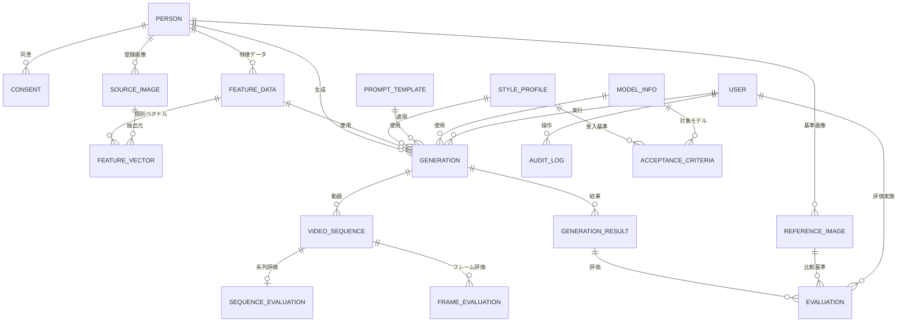
```mermaid
erDiagram
    PERSON ||--o{ CONSENT : "同意"
    PERSON ||--o{ SOURCE_IMAGE : "登録画像"
    PERSON ||--o{ REFERENCE_IMAGE : "基準画像"
    PERSON ||--o{ FEATURE_DATA : "特徴データ"
    FEATURE_DATA ||--o{ FEATURE_VECTOR : "個別ベクトル"
    SOURCE_IMAGE ||--o{ FEATURE_VECTOR : "抽出元"

    PERSON ||--o{ GENERATION : "生成"
    FEATURE_DATA ||--o{ GENERATION : "使用"
    STYLE_PROFILE ||--o{ GENERATION : "適用"
    PROMPT_TEMPLATE ||--o{ GENERATION : "使用"
    MODEL_INFO ||--o{ GENERATION : "使用"

    GENERATION ||--o{ GENERATION_RESULT : "結果"
    GENERATION_RESULT ||--o{ EVALUATION : "評価"
    REFERENCE_IMAGE ||--o{ EVALUATION : "比較基準"

    GENERATION ||--o{ VIDEO_SEQUENCE : "動画"
    VIDEO_SEQUENCE ||--o{ FRAME_EVALUATION : "フレーム評価"
    VIDEO_SEQUENCE ||--o| SEQUENCE_EVALUATION : "系列評価"

    USER ||--o{ GENERATION : "実行"
    USER ||--o{ EVALUATION : "評価実施"
    USER ||--o{ AUDIT_LOG : "操作"

    STYLE_PROFILE ||--o{ ACCEPTANCE_CRITERIA : "受入基準"
    MODEL_INFO ||--o{ ACCEPTANCE_CRITERIA : "対象モデル"
```

*図B-1　エンティティ関連図*

## B.2　エンティティ一覧

| ID | エンティティ | 概要 | 個人情報 | 定義箇所 |
|---|---|---|---|---|
| E-01 | PERSON（人物） | 人物IDとメタ情報 | 該当 | 13.3.1 |
| E-02 | CONSENT（同意情報） | 権利者の同意記録 | 該当 | 13.3.2 |
| E-03 | SOURCE_IMAGE（登録画像） | 特徴抽出に用いた原画像 | 該当 | 13.2 |
| E-04 | REFERENCE_IMAGE（基準画像） | 評価基準となる画像 | 該当 | 7.1.2 |
| E-05 | FEATURE_DATA（特徴データ） | 代表特徴とモデル情報 | 該当 | 13.3.3 |
| E-06 | FEATURE_VECTOR（個別ベクトル） | 統合前の特徴ベクトル | 該当 | 6.7.3 |
| E-07 | STYLE_PROFILE（スタイルプロファイル） | スタイル変換の定義 | 非該当 | 9.2.2 |
| E-08 | PROMPT_TEMPLATE（プロンプトテンプレート） | 標準プロンプト定義 | 非該当 | 8.5.3 |
| E-09 | MODEL_INFO（モデル情報） | モデル・重みの登録 | 非該当 | 8.6 |
| E-10 | GENERATION（生成履歴） | 生成の実行記録 | 該当 | 13.3.4 |
| E-11 | GENERATION_RESULT（生成結果） | 生成された画像・動画 | 該当 | 13.2 |
| E-12 | EVALUATION（評価結果） | 同一性評価の記録 | 該当 | 13.3.5 |
| E-13 | VIDEO_SEQUENCE（動画系列） | 動画固有の情報 | 該当 | 12.8 |
| E-14 | FRAME_EVALUATION（フレーム評価） | フレーム単位の評価 | 該当 | 12.4 |
| E-15 | SEQUENCE_EVALUATION（系列評価） | 系列全体の評価 | 該当 | 12.5 |
| E-16 | ACCEPTANCE_CRITERIA（受入基準） | 判定に用いる基準値 | 非該当 | 11.8.4 |
| E-17 | USER（利用者） | システム利用者 | 該当 | 13.2 |
| E-18 | AUDIT_LOG（監査ログ） | 操作の記録 | 該当 | 15.6 |

## B.3　主要な関連

| 関連 | 多重度 | 説明 |
|---|---|---|
| PERSON — FEATURE_DATA | 1対多 | 人物IDは複数バージョンの特徴データを持つ |
| FEATURE_DATA — FEATURE_VECTOR | 1対多 | 代表特徴は複数の個別ベクトルから統合される |
| PERSON — GENERATION | 1対多 | 人物IDに対して複数の生成が行われる |
| GENERATION — EVALUATION | 1対多 | 1つの生成結果に複数方式の評価が紐づく |
| STYLE_PROFILE — ACCEPTANCE_CRITERIA | 1対多 | スタイルごと・モデルごとに基準が存在する |

## B.4　整合性制約

| ID | 制約 | 根拠 |
|---|---|---|
| C-01 | PERSON.state が「有効」でない場合、GENERATION を作成できない | 8.2 |
| C-02 | CONSENT が存在しない PERSON は、state を「有効」にできない | FR-06 |
| C-03 | FEATURE_DATA は、モデル識別子・バージョンを必須とする | 6.6.2 |
| C-04 | GENERATION は、参照する全資源のバージョンを必須とする | 10.3.3 |
| C-05 | EVALUATION は、適用した受入基準を必須とする | 11.3.4 |
| C-06 | GENERATION、EVALUATION、AUDIT_LOG は更新・削除しない | 13.5 |
| C-07 | PERSON 削除時、E-03・E-04・E-05・E-06 を削除する | 7.6.1 |
| C-08 | PERSON 削除後も PERSON.person_id は保持する | 7.6.2 |

## B.5　データ領域配置

| 領域 | 格納エンティティ |
|---|---|
| 個人情報領域 | E-01, E-02, E-03, E-04, E-05, E-06 |
| 生成・評価領域 | E-10, E-11, E-12, E-13, E-14, E-15 |
| マスタ領域 | E-07, E-08, E-09, E-16 |
| 監査ログ領域 | E-18 |
| 利用者管理領域 | E-17 |

---

# 付録C　シーケンス図

## C.0　本付録の位置付け

本付録は、2.4 に定める主要フロー F1〜F6 について、詳細なシーケンスを示す。

第2章と本付録は、同じフローを異なる粒度で扱う。両者は重複ではなく、次の役割分担による。

| | 第2章（2.4.2〜2.4.7） | 本付録（C.1〜C.6） |
|---|---|---|
| 目的 | 処理の流れの概観 | 実装・試験に用いる詳細 |
| 粒度 | 主要なやり取りのみ | 分岐・エラー処理・ループを含む |
| 記法 | 通番なし | 通番付き（autonumber） |
| 想定読者 | 全体像を把握したい読者 | 設計者・実装者・試験担当者 |

記述に相違がある場合、本付録を優先する。

## C.1　人物登録（F1）

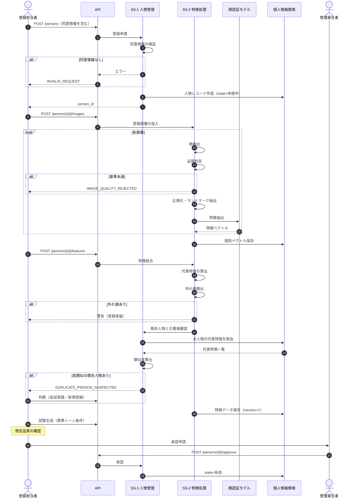
```mermaid
sequenceDiagram
    autonumber
    actor U as 登録担当者
    participant API
    participant SS1 as SS-1 人物管理
    participant SS2 as SS-2 特徴処理
    participant M as 顔認証モデル
    participant D as 個人情報領域
    actor R as 管理責任者

    U->>API: POST /persons（同意情報を含む）
    API->>SS1: 登録申請
    SS1->>SS1: 同意情報の検証
    alt 同意情報なし
        SS1-->>API: エラー
        API-->>U: INVALID_REQUEST
    end
    SS1->>D: 人物レコード作成（state=申請中）
    SS1-->>U: person_id

    U->>API: POST /persons/{id}/images
    API->>SS2: 登録画像の投入
    loop 各画像
        SS2->>SS2: 顔検出
        SS2->>SS2: 品質判定
        alt 基準未達
            SS2-->>U: IMAGE_QUALITY_REJECTED
        end
        SS2->>SS2: 正規化・ランドマーク抽出
        SS2->>M: 特徴抽出
        M-->>SS2: 特徴ベクトル
    end
    SS2->>D: 個別ベクトル保存

    U->>API: POST /persons/{id}/features
    API->>SS2: 特徴統合
    SS2->>SS2: 代表特徴の算出
    SS2->>SS2: 外れ値検出
    alt 外れ値あり
        SS2-->>U: 警告（登録保留）
    end
    SS2->>SS1: 既存人物との重複確認
    SS1->>D: 全人物の代表特徴を照会
    D-->>SS1: 代表特徴一覧
    SS1->>SS1: 類似度算出
    alt 高類似の既存人物あり
        SS1-->>U: DUPLICATE_PERSON_SUSPECTED
        U->>API: 判断（追加登録／新規登録）
    end
    SS2->>D: 特徴データ保存（version=1）

    U->>API: 試験生成（標準シーン条件）
    Note over U: 想定品質の確認
    U->>R: 承認申請
    R->>API: POST /persons/{id}/approve
    API->>SS1: 承認
    SS1->>D: state=有効
```

*図C-1　人物登録（F1）シーケンス*

## C.2　画像生成（F2）

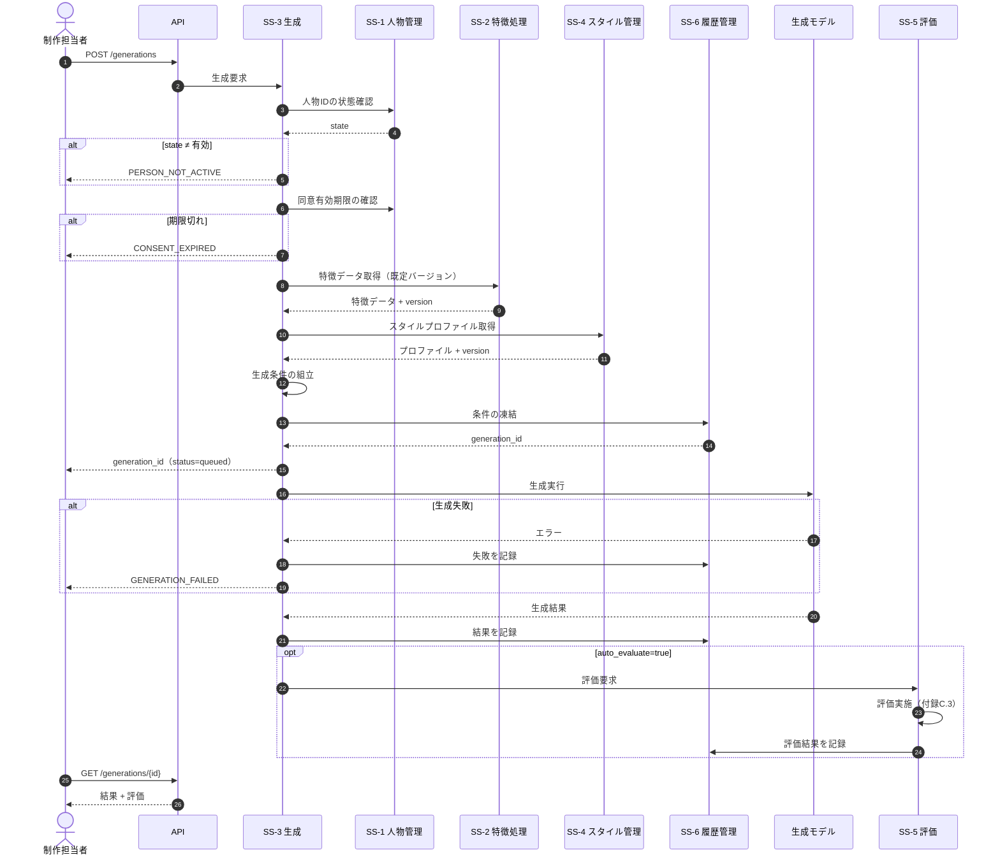
```mermaid
sequenceDiagram
    autonumber
    actor U as 制作担当者
    participant API
    participant SS3 as SS-3 生成
    participant SS1 as SS-1 人物管理
    participant SS2 as SS-2 特徴処理
    participant SS4 as SS-4 スタイル管理
    participant SS6 as SS-6 履歴管理
    participant M as 生成モデル
    participant SS5 as SS-5 評価

    U->>API: POST /generations
    API->>SS3: 生成要求
    SS3->>SS1: 人物IDの状態確認
    SS1-->>SS3: state
    alt state ≠ 有効
        SS3-->>U: PERSON_NOT_ACTIVE
    end
    SS3->>SS1: 同意有効期限の確認
    alt 期限切れ
        SS3-->>U: CONSENT_EXPIRED
    end
    SS3->>SS2: 特徴データ取得（既定バージョン）
    SS2-->>SS3: 特徴データ + version
    SS3->>SS4: スタイルプロファイル取得
    SS4-->>SS3: プロファイル + version
    SS3->>SS3: 生成条件の組立
    SS3->>SS6: 条件の凍結
    SS6-->>SS3: generation_id
    SS3-->>U: generation_id（status=queued）

    SS3->>M: 生成実行
    alt 生成失敗
        M-->>SS3: エラー
        SS3->>SS6: 失敗を記録
        SS3-->>U: GENERATION_FAILED
    end
    M-->>SS3: 生成結果
    SS3->>SS6: 結果を記録

    opt auto_evaluate=true
        SS3->>SS5: 評価要求
        SS5->>SS5: 評価実施（付録C.3）
        SS5->>SS6: 評価結果を記録
    end
    U->>API: GET /generations/{id}
    API-->>U: 結果 + 評価
```

*図C-2　画像生成（F2）シーケンス*

## C.3　評価（F3）

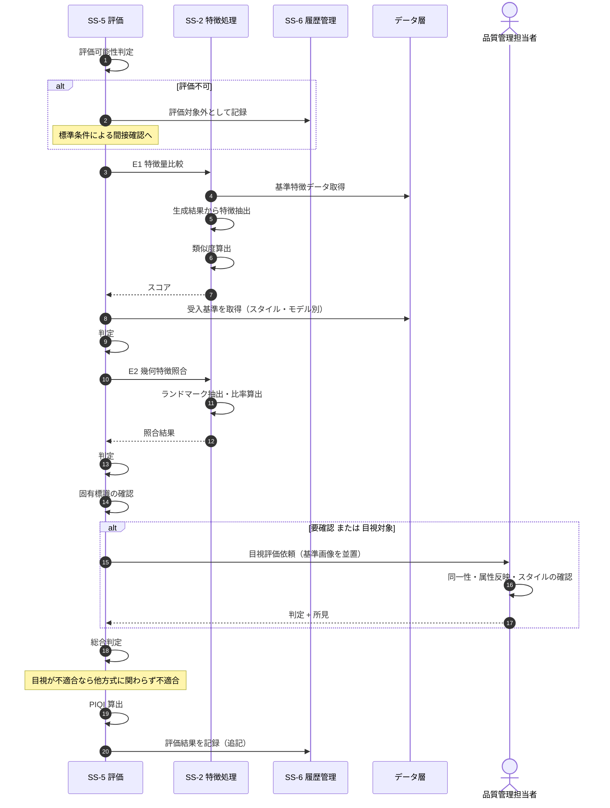
```mermaid
sequenceDiagram
    autonumber
    participant SS5 as SS-5 評価
    participant SS2 as SS-2 特徴処理
    participant SS6 as SS-6 履歴管理
    participant D as データ層
    actor V as 品質管理担当者

    SS5->>SS5: 評価可能性判定
    alt 評価不可
        SS5->>SS6: 評価対象外として記録
        Note over SS5: 標準条件による間接確認へ
    end

    SS5->>SS2: E1 特徴量比較
    SS2->>D: 基準特徴データ取得
    SS2->>SS2: 生成結果から特徴抽出
    SS2->>SS2: 類似度算出
    SS2-->>SS5: スコア
    SS5->>D: 受入基準を取得（スタイル・モデル別）
    SS5->>SS5: 判定

    SS5->>SS2: E2 幾何特徴照合
    SS2->>SS2: ランドマーク抽出・比率算出
    SS2-->>SS5: 照合結果
    SS5->>SS5: 判定
    SS5->>SS5: 固有標識の確認

    alt 要確認 または 目視対象
        SS5->>V: 目視評価依頼（基準画像を並置）
        V->>V: 同一性・属性反映・スタイルの確認
        V-->>SS5: 判定 + 所見
    end

    SS5->>SS5: 総合判定
    Note over SS5: 目視が不適合なら他方式に関わらず不適合
    SS5->>SS5: PIQI 算出
    SS5->>SS6: 評価結果を記録（追記）
```

*図C-3　評価（F3）シーケンス*

## C.4　再現生成（F4）

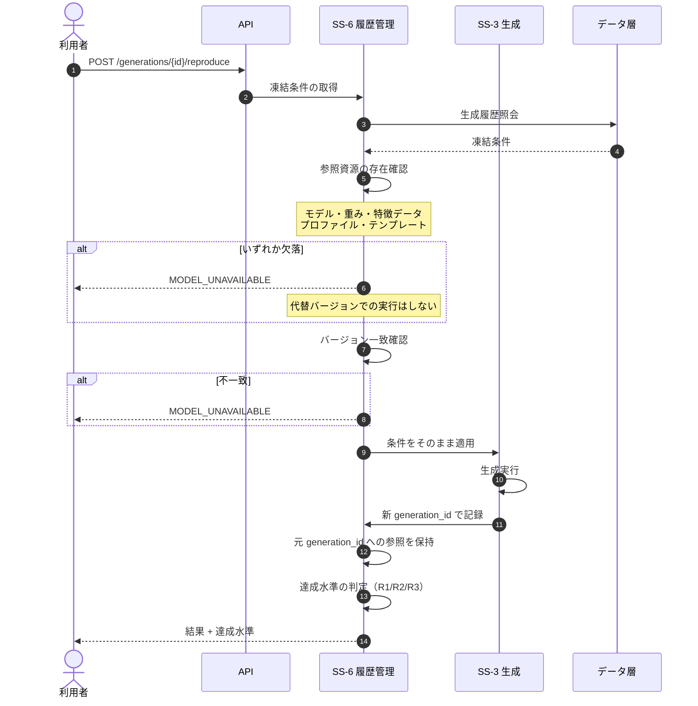
```mermaid
sequenceDiagram
    autonumber
    actor U as 利用者
    participant API
    participant SS6 as SS-6 履歴管理
    participant SS3 as SS-3 生成
    participant D as データ層

    U->>API: POST /generations/{id}/reproduce
    API->>SS6: 凍結条件の取得
    SS6->>D: 生成履歴照会
    D-->>SS6: 凍結条件
    SS6->>SS6: 参照資源の存在確認
    Note over SS6: モデル・重み・特徴データ<br/>プロファイル・テンプレート
    alt いずれか欠落
        SS6-->>U: MODEL_UNAVAILABLE
        Note over SS6: 代替バージョンでの実行はしない
    end
    SS6->>SS6: バージョン一致確認
    alt 不一致
        SS6-->>U: MODEL_UNAVAILABLE
    end
    SS6->>SS3: 条件をそのまま適用
    SS3->>SS3: 生成実行
    SS3->>SS6: 新 generation_id で記録
    SS6->>SS6: 元 generation_id への参照を保持
    SS6->>SS6: 達成水準の判定（R1/R2/R3）
    SS6-->>U: 結果 + 達成水準
```

*図C-4　再現生成（F4）シーケンス*

## C.5　モデル更新（F5）

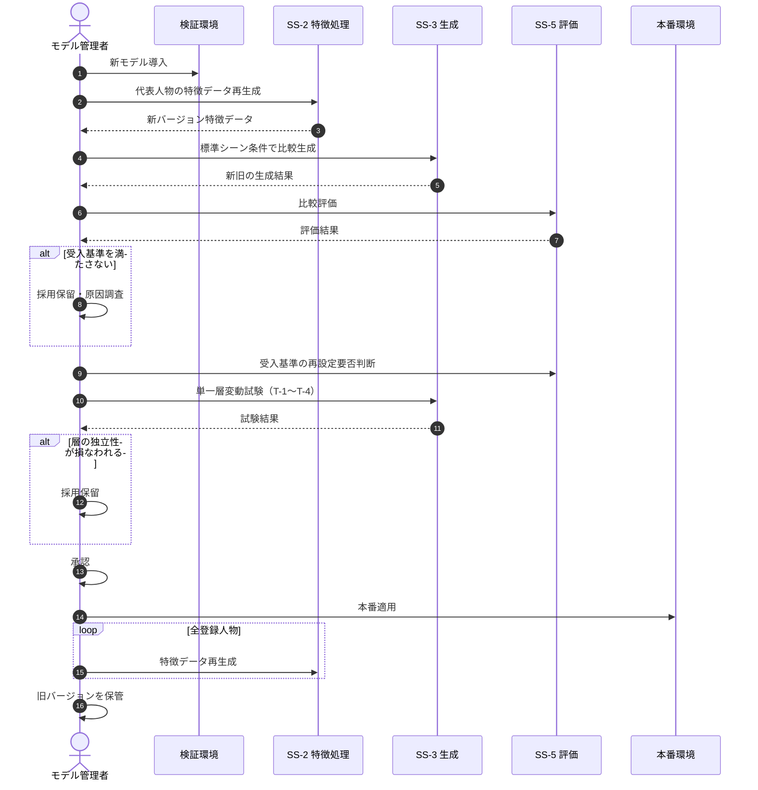
```mermaid
sequenceDiagram
    autonumber
    actor MA as モデル管理者
    participant V as 検証環境
    participant SS2 as SS-2 特徴処理
    participant SS3 as SS-3 生成
    participant SS5 as SS-5 評価
    participant P as 本番環境

    MA->>V: 新モデル導入
    MA->>SS2: 代表人物の特徴データ再生成
    SS2-->>MA: 新バージョン特徴データ
    MA->>SS3: 標準シーン条件で比較生成
    SS3-->>MA: 新旧の生成結果
    MA->>SS5: 比較評価
    SS5-->>MA: 評価結果
    alt 受入基準を満たさない
        MA->>MA: 採用保留・原因調査
    end
    MA->>SS5: 受入基準の再設定要否判断
    MA->>SS3: 単一層変動試験（T-1〜T-4）
    SS3-->>MA: 試験結果
    alt 層の独立性が損なわれる
        MA->>MA: 採用保留
    end
    MA->>MA: 承認
    MA->>P: 本番適用
    loop 全登録人物
        MA->>SS2: 特徴データ再生成
    end
    MA->>MA: 旧バージョンを保管
```

*図C-5　モデル更新（F5）シーケンス*

## C.6　削除（F6）

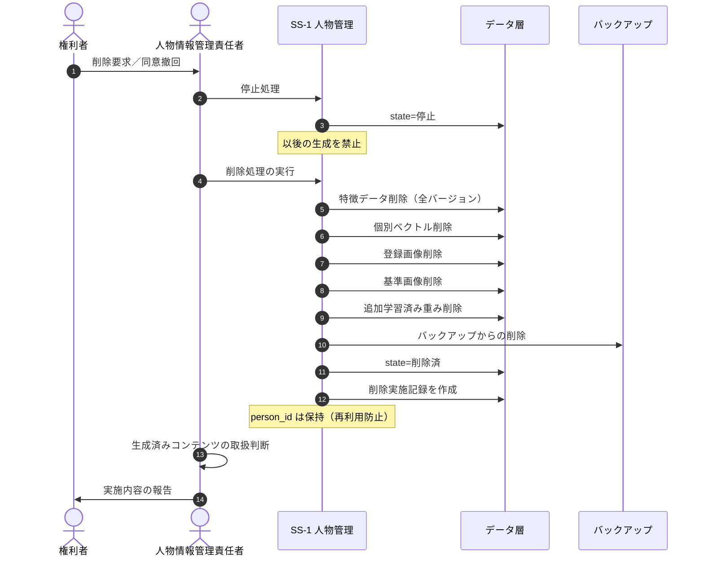
```mermaid
sequenceDiagram
    autonumber
    actor R as 権利者
    actor M as 人物情報管理責任者
    participant SS1 as SS-1 人物管理
    participant D as データ層
    participant B as バックアップ

    R->>M: 削除要求／同意撤回
    M->>SS1: 停止処理
    SS1->>D: state=停止
    Note over SS1: 以後の生成を禁止
    M->>SS1: 削除処理の実行
    SS1->>D: 特徴データ削除（全バージョン）
    SS1->>D: 個別ベクトル削除
    SS1->>D: 登録画像削除
    SS1->>D: 基準画像削除
    SS1->>D: 追加学習済み重み削除
    SS1->>B: バックアップからの削除
    SS1->>D: state=削除済
    SS1->>D: 削除実施記録を作成
    Note over SS1: person_id は保持（再利用防止）
    M->>M: 生成済みコンテンツの取扱判断
    M->>R: 実施内容の報告
```

*図C-6　削除（F6）シーケンス*

---

# 付録D　データフロー図

## D.0　本付録の位置付け

本付録は、システム内のデータの流れを段階的に示す。D.1（コンテキスト図）から D.2（レベル1）へと詳細化する構成である。

D.3・D.4 は、通常のデータフロー図とは目的が異なる。前者は個人情報が境界を越える箇所（管理点）を、後者は削除処理の網羅性を、それぞれ検証するための図であり、13.1（データ構造設計方針）第4項および 7.6（削除）に対応する。

## D.1　コンテキスト図（レベル0）

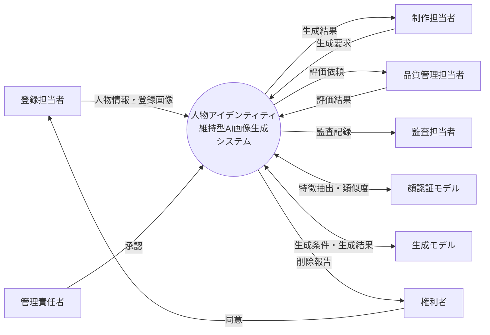
```mermaid
flowchart LR
    U1[登録担当者]
    U2[制作担当者]
    U3[品質管理担当者]
    U4[管理責任者]
    U5[監査担当者]
    R[権利者]

    S((人物アイデンティティ<br/>維持型AI画像生成<br/>システム))

    M1[顔認証モデル]
    M2[生成モデル]

    R -->|同意| U1
    U1 -->|人物情報・登録画像| S
    U2 -->|生成要求| S
    S -->|生成結果| U2
    U3 -->|評価結果| S
    S -->|評価依頼| U3
    U4 -->|承認| S
    S -->|監査記録| U5
    S <-->|特徴抽出・類似度| M1
    S <-->|生成条件・生成結果| M2
    S -->|削除報告| R
```

*図D-1　コンテキスト図（レベル0）*

## D.2　レベル1（主要プロセス）

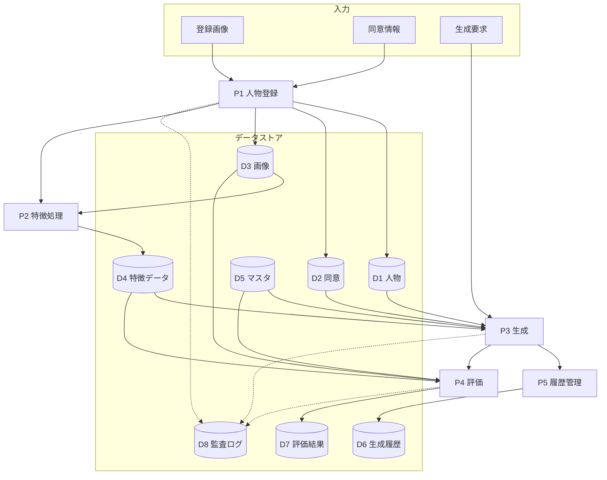
```mermaid
flowchart TB
    subgraph 入力
        I1[登録画像]
        I2[同意情報]
        I3[生成要求]
    end

    P1[P1 人物登録]
    P2[P2 特徴処理]
    P3[P3 生成]
    P4[P4 評価]
    P5[P5 履歴管理]

    subgraph データストア
        DS1[(D1 人物)]
        DS2[(D2 同意)]
        DS3[(D3 画像)]
        DS4[(D4 特徴データ)]
        DS5[(D5 マスタ)]
        DS6[(D6 生成履歴)]
        DS7[(D7 評価結果)]
        DS8[(D8 監査ログ)]
    end

    I2 --> P1
    I1 --> P1
    P1 --> DS1
    P1 --> DS2
    P1 --> DS3
    P1 --> P2
    P2 --> DS4
    DS3 --> P2

    I3 --> P3
    DS1 --> P3
    DS2 --> P3
    DS4 --> P3
    DS5 --> P3
    P3 --> P5
    P5 --> DS6

    P3 --> P4
    DS3 --> P4
    DS4 --> P4
    DS5 --> P4
    P4 --> DS7

    P1 -.-> DS8
    P3 -.-> DS8
    P4 -.-> DS8
```

*図D-2　データフロー図（レベル1：主要プロセス）*

## D.3　個人情報の流れ

個人情報に該当するデータの流れのみを抽出した図を示す。境界を越える箇所に管理点を設ける（2.4.8）。

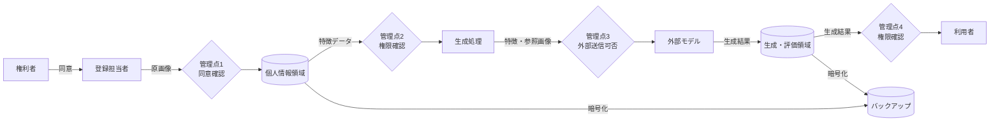
```mermaid
flowchart LR
    A[権利者] -->|同意| B[登録担当者]
    B -->|原画像| C{管理点1<br/>同意確認}
    C --> D[(個人情報領域)]
    D -->|特徴データ| E{管理点2<br/>権限確認}
    E --> F[生成処理]
    F -->|特徴・参照画像| G{管理点3<br/>外部送信可否}
    G --> H[外部モデル]
    H -->|生成結果| I[(生成・評価領域)]
    I -->|生成結果| J{管理点4<br/>権限確認}
    J --> K[利用者]
    D -->|暗号化| L[(バックアップ)]
    I -->|暗号化| L
```

*図D-3　個人情報の流れと管理点*

| 管理点 | 制御内容 | 参照 |
|---|---|---|
| 管理点1 | 同意情報の存在確認。なければ登録不可 | FR-06 |
| 管理点2 | 権限確認と監査ログ記録 | 7.7、15.6 |
| 管理点3 | 外部送信の可否判断。運用方針による | 2.4.8 |
| 管理点4 | 権限確認 | 7.7 |

## D.4　削除時のデータ消去範囲

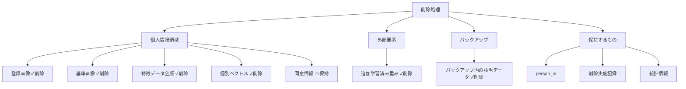
```mermaid
flowchart TB
    A[削除処理] --> B[個人情報領域]
    A --> C[外部要素]
    A --> D[バックアップ]

    B --> B1[登録画像 ✓削除]
    B --> B2[基準画像 ✓削除]
    B --> B3[特徴データ全版 ✓削除]
    B --> B4[個別ベクトル ✓削除]
    B --> B5[同意情報 △保持]

    C --> C1[追加学習済み重み ✓削除]

    D --> D1[バックアップ内の該当データ ✓削除]

    A --> E[保持するもの]
    E --> E1[person_id]
    E --> E2[削除実施記録]
    E --> E3[統計情報]
```

*図D-4　削除時のデータ消去範囲*

△は、監査上の必要性に応じて保持期間を定める（13.6、7.6.2）。

---

# 付録E　テスト仕様

## E.1　本付録の位置付け

本付録は、本仕様書への適合を確認するためのテスト仕様を定める。テストケースは要件識別子および不変条件識別子に対応付ける。

## E.2　テスト区分

| 区分 | 対象 | 実施時期 |
|---|---|---|
| TC-A | 五層モデルの成立 | 受入時、モデル更新時、プロファイル追加時 |
| TC-B | 再現性 | 受入時、モデル更新時、環境変更時、定期 |
| TC-C | 評価機能 | 受入時、基準改訂時 |
| TC-D | 人物管理・同意 | 受入時、機能改修時 |
| TC-E | 動画 | 受入時、動画機能改修時 |
| TC-F | セキュリティ | 受入時、定期 |

## E.3　TC-A：五層モデルの成立

### TC-A-01　単一層変動試験（属性）

| 項目 | 内容 |
|---|---|
| 対応要件 | IDM-01、QR-04、P-04 |
| 目的 | 属性変更がアイデンティティに影響しないことを確認 |
| 前提 | 代表人物3名以上（年齢・性別・顔立ちが異なる） |
| 条件 | I・S・Sc を固定。標準シーン条件を使用 |
| 手順 | 属性（髪型、髪色、眼鏡、服装、表情）を順次変更して生成 |
| 判定 | 全生成結果が同一性の受入基準を満たすこと |
| 不合格時 | 干渉Cの発生。属性許容範囲を見直す（5.6.5） |

### TC-A-02　単一層変動試験（スタイル）

| 項目 | 内容 |
|---|---|
| 対応要件 | IDM-01、IDM-06、QR-03、P-03 |
| 目的 | スタイル変更がアイデンティティおよび属性に影響しないことを確認 |
| 条件 | I・A・Sc を固定 |
| 手順 | 全標準スタイルプロファイルを順次適用して生成 |
| 判定1 | 各スタイルの受入基準を満たすこと |
| 判定2 | 指定した属性が全スタイルで保持されていること |
| 不合格時 | 判定1不合格は干渉A、判定2不合格は干渉B（5.6.3、5.6.4） |

### TC-A-03　単一層変動試験（シーン）

| 項目 | 内容 |
|---|---|
| 対応要件 | IDM-07 |
| 目的 | シーン変更がアイデンティティに影響しないことを確認 |
| 条件 | I・A・S を固定 |
| 手順 | 背景・照明・カメラ角度を順次変更して生成 |
| 判定 | 評価可能な条件下で受入基準を満たすこと |
| 備考 | 評価不能な条件は「評価対象外」とし、不合格と区別する |

### TC-A-04　制限付き可変属性の境界

| 項目 | 内容 |
|---|---|
| 対応要件 | 5.2.3 |
| 目的 | 許容範囲外の指定に警告が発せられることを確認 |
| 手順 | 年齢表現・体格表現を許容範囲外に指定 |
| 判定 | 警告が発せられ、明示的承認なしに実行されないこと |

## E.4　TC-B：再現性

### TC-B-01　R3 の達成

| 項目 | 内容 |
|---|---|
| 対応要件 | QR-02、FR-20、P-06 |
| 手順 | 生成後、一定期間をおいて同一条件で再生成 |
| 判定 | 同一性の受入基準を満たすこと |

### TC-B-02　R2 の達成

| 項目 | 内容 |
|---|---|
| 対応要件 | 10.2.2 |
| 条件 | 同一実行環境 |
| 判定 | 目視で区別できないこと |

### TC-B-03　資源欠落時の挙動

| 項目 | 内容 |
|---|---|
| 対応要件 | 10.4.3 第3項 |
| 手順 | 参照モデルを利用不可の状態にして再現要求 |
| 判定 | MODEL_UNAVAILABLE を返し、代替バージョンで実行しないこと |

### TC-B-04　条件記録の網羅性

| 項目 | 内容 |
|---|---|
| 対応要件 | 8.4.1、10.3.3 |
| 手順 | 生成を実行し、記録された条件項目を確認 |
| 判定 | 8.4.1 の全項目が、バージョン込みで記録されていること |

### TC-B-05　生成失敗時の記録

| 項目 | 内容 |
|---|---|
| 対応要件 | 2.3.4 第三原則 |
| 手順 | 生成を意図的に失敗させる |
| 判定 | 条件と失敗の事実が記録されていること |

## E.5　TC-C：評価機能

### TC-C-01　三方式の実施

| 項目 | 内容 |
|---|---|
| 対応要件 | QR-06、P-08 |
| 判定 | E1・E2 が実施され、条件に応じて E3 が実施されること |

### TC-C-02　目視優先の判定

| 項目 | 内容 |
|---|---|
| 対応要件 | 11.6.1、P-08 |
| 手順 | E1・E2 が適合、E3 が不適合となる事例を投入 |
| 判定 | 総合判定が不適合となること |

### TC-C-03　評価対象外の判定

| 項目 | 内容 |
|---|---|
| 対応要件 | 11.6.2 |
| 手順 | 顔が検出できない生成結果を評価 |
| 判定 | 「評価対象外」として記録され、適合・不適合と区別されること |

### TC-C-04　受入基準の適用

| 項目 | 内容 |
|---|---|
| 対応要件 | 11.3.4、9.2.2 |
| 手順 | 複数スタイルで評価を実施 |
| 判定 | スタイルごとに異なる基準が適用され、適用基準が記録されていること |

### TC-C-05　未評価生成物の扱い

| 項目 | 内容 |
|---|---|
| 対応要件 | QR-07、P-07 |
| 手順 | 評価未実施の生成物を承認しようとする |
| 判定 | 承認できないこと |

## E.6　TC-D：人物管理・同意

### TC-D-01　同意なき登録の拒否

| 項目 | 内容 |
|---|---|
| 対応要件 | FR-06、OR-01、P-10 |
| 手順 | 同意情報を含めずに登録を要求 |
| 判定 | 人物IDが発行されないこと |

### TC-D-02　同意期限到来時の失効

| 項目 | 内容 |
|---|---|
| 対応要件 | OR-02、15.3.2 |
| 手順 | 同意期限を経過させる |
| 判定 | 人物IDが失効し、生成が実行できないこと |

### TC-D-03　非有効状態での生成拒否

| 項目 | 内容 |
|---|---|
| 対応要件 | 8.2 第2段階 |
| 手順 | 停止・失効・削除済の人物IDで生成を要求 |
| 判定 | PERSON_NOT_ACTIVE を返すこと |

### TC-D-04　重複登録の検出

| 項目 | 内容 |
|---|---|
| 対応要件 | 7.3.1、P-01 |
| 手順 | 登録済み人物と同一人物を新規登録 |
| 判定 | 警告が発せられること |

### TC-D-05　削除の網羅性

| 項目 | 内容 |
|---|---|
| 対応要件 | 7.6.1、15.3.3、C-07 |
| 手順 | 追加学習済み重みを用いた人物を削除 |
| 判定 | 特徴データ・原画像・基準画像・追加学習済み重み・バックアップ内データがすべて消去されること |

### TC-D-06　人物IDの継承

| 項目 | 内容 |
|---|---|
| 対応要件 | IDM-08、P-05、BR-07 |
| 手順 | 顔認証モデルを更新 |
| 判定 | 人物IDが変更されず、特徴データのバージョンのみが更新されること |

## E.7　TC-E：動画

### TC-E-01　フレーム単位の同一性

| 項目 | 内容 |
|---|---|
| 対応要件 | 12.4、12.9.1 基準A |
| 判定 | 評価対象フレームの規定割合以上が適合であること |

### TC-E-02　ドリフト検出

| 項目 | 内容 |
|---|---|
| 対応要件 | 12.5.3、12.9.1 基準B |
| 手順 | 基準乖離推移を算出 |
| 判定 | 一方向の傾向が認められないこと |

### TC-E-03　冒頭終盤比較

| 項目 | 内容 |
|---|---|
| 対応要件 | 12.9.1 基準C |
| 判定 | 冒頭・終盤フレームが相互に受入基準を満たすこと |

### TC-E-04　固定属性の一貫性

| 項目 | 内容 |
|---|---|
| 対応要件 | 5.5.4、12.9.1 基準D |
| 判定 | 髪型・髪色・服装・装着物がフレーム間で変化しないこと |

### TC-E-05　スタイルの一貫性

| 項目 | 内容 |
|---|---|
| 対応要件 | 5.3.5、12.9.1 基準E |
| 判定 | 記録なきスタイル変化が認められないこと |

## E.8　TC-F：セキュリティ

### TC-F-01　権限制御

| 項目 | 内容 |
|---|---|
| 対応要件 | NFR-03、7.7 |
| 手順 | 各権限区分で全操作を試行 |
| 判定 | 7.7 の表のとおりに制御されること |

### TC-F-02　監査ログ

| 項目 | 内容 |
|---|---|
| 対応要件 | NFR-04、15.6.1 |
| 判定 | 15.6.1 の全対象が記録されること |

### TC-F-03　ログの追記専用

| 項目 | 内容 |
|---|---|
| 対応要件 | 15.6.2、C-06 |
| 手順 | 監査ログの更新・削除を試行 |
| 判定 | 実行できないこと |

### TC-F-04　暗号化

| 項目 | 内容 |
|---|---|
| 対応要件 | NFR-01、NFR-02 |
| 判定 | 保存データおよび通信が暗号化されていること |

### TC-F-05　禁止用途の検出

| 項目 | 内容 |
|---|---|
| 対応要件 | 15.7.2 |
| 手順 | 禁止用途に該当しうる指示を投入 |
| 判定 | 検出され、実行が制限されること |

## E.9　テスト実施記録

各テストケースについて、次を記録する。

| 項目 | 内容 |
|---|---|
| テストケースID | |
| 実施日時 | |
| 実施者 | |
| 対象環境 | 実行環境識別子 |
| 対象モデル | モデル識別子・バージョン |
| 使用人物ID | 代表人物 |
| 結果 | 合格／不合格 |
| 不合格時の所見 | |
| 是正内容 | |
| 再試験結果 | |

---

# 付録F　標準プロンプト設計

## F.1　本付録の位置付け

本付録は、8.5（プロンプト設計標準）に基づく標準テンプレートを収録する。

本付録の内容は、モデルの交代に応じて改訂頻度が高い。P-09 に基づき、具体的な記述例は参考として示し、**構造と規則を主たる規定**とする。

## F.2　基本構造

プロンプトは、五層モデルに対応して次の順序で構成する。

```
[1 人物指定] [2 人物属性] [3 表現スタイル] [4 シーン] [5 品質指定]
```

| 部分 | 対応する層 | 管理形態 |
|---|---|---|
| 1 人物指定 | アイデンティティ層 | システムが自動生成（人物IDから） |
| 2 人物属性 | 属性層 | 構造化データから生成 |
| 3 表現スタイル | スタイル層 | スタイルプロファイルから取得 |
| 4 シーン | シーン層 | 構造化データから生成 |
| 5 品質指定 | — | 標準テンプレート |

**各部分は独立した記述単位として保持し、単一の文字列として結合した状態でのみ保持してはならない。** 結合後の文字列からは、どの部分がどの層に属するかを事後に判別できない（P-02）。

## F.3　記述規則

| ID | 規則 | 根拠 |
|---|---|---|
| PR-01 | 人物アイデンティティに関わる記述を、属性・スタイル部分に混入させない | P-03 |
| PR-02 | スタイル指定に、顔の形状・比率を変更しうる語を含めない | IDM-01 |
| PR-03 | スタイル指定に、属性に相当する語（髪色・服装等）を含めない | IDM-06 |
| PR-04 | シーン指定に、人物の特徴に関する語を含めない | IDM-07 |
| PR-05 | 各部分の記述は、テンプレートと自由記述を区別して保持する | 8.5.3 |
| PR-06 | ネガティブプロンプトに、同一性を損なう傾向のある要素を標準として含める | 8.5.2 |

## F.4　禁止語の分類

### F.4.1　スタイル部分の禁止語

顔の形状・比率に影響しうる語は、スタイル部分に含めない。

| 分類 | 例 |
|---|---|
| 顔の形状 | 顔の輪郭・骨格に関する形容 |
| 目鼻立ち | 目・鼻・口の大きさ・形状に関する形容 |
| 年齢的印象 | 若々しい／老けた等の形容 |
| 体型的印象 | 痩せた／太った等の形容 |
| 美的評価 | 整った顔立ち等の評価語 |

最後の分類は見落とされやすい。美的評価語は、モデルが「標準的に美しいとされる顔」へ寄せる作用を持ち、個人の特徴を平準化する。

### F.4.2　シーン部分の禁止語

| 分類 | 例 |
|---|---|
| 人物の特徴 | 人物の外見に関する一切の語 |
| 属性 | 服装・髪型等（属性部分で指定する） |

## F.5　ネガティブプロンプト標準

### F.5.1　同一性維持のための標準項目

| 分類 | 目的 |
|---|---|
| 顔の変形抑制 | 顔の歪み・非対称の抑制 |
| 複数人物の抑制 | 意図しない複数人物の出現の抑制 |
| 部分破綻の抑制 | 目・鼻・口の破綻の抑制 |
| 平準化の抑制 | 個人の特徴が平均的な顔へ寄ることの抑制 |

### F.5.2　スタイル別の追加項目

各スタイルプロファイルは、当該スタイルで抑制すべき要素を定義する（9.2.2）。

| スタイル区分 | 抑制対象の例 |
|---|---|
| 実写系 | 二次元的な表現の混入 |
| 二次元系 | 写実的な質感の混入 |
| 絵画系 | 写真的な鮮鋭さの混入 |
| モノクロ系 | 色彩の混入 |

## F.6　テンプレート構造

### F.6.1　保持形式

テンプレートは、部分ごとに分離した構造として保持する。

```json
{
  "template_id": "TPL-STD-001",
  "version": 3,
  "sections": {
    "identity": { "source": "person_id", "editable": false },
    "attributes": { "source": "structured", "editable": true },
    "style": { "source": "style_profile", "editable": false },
    "scene": { "source": "structured", "editable": true },
    "quality": { "source": "template", "editable": false }
  },
  "negative": {
    "standard": ["..."],
    "style_specific": { "source": "style_profile" }
  },
  "approved_by": "...",
  "approved_at": "..."
}
```

`editable: false` の部分を利用者が編集できない構成とすることにより、PR-01〜PR-04 を構造的に担保する。

### F.6.2　バージョン管理

| 要件 | 内容 |
|---|---|
| バージョン付与 | テンプレートはバージョンを持つ |
| 変更手続 | 変更は比較評価を経て承認する（8.5.3） |
| 履歴保持 | 過去バージョンを保持する（10.4.2） |
| 参照記録 | 生成履歴にテンプレートIDとバージョンを記録する |

## F.7　テンプレート変更時の確認

テンプレートを変更する場合、次を実施する。

1. 代表人物3名以上、標準スタイル全区分で、変更前後の比較生成を行う。
2. 同一性の受入基準を満たすことを確認する。
3. 属性の反映が変化していないことを確認する。
4. 単一層変動試験（TC-A-01〜03）を実施する。
5. 結果を記録し、承認を得る。

テンプレートの変更は、生成条件の暗黙の変化を引き起こしやすい（10.3.2）。変更の記録なくして、再現性は保証できない。

---

# 付録G　評価シート

## G.1　本付録の位置付け

本付録は、第11章および第12章に定める評価の記録様式を定める。

## G.2　様式G-1：静止画 同一性評価シート

### 基本情報

| 項目 | 記入欄 |
|---|---|
| 評価ID | |
| 生成ID | |
| 人物ID | |
| 特徴データバージョン | |
| スタイルプロファイル／バージョン | |
| シーン条件 | 標準／非標準（　　　　） |
| 評価日時 | |
| 評価者 | |

### 評価可能性判定

| 項目 | 判定 |
|---|---|
| 顔検出 | 可／不可 |
| 顔領域サイズ | 適／不適 |
| 露出 | 適／不適 |
| 遮蔽 | なし／あり |
| 顔向き | 範囲内／範囲外 |
| **総合** | **評価可／評価対象外** |

「評価対象外」の場合、以下を記入せず、間接確認欄へ進む。

### E1：特徴量比較

| 項目 | 記入欄 |
|---|---|
| 使用モデル／バージョン | |
| 算出方式 | |
| 類似度スコア | |
| 適用受入基準 | |
| 判定 | 適合／要確認／不適合 |

### E2：幾何特徴照合

| 照合項目 | 判定 |
|---|---|
| 顔の縦横比 | 適合／不適合 |
| 両眼間距離比 | 適合／不適合 |
| 目・鼻・口の縦位置比 | 適合／不適合 |
| 鼻長比 | 適合／不適合 |
| 口幅比 | 適合／不適合 |
| 下顎線の形状 | 適合／不適合 |
| 対称性 | 適合／不適合 |
| 固有標識の再現 | 再現／欠落／該当なし |
| **総合** | **適合／要確認／不適合** |

### E3：目視評価

| 観点 | 判定 |
|---|---|
| 同一人物として認識できるか | はい／いいえ |
| 違和感のある部位 | （記述） |
| 固有標識の再現 | 適／不適／該当なし |
| 属性指定の反映 | 適／不適 |
| スタイルとしての自然さ | 適／不適 |
| **判定** | **適合／不適合** |

所見：

```

```

### 総合判定

| 項目 | 記入欄 |
|---|---|
| 総合判定 | 適合／要確認／不適合／評価対象外 |
| PIQI | |
| 承認可否 | 可／不可 |
| 判定者 | |

**注：E3 が不適合の場合、E1・E2 の結果にかかわらず不適合とする。**

### 間接確認（評価対象外の場合）

| 項目 | 記入欄 |
|---|---|
| 参照した標準条件生成の生成ID | |
| 当該生成の総合判定 | |
| 間接確認の結論 | 同一性を認める／認めない |

---

## G.3　様式G-2：スタイル展開セット評価シート

同一人物を複数スタイルで展開した場合、セット単位で評価する（9.5）。

| 項目 | 記入欄 |
|---|---|
| セットID | |
| 人物ID | |
| 属性指定 | |
| 評価日時 | |

| No | スタイル | 生成ID | E1スコア | 適用基準 | E2 | E3 | 総合 |
|---|---|---|---|---|---|---|---|
| 1 | | | | | | | |
| 2 | | | | | | | |
| 3 | | | | | | | |
| 4 | | | | | | | |
| 5 | | | | | | | |

### セット全体の確認

| 確認項目 | 判定 |
|---|---|
| 全スタイルが同一の基準画像に対して評価されたか | はい／いいえ |
| スタイル間で属性指定が変化していないか | 変化なし／変化あり |
| 属性変化があった場合、干渉Bの疑い | あり／なし |
| セットとして同一人物と認識できるか | はい／いいえ |

| 項目 | 記入欄 |
|---|---|
| セット総合判定 | 適合／不適合 |
| 人物同一性維持率 | 　／　 ＝ 　％ |

---

## G.4　様式G-3：動画 同一性評価シート

### 基本情報

| 項目 | 記入欄 |
|---|---|
| 評価ID | |
| 生成ID | |
| 人物ID | |
| 生成方式 | フレーム独立／参照連鎖／系列一括／基準参照 |
| 総フレーム数／尺 | |
| フレームレート | |
| 評価日時／評価者 | |

### フレーム単位評価

| フレーム | 位置 | E1スコア | 判定 |
|---|---|---|---|
| 冒頭 | | | |
| 1/4地点 | | | |
| 中間 | | | |
| 3/4地点 | | | |
| 終盤 | | | |
| （追加） | | | |

| 項目 | 記入欄 |
|---|---|
| 評価対象フレーム数 | |
| うち適合 | |
| うち評価対象外 | |
| 適合率 | 　％ |
| 基準A（規定割合以上） | 適合／不適合 |

### 系列評価

| 項目 | 判定 |
|---|---|
| 基準乖離推移の傾向 | 一方向／傾向なし／区間限定 |
| 区間限定の場合、シーン条件の変化 | あり／なし |
| ドリフト判定 | あり／なし |
| 隣接フレーム差分の分散 | |
| 冒頭終盤の直接比較スコア | |
| 基準B（ドリフト不在） | 適合／不適合 |
| 基準C（冒頭終盤一致） | 適合／不適合 |
| Q_tmp | |

### 一貫性確認

| 項目 | 判定 |
|---|---|
| 固定属性（髪型） | 一貫／変化あり |
| 固定属性（髪色） | 一貫／変化あり |
| 固定属性（服装） | 一貫／変化あり |
| 固定属性（装着物） | 一貫／変化あり |
| 基準D | 適合／不適合 |
| スタイル（色調） | 一貫／変化あり |
| スタイル（質感） | 一貫／変化あり |
| スタイル（輪郭表現） | 一貫／変化あり |
| 記録された意図的切替 | あり／なし |
| 基準E | 適合／不適合 |

### 目視評価

| 観点 | 判定 |
|---|---|
| 通して視聴して同一人物と認識できるか | はい／いいえ |
| 動きが人物として自然か | はい／いいえ |
| 動きの不連続な変化 | なし／あり |
| 違和感のある区間 | （記述） |
| 基準F | 適合／不適合 |

所見：

```

```

### 総合判定

| 基準 | 判定 |
|---|---|
| A フレーム同一性 | |
| B ドリフト不在 | |
| C 冒頭終盤一致 | |
| D 固定属性一貫 | |
| E スタイル一貫 | |
| F 目視適合 | |
| **総合** | **適合／不適合** |

**注：基準F が不適合の場合、他の基準にかかわらず不適合とする。**

---

## G.5　様式G-4：単一層変動試験記録シート

| 項目 | 記入欄 |
|---|---|
| 試験ID | |
| 実施日時／実施者 | |
| 対象モデル／バージョン | |
| 実行環境識別子 | |
| 代表人物ID（3名以上） | |

### T-1：属性変動

| 変動させた属性 | 生成ID | 同一性判定 |
|---|---|---|
| 髪型 | | |
| 髪色 | | |
| 眼鏡 | | |
| 服装 | | |
| 表情 | | |

| 判定 | 合格／不合格 |
|---|---|
| 不合格時の干渉類型 | 干渉C |

### T-2：スタイル変動

| スタイル | 生成ID | 同一性 | 属性保持 |
|---|---|---|---|
| 標準写真風 | | | |
| ポートレート | | | |
| モノクロ写真風 | | | |
| 昭和レトロ映画風 | | | |
| アニメ風 | | | |
| 漫画風 | | | |
| イラスト風 | | | |
| 水彩画風 | | | |
| 油彩画風 | | | |
| サイバーパンク風 | | | |

| 判定 | 合格／不合格 |
|---|---|
| 同一性不合格時 | 干渉A |
| 属性不保持時 | 干渉B |

### T-3：シーン変動

| 変動させたシーン | 生成ID | 判定 |
|---|---|---|
| 背景 | | |
| 照明（方向） | | |
| 照明（強度） | | |
| カメラ角度 | | |
| ショットサイズ | | |

| 判定 | 合格／不合格 |
|---|---|
| 不合格時の干渉類型 | 干渉D／IDM-01違反 |

### T-4：時間変動（動画のみ）

| 項目 | 記入欄 |
|---|---|
| 生成ID | |
| 全層保持の判定 | 合格／不合格 |
| 不合格時の干渉類型 | 干渉E |

### 総合

| 項目 | 記入欄 |
|---|---|
| 総合判定 | 合格／不合格 |
| 不合格時の措置 | プロファイル修正／属性範囲見直し／システム構成見直し |
| 是正完了確認 | |

---

## G.6　様式G-5：受入基準設定記録シート

| 項目 | 記入欄 |
|---|---|
| 基準ID | |
| 対象モデル／バージョン | |
| 対象スタイル区分 | |
| 設定日／設定者 | |

### 試験条件

| 項目 | 記入欄 |
|---|---|
| 代表人物数 | |
| 人物の構成（年齢・性別・顔立ち） | |
| シーン条件 | 標準シーン条件 |
| 生成件数 | |

### 分析結果

| 項目 | 記入欄 |
|---|---|
| E3 適合群のスコア範囲 | |
| E3 不適合群のスコア範囲 | |
| 分離水準 | |
| 「要確認」帯の範囲 | |
| 用途に応じた調整 | 厳格側／寛容側／調整なし |

### 設定内容

| 項目 | 値 |
|---|---|
| 適合基準 | |
| 要確認下限 | |
| 不適合基準 | |

| 項目 | 記入欄 |
|---|---|
| 設定根拠（要約） | |
| 承認者／承認日 | |
| 有効期間／見直し予定 | |

---

## G.7　様式G-6：定期監視シート

| 項目 | 記入欄 |
|---|---|
| 集計期間 | |
| 集計日／集計者 | |

| 指標 | 全体 | 備考 |
|---|---|---|
| 人物同一性維持率 | | |
| PIQI 平均 | | |
| 評価対象外の発生率 | | |
| 目視と数値の不一致率 | | |

### スタイル別

| スタイル | 維持率 | PIQI平均 | 不一致率 |
|---|---|---|---|
| | | | |

### 前期比較

| 指標 | 前期 | 今期 | 増減 | 所見 |
|---|---|---|---|---|
| 人物同一性維持率 | | | | |
| PIQI 平均 | | | | |

### 是正の要否

| 項目 | 判定 |
|---|---|
| 有意な低下 | あり／なし |
| 受入基準の見直し要否 | 要／不要 |
| 是正内容 | |

---

---

# 未解決事項一覧

本仕様書の記述中で「別途定める」「今後検討する」とした事項を集約する。
統合作業そのものに関する作業項目（ファイル統合、未執筆章の作成、節番号の反映、
付録の作成等）は、統合をもって解決済みのため本一覧から除外している。

## 1. 下位文書として別途策定を要するもの

本仕様書は、改訂頻度の高い具体値・具体手順を下位文書へ委ねている（1.8.3、P-09）。
次の6文書が未策定である。

| 下位文書 | 委ねている事項 | 主な参照箇所 |
|---|---|---|
| 登録画像基準書 | 画像品質のしきい値、必須枚数、推奨枚数 | 6.4、6.7.2 |
| 性能基準書 | 性能目標値（PR-01〜PR-06） | 4.4 |
| 評価基準書 | 類似度しきい値、PIQI の重み、動画受入基準 | 11.8、12.9.2 |
| データ保持基準書 | 各データの保持期間 | 13.6 |
| インシデント対応手順書 | インシデント時の具体手順 | 15.8 |
| システム利用規程 | 禁止用途の詳細、違反時の措置 | 15.7.1 |

## 2. 実証試験を経て決定を要する事項

いずれも「評価基準書」へ記載する事項である。

| No | 事項 | 参照 |
|---|---|---|
| 1 | PIQI の各要素（Q_id、Q_geo、Q_vis、Q_tmp）の正規化方式 | 11.7.2 |
| 2 | PIQI の重み w1〜w4 のスタイル区分別の値 | 11.7.3 |
| 3 | 時間的一貫性指標 Q_tmp の算出式 | 12.5.4 |
| 4 | 動画受入基準の具体値（基準Aの規定割合、ドリフト判定しきい値） | 12.9.2 |
| 5 | 制限付き可変属性（年齢表現・体格表現）の許容範囲の設定手順 | 5.2.3 |

## 3. 方針決定を要する事項

| No | 事項 | 参照 | 決定を要する理由 |
|---|---|---|---|
| 1 | 外部モデルへの特徴データ送信の可否 | 2.4.8 管理点3 | 社外クラウド利用時に個人情報が組織外へ出るため |
| 2 | 生成物の著作権の帰属 | 1.8.7 | 法務判断を要するため |
| 3 | 生成物の広告表示義務等の法的要件 | 1.8.7 | 適用法令によるため |
| 4 | 外部提供時の第三者無断登録への対応方針 | 17.6.3 | 対応なくして外部提供は行えないため |
| 5 | リアルタイム生成における評価方針（事前検証型／実時間監視型／制限型） | 17.4.2 | 事後評価が成立しないため |

## 4. 技術的検討を要する事項

| No | 事項 | 参照 | 現状 |
|---|---|---|---|
| 1 | 動作の一貫性の定量的評価方式 | 5.5.5、12.6.1 | 初版では定性的要件にとどめている |
| 2 | 動作特徴のアイデンティティ層／属性層の切り分け基準 | 17.5.2 | 拡張実施時に定義を要する |
| 3 | 三次元における多視点評価方式 | 17.4.1 | 未定義 |
| 4 | 音声特徴を追加する場合の評価方式 | 17.5.3 | 未定義 |

## 5. 成果物として作成を要するもの

| No | 事項 | 参照 | 状況 |
|---|---|---|---|
| 1 | 付録B：物理データモデル（テーブル定義） | 付録B | 未着手 |
| 2 | 第2章の重要図3点（サブシステム依存関係、全体アーキテクチャ、F2画像生成フロー）の画像化 | 2.2.5、2.3.2、2.4.3 | **完了**（PNG/SVG化し本文に埋め込み。ソースはfigures/フォルダに保管） |
| 3 | 付録C・D：残る図（シーケンス図5点、データフロー図3点）の正式図版化 | 付録C、付録D | 未着手（優先度：中） |
| 4 | 付録D：レベル2以下の詳細データフロー図 | 付録D | 未着手 |
| 5 | 付録E：各テストケースの合否判定値（下位文書と連動） | 付録E | 未着手 |
| 6 | 付録F：モデル別の具体的記述例 | 付録F | 未着手 |
| 7 | 付録G：様式の運用形態（紙／システム内フォーム）の決定 | 付録G | 未着手 |
| 8 | 1.6.2 の原則 P-01〜P-10 と第4章の要件との対応表 | 1.6.4 | 未着手 |
| 9 | 1.8.2 の文書体系図の正式版 | 1.8.2 | 未着手 |
| 10 | 2.5.6 の時間軸図の正式版 | 2.5.6 | 未着手 |

## 6. 編集上の確認事項

| No | 事項 | 状況 |
|---|---|---|
| 1 | 全章の用語を付録A（用語集）と照合し、表記揺れを解消する | **完了**（付録A.9に省略表記ルールを追加。「登録原画像」→「登録画像」統一済み） |
| 2 | 第17章の内容と 1.7（将来構想）の重複を整理する | 未着手 |
| 3 | 各章の相互参照を最終確認する | 未着手 |
